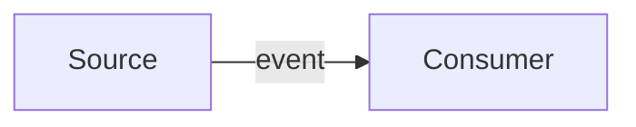

# Documentation Writing Standards

Technical documentation for the SilverMind Project follows the same standards as professional systems documentation: precise, concise, and structured for the reader who needs to get something done.

---

## 1. Voice and tone

Write like Google Cloud, Microsoft Learn, or Apple Developer documentation:

- **Direct and instructional.** The reader is here to accomplish a task. Lead with the action or the concept, not with marketing prose.
- **No superlatives.** Never "incredibly fast", "seamlessly integrated", "powerful". Let the architecture and API speak for themselves.
- **No em-dashes.** Use colons, commas, or separate sentences. Em-dashes are a crutch for stream-of-consciousness writing.
- **No exclamation marks.** Documentation is not a pitch deck.
- **No first person.** The documentation is not a person. "The system processes frames" not "We process frames".
- **No future promises.** Document what exists today. "Pipeline steps support template expressions" not "We plan to add template support soon."

### Correcting flowery language

| Flowery | Professional |
|---------|-------------|
| "seamlessly integrates with your existing setup" | "connects to Home Assistant over the LAN" |
| "incredibly powerful rule engine" | "rule engine supporting 20 step types" |
| "beautiful, intuitive dashboard" | "Vue 3 admin dashboard with live tracking" |
| "takes privacy seriously" | "all inference runs on-premise; no data leaves the LAN" |
| "revolutionary AI-powered insights" | "detects behavioral patterns from camera feeds" |

---

## 2. Structure

### Every page has a purpose

A reader should finish any page knowing exactly what they can do and how to do it. If a page mixes concepts, tasks, and reference material, split it.

- **Guide pages:** task-oriented. "How to configure a camera", "How to deploy on Kubernetes".
- **Feature pages:** capability-oriented. "Pipeline system", "Continuous tracking".
- **API reference:** field-oriented. Tables of endpoints, parameters, responses.
- **Development pages:** contributor-oriented. "Setting up a dev environment", "Extending the pipeline".

### Page structure template

```markdown
# Title (noun phrase or gerund)

One-sentence description of what this page covers.

## Section (concept or task name)

Context paragraph. Why this matters, when to use it.

### Sub-section (detail)

Code block, table, or step-by-step list.

## Next steps

Link to related pages the reader should visit next.
```

---

## 3. Formatting conventions

### Code blocks

Always specify a language:
```yaml
cts:
  enabled: true
```

Use `bash` for shell commands, `python` for Python, `yaml` for config, `json` for API responses, `typescript` for Vue components.

### File paths

Use backticks: `` `config/settings.yaml` ``. Absolute paths from the repo root when the file location matters; relative paths when context is clear.

### Tables

Use for reference data (env vars, API parameters, config keys). Column order: Name, Type/Value, Description. Align with standard Markdown table syntax.

### Admonitions

Use VitePress custom containers sparingly:
```markdown
::: warning
This feature requires `cts.enabled: true` in settings.yaml.
:::
```

### Links

Use relative paths for internal links: `[Pipeline System](../features/pipeline.md)`. Use full URLs only for external references.

---

## 4. Diagrams

Use Mermaid for all diagrams in documentation. Do not embed raster images (PNG, JPEG) or SVG files — they cannot be reviewed as text and become stale silently.

### Supported diagram types

| Type | Mermaid directive | When to use |
|------|-------------------|-------------|
| Architecture / data flow | `flowchart TB` or `flowchart LR` | Service-to-service data paths, component relationships |
| Sequence | `sequenceDiagram` | Request/response flows, event ordering |
| State machine | `stateDiagram-v2` | Presence states, signal lifecycle |
| Entity relationship | `erDiagram` | Database table relationships |

### Usage

Wrap Mermaid source in a fenced code block tagged `mermaid`:

````markdown

````

VitePress renders Mermaid natively. No plugin or extension is required.

### Style conventions

- **Labels**: sentence case, no trailing periods.
- **Node shapes**: rectangles `[...]` for services, rounded `(...)` for actions, database cylinders `[(DB)]` for storage.
- **Direction**: prefer top-to-bottom (`TB`) for vertical architectures, left-to-right (`LR`) for pipelines and sequential flows.
- **Subgraphs**: use for logical groupings (ingest, inference, storage). Title the subgraph with a noun phrase, not a verb.
- Keep diagrams focused: one diagram per concept. Split rather than overload.

---

## 5. Accuracy and maintenance


### Verify every claim against the codebase

Before writing that something exists, verify it:
- **Step types:** check `backend/steps/builtin/` for registered handlers.
- **API endpoints:** check `backend/routers/` and `main.py` for route registration.
- **Config keys:** check `config/settings.yaml` for the actual key path.
- **Model columns:** check `backend/models/` for the actual column names and types.

### Numbers must match

If the introduction says "20 step types", the API reference must also say "20 step types". Hardcoded numbers in docs are a liability. When adding or removing a step type, grep the entire `docs/` tree for that number.

### Versions and dates

- Node.js version: verify against `.nvmrc` or `package.json` `engines` field.
- Python version: verify against `pyproject.toml` `requires-python`.
- PostgreSQL version: verify against `docker-compose.db.yml` image tag.
- Model identifiers: verify against `config/settings.yaml`.

### No internal deployment details

Public documentation must not contain:
- Internal IP addresses (192.168.x.x, 10.x.x.x)
- Internal domain names (nanai.khoofia.com, etc.)
- Specific hostnames of development machines
- Placeholder secrets that look like real values

Use `example.com` or descriptive placeholders like `llama-server-host:8100`.

---

## 6. Common corrections

### Spelling: American English

Use American spelling consistently:
- `behavior` not `behaviour`
- `color` not `colour`
- `customize` not `customise`

### Terminology

| Term | Use |
|------|-----|
| Cognitive Companion | The system as a whole |
| cognitive-companion | The repository or Docker image |
| orchestrator | tracking-orchestrator service |
| CC | Acceptable abbreviation after first use |
| CTS | Continuous Tracking System |

### Remove filler words

| Remove | Replace with |
|--------|-------------|
| "basically", "essentially", "simply" | (nothing) |
| "just", "really", "very" | (nothing) |
| "it is important to note that" | (nothing) |
| "as mentioned previously" | (nothing; trust the reader) |
| "in order to" | "to" |

---

## 7. Edit checklist

Before publishing any documentation change:

- [ ] Every claim is verified against the current codebase
- [ ] No em-dashes, exclamation marks, or first-person pronouns
- [ ] No internal deployment details (IPs, domain names)
- [ ] American spelling throughout
- [ ] All code blocks have language tags
- [ ] Numbers are consistent across all pages (step counts, version numbers)
- [ ] Links are relative internal paths; external links are full URLs
- [ ] The sidebar in `.vitepress/config.mts` includes the new page if applicable
- [ ] Remove filler words and flowery language
- [ ] Any new diagram is written in Mermaid, not a raster image or embedded SVG
- [ ] Mermaid source is directly in the `.md` file, not linked from an external tool
