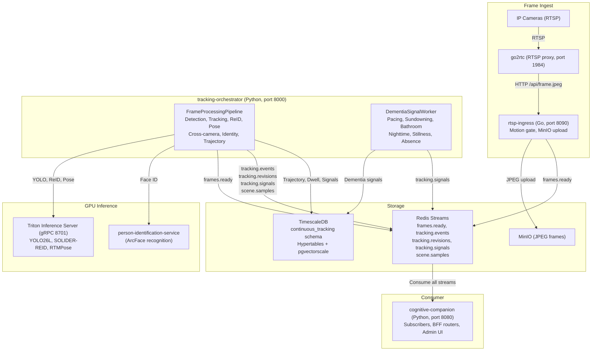

# Continuous Tracking

The Continuous Tracking System (CTS) is a standalone service family at `continuous-tracking/` that provides multi-camera person tracking, Bayesian identity resolution, and dementia-relevant behavioral signal detection. It pulls RTSP camera streams, processes frames through a GPU-accelerated inference pipeline, and publishes results to Redis Streams. Cognitive Companion consumes these streams as a BFF gateway: every browser, MCP, and rule-engine path into CTS goes through the CC backend.

## When CTS is needed

Cognitive Companion without CTS provides single-frame perception: each camera event is an isolated batch analyzed by a vision LLM. This is sufficient for "is the stove on?" and "who is at the door?". It is not sufficient for questions that require continuous temporal context:

- Has a person been pacing in the hallway for the last 20 minutes?
- Is a bathroom dwell longer than the person's historical baseline?
- Is there a sundowning pattern building over the afternoon?
- Has a person left the house and not returned within their usual window?

CTS answers these by maintaining persistent, multi-camera tracks with stable identity over time.

## System architecture

**Infrastructure**: TimescaleDB + pgvectorscale (StreamingDiskANN), Redis Streams (AOF), MinIO, Triton Inference Server. All inference runs on-premise via NVIDIA GPU (TensorRT/CUDA ONNX Runtime).

## Redis Streams

CTS publishes and consumes raw protobuf bytes: no JSON, no base64. All streams use the `continuoustracking.v1` proto package. The Python codec lives at `app/transport/codec.py`.

| Stream | Direction | Field | Proto message |
|--------|-----------|-------|---------------|
| `frames.ready` | consume (CTS reads) | `"frame"` | `FrameReady` |
| `tracking.events` | publish (CTS writes) | `"event"` | `TrackingEvent` |
| `tracking.revisions` | publish | `"revision"` | `IdentityRevision` |
| `tracking.signals` | publish | `"signal"` | `DementiaSignal` |
| `scene.samples` | publish | `"sample"` | `SceneSample` |

::: warning
Redis clients must set `decode_responses=False` so binary payloads round-trip unchanged.
:::

## PostgreSQL schema

All CTS tables, indexes, triggers, and functions live in the `continuous_tracking` schema on the shared PostgreSQL instance. SQL migrations (`0001` to `0006` in `tracking-orchestrator/migrations/`) are managed by `MigrationRunner` with `pg_try_advisory_lock` for multi-replica safety.

Key hypertables:

| Table | Type | Content |
|-------|------|---------|
| `tracking_events` | Hypertable | Per-frame tracking events with detections and identities |
| `person_trajectories` | Hypertable | Per-frame trajectory points with floor coordinates, posture, motion energy |
| `room_dwells` | Regular | Continuous room occupancy intervals with cumulative metrics |
| `dementia_signals` | Regular | Behavioral signal detections with severity and z-scores |
| `dementia_signals_daily` | Continuous aggregate | Daily rollup of signal counts by kind and severity |
| `tagged_keyframes` | Regular | Sampled JPEG keyframes with annotations |
| `global_tracks` | Regular | Cross-camera track entities with identity assignments |
| `tracklets` | Regular | Per-camera track fragments with gallery embeddings |

## Boundaries

- Do not write to `dementia_signals` or `cts_cameras` tables outside the CTS services.
- Do not subscribe to `tracking.*` or `scene.*` streams outside the CC subscriber layer.
- Do not bypass the BFF: there is no path from browser or MCP into CTS internals that does not go through CC routers.
- Do not duplicate `_cts_enabled()`, `ns_to_iso()`, or `parse_ts()`. Import them from CC's CTS utility modules.

## Related pages

- [Frame Processing Pipeline](/features/continuous-tracking/frame-pipeline): detection, tracking, ReID, cross-camera association, Bayesian identity resolution, and the identity feedback loop
- [Dementia Signal Detection](/features/continuous-tracking/dementia-signals): signal kinds, hysteresis, baseline computation, and configuration
- [CC Integration](/features/continuous-tracking/cc-integration): enabling CTS, subscribers, rule examples, presence chain, and per-person alert profiles
- [Person Tracking](/features/person-tracking): single-camera face recognition, camera topology, room transitions
- [Composable Pipelines](/features/pipeline): full step-type reference and rule examples
- [Architecture](/guide/architecture): system overview including CTS subsystem
