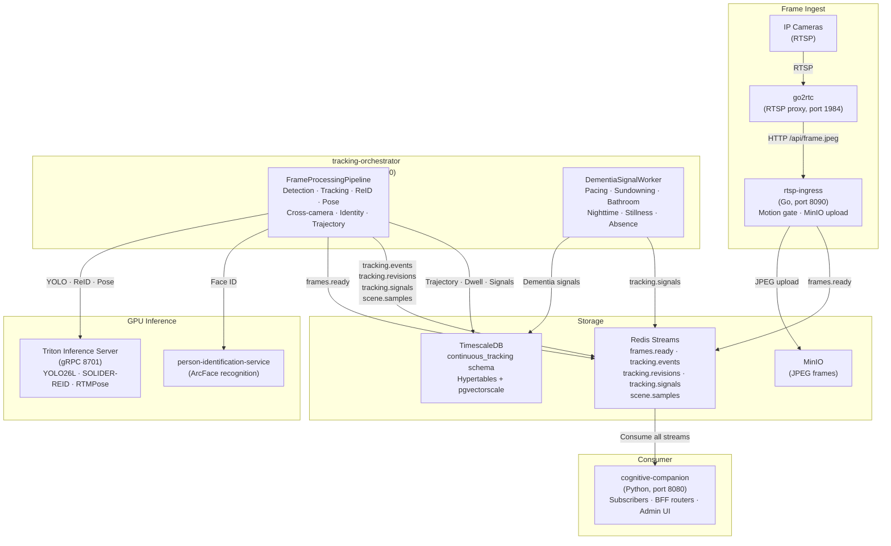

# Continuous Tracking

The Continuous Tracking System (CTS) is a standalone service family at `continuous-tracking/` that provides multi-camera person tracking, Bayesian identity resolution, and dementia-relevant behavioral signal detection. It pulls RTSP camera streams, processes frames through a GPU-accelerated inference pipeline, and publishes results to Redis Streams. Cognitive Companion consumes these streams as a BFF gateway — every browser, MCP, and rule-engine path into CTS goes through the CC backend.

## When CTS is needed

Cognitive Companion without CTS provides single-frame perception: each camera event is an isolated batch analyzed by a vision LLM. This is sufficient for "is the stove on?" and "who is at the door?". It is not sufficient for questions that require continuous temporal context:

- Has a person been pacing in the hallway for the last 20 minutes?
- Is a bathroom dwell longer than the person's historical baseline?
- Is there a sundowning pattern building over the afternoon?
- Has a person left the house and not returned within their usual window?

CTS answers these by maintaining persistent, multi-camera tracks with stable identity over time.

## System architecture



**Infrastructure**: TimescaleDB + pgvectorscale (StreamingDiskANN) · Redis Streams (AOF) · MinIO · Triton Inference Server. All inference runs on-premise via NVIDIA GPU (TensorRT/CUDA ONNX Runtime).

## Frame processing pipeline

The orchestrator's `FrameProcessingPipeline` (`app/pipeline/frame_pipeline.py`) runs these stages per frame:

### 1. Frame fetch

JPEG frames are fetched from MinIO using the key published in the `FrameReady` proto message. Frames older than 30 s are dropped as stale replay backlog.

### 2. Person detection

YOLO26L ONNX runs on Triton, returning normalized bounding boxes with confidence scores. Post-decode IoU deduplication suppresses near-duplicate detections that survive the model's baked NMS (configurable threshold, default 0.55).

### 3. Privacy zone enforcement

Operator-drawn privacy polygons (configured at `/admin/cts/privacy`) are applied:
- **Blur/mask**: pixels inside privacy zones are obscured in the frame before any further processing
- **Detection drop**: detections whose foot-point falls in a drop zone are discarded before tracking

### 4. ReID appearance embedding

Per-detection person crops are sent to the SOLIDER-REID ONNX model on Triton. The resulting 768-dimensional embedding is used by the tracker's appearance cost matrix and by the downstream gallery-based identity resolver.

### 5. Pose estimation

Per-detection crops are sent to the RTMPose ONNX model on Triton. Keypoint outputs feed into posture classification (`lying`, `sitting`, `standing`, `unknown`) and motion energy tracking (mean keypoint velocity in pixels/second). Crops smaller than 16×32 are skipped.

### 6. Per-camera tracking (BoT-SORT)

Each camera gets an isolated `PerCameraTracker` with a 2D Kalman filter per track. Association uses the Hungarian algorithm on a combined cost matrix:

```
cost = (1 - α) × IoU_cost + α × embedding_distance
```

Where α = 0.5 (configurable). Tracks without embedding history use IoU-only cost to avoid artificial advantage from a neutral embedding. New tracklets that overlap stable tracklets (age ≥ 5, IoU > 0.7) are deduplicated to suppress ghost re-detections.

### 7. Tracklet management

The `TrackletManager` manages lifecycle across cameras:
- **Hit ratio gate**: tracklets with too many missed frames are closed
- **Stability gate** (default: 3 frames): tracklets below the threshold are withheld from cross-camera association, identity resolution, and publication
- **Gallery append**: high-quality embeddings from confirmed tracklets are stored in the gallery for downstream ReID lookups
- **Close grace**: tracklets persist briefly after their last detection before termination

### 8. Face identification

Per-camera, rate-limited calls to the person-identification-service. Person crops are sent at native resolution to `POST /api/v1/identify`. The ArcFace-based service returns face detections with identity assignments and confidence scores. The effective confidence threshold is resolved per camera: Cognitive Companion's camera config takes precedence, with a `FACE_ID_CAMERA_CONFIDENCE` env var as fallback.

Per-camera cooldown (default: 5 s) prevents redundant calls. Face identification can be disabled per camera (e.g., top-down surveillance views where faces are not visible).

### 9. Cross-camera association

The `CrossCameraAssociator` merges tracklets from different cameras into `GlobalTrack` entities using:

- **Appearance similarity**: cosine similarity between mean gallery embeddings per tracklet
- **Floor geometry**: exponential decay of calibrated floor-plane distance through per-camera homography matrices
- **Adjacency graph**: operator-configured camera topology with min/max transit times, reachability budgeting, and overlap groups

The combined association score is:

```
score = α × appearance_sim + (1 - α) × exp(-(dist_m / sigma)²)
```

Where α = 0.7, sigma = 1.5 m. Pairs exceeding `max_floor_distance_m` (8 m) are pruned. Overlap group pairs (cameras sharing physical field of view) use a relaxed minimum score threshold (0.35 vs 0.55).

### 10. Bayesian identity resolution

The `IdentityResolver` maintains a posterior probability distribution for each GlobalTrack over `{known_identities ∪ UNKNOWN}`. Three evidence sources are combined:

**Temporal prior.** Encodes continuity from the previous identity assignment with `prior_weight = 0.6`. The remaining mass is spread uniformly over other known identities, plus an `unknown_mass` floor (0.05). Identity persists for `prior_maintenance_max_age_s` (120 s) without new evidence; beyond that window, the prior alone is insufficient and the track reverts to UNKNOWN.

**Face likelihood.** Face anchors from the person-identification-service carry a `p_face` probability derived from a sigmoid of confidence and quality. The face anchor with the highest `confidence × quality` product is selected per GlobalTrack. Face evidence receives a `face_weight_multiplier` of 3.0 over ReID evidence — ArcFace is more reliable than body appearance for disambiguating identities in multi-person households.

**ReID likelihood.** Gallery k-NN search retrieves similar embeddings from stored tracklet galleries. Similarity scores pass through a logistic curve (midpoint at 0.70 similarity, steepness k = 10) to produce per-identity likelihoods.

**Posterior combination.** The posterior is the product of all three sources, with missing sources treated as uniform (weight = 1.0) to avoid dilution:

```
posterior(identity) = prior(identity) × face_likelihood(identity) × reid_likelihood(identity)
```

### 11. Identity committer

The `IdentityCommitter` buffers per-frame posterior evidence and emits commit decisions on a configurable window (default: 3 s). Two paths exist:

**Buffered windowed commit.** Posterior evidence accumulates over the window. At flush, the commit rule is applied: an identity is committed when `top_prob ≥ commit_prob` (0.65) AND `margin ≥ commit_margin` (0.25) AND at least one non-prior evidence source supports the top identity.

**High-confidence face fast-path.** Face anchors with confidence ≥ 0.85 (configurable) trigger an immediate commit that rewrites history back to the track's `started_at` time via cross-table identity rewriting.

**Dense scene detection.** When two or more candidate identities each have posterior > 0.3, escalated thresholds are used (`commit_prob_dense = 0.80`, `commit_margin_dense = 0.20`) to prevent confident-but-wrong commits from ambiguous ReID evidence in multi-person frames.

### 12. Trajectory writing

The `TrajectoryWriter` records two types of data in TimescaleDB hypertables:

- **`person_trajectories`**: one row per frame per tracked person, with identity, room, floor-projected coordinates, posture, motion energy, and identity confidence
- **`room_dwells`**: continuous intervals in a room with entry/exit times, cumulative dwell, still-seconds, min/max/mean motion energy, and dominant posture

Floor projection uses per-camera 3×3 homography matrices calibrated via OpenCV RANSAC from operator-provided pixel-to-floor correspondences. When homography is unavailable, uncalibrated (0, 0) floor points are written.

### 13. Keyframe sampling

The `KeyframeSampler` saves tagged JPEG keyframes to the `tagged_keyframes` table and publishes `SceneSample` protos to the `scene.samples` Redis stream. Two triggers:
- **Periodic**: one keyframe per tracklet per configurable sampling interval
- **Identity change**: an immediate keyframe when a tracklet's identity is revised

Keyframes carry annotations (tracklet ID, camera ID, identity ID, bounding box) used by the CC-side `SceneSampleSubscriber` for downstream scene analysis.

### 14. Identity revisions

When the committed identity changes (new assignment, reassignment, or demotion to UNKNOWN), an `IdentityRevision` proto is published to `tracking.revisions`. The revision carries the full posterior distribution as `IdentityCandidate` entries, the previous and new identity IDs, and evidence metadata (top probability, margin). A rate limiter caps revisions at 3 per GlobalTrack per minute.

When the identity committer is enabled, the `PostgresIdentityRewriter` performs retroactive cross-table rewriting: trajectory points, room dwells, and dementia signals for the affected GlobalTrack are relabeled from the old identity to the new identity, covering the window from `applies_from` to `applies_to`.

### 15. Event publishing

The final `TrackingEvent` proto is published to `tracking.events`. It carries per-frame detections enriched with `tracklet_id` and `global_track_id`, the posterior's top identity per GlobalTrack (even before formal commit), pose keypoints, and per-tracklet foot-point trails. This event is what the CC-side `TrackingEventSubscriber` consumes to update `PersonLocationState` and broadcast live view WebSocket frames.

## Dementia signal detection

A periodic worker (`DementiaSignalWorker`) runs every 60 s (configurable) and computes six signal kinds per tracked identity. Each signal is persisted via upsert with a deterministic UUID5 so the same detection window always maps to the same row.

### Signal computation

All signals use robust z-scores (median + MAD) against per-person historical baselines fetched from the `BehaviorBaselineRepository`. A configurable hysteresis system prevents flicker:

- **Onset debounce**: a trigger condition must hold for `min_consecutive` runs (default: 2) before first emission
- **Cooldown**: after emission, the same (identity, kind) is suppressed for `cooldown_minutes` (default: 60) unless severity escalates
- **Severity monotonic**: within an active episode, severity only increases; the episode closes when the trigger condition clears

Incremental window computation (enabled by default) merges new trajectory/dwell data with rolling state from previous runs, avoiding re-fetching the full 24-hour window on each cycle.

### Signal kinds

| Kind | Trigger | Baseline | Severity tiers |
|------|---------|----------|----------------|
| `pacing` | Repeated room transitions in a 30 min window, normalized for observation density. Minimum 8 transitions and 2 unique rooms. Purpose-driven ambulation (kitchen, living room, bathroom) typically produces 5-6 transitions; 8+ in 30 min identifies repetitive, purposeless movement. | 30-day hourly activity transition rates | `info` (>0.15 rate), `warning` (>0.3 rate), `emergency` (rate-based) |
| `sundowning_index` | Evening (17:00-22:00 local) room transition rate vs 14-day evening baseline. Minimum 30 evening observation-minutes. | 14-day evening-window activity | `info` (mod-z ≥ 2.5), `warning` (≥ 3.0), `emergency` (≥ 4.0) |
| `bathroom_dwell_anomaly` | Current open bathroom dwell vs 30-day closed-dwell duration baseline. Nighttime (22:00-06:00) uses a relaxed z-threshold (4.0 vs 3.5). Cold start (before 5+ baseline samples): absolute 45 min threshold, severity capped at `warning`. | 30-day dwell durations | `info` (z ≥ 3.5), `warning` (z ≥ 4.0), `emergency` (z ≥ 5.0) |
| `nighttime_movement` | Room transitions during 22:00-06:00 local time. Cold start: flat threshold of 3 transitions (one bathroom trip returns 2 transitions; 3+ indicates additional nocturnal movement). | 14-day hourly activity | `info`, `warning` (z ≥ 3.0), `emergency` (z ≥ 4.0) |
| `stillness_anomaly` | Sustained near-zero motion energy in a non-resting posture (lying in non-bedroom, or prolonged sitting/standing). Default threshold: 60 min. Desk work, reading, and TV watching routinely exceed 30 min without clinical concern; 60 min aligns with clinical guidelines for meaningful seated immobility. Resting rooms are configurable (default: "bed", "bedroom"). | 30-day stillness episode durations | Posture-aware: `lying` starts at `warning` (escalates to `emergency` at 120 min); `sitting`/`standing` starts at `info` at threshold (upgrades to `warning` at 2× threshold) |
| `absence` | No detection for > 60 min (configurable). Cameras do not cover every room; 30 min gaps are normal (cooking, porch, bathroom). Hourly context from 14-day baseline: if the person is historically frequently absent at this hour, severity is demoted. | 14-day hourly activity | `info` (>60 min), `warning` (>120 min), `emergency` (>180 min); demoted by `expected_absence_prior` |

### Signal structure

Each `DementiaSignal` carries:

| Field | Description |
|-------|-------------|
| `signal_id` | Deterministic UUID5 from `(identity, kind, window_start, window_end)` |
| `identity_id` | Tracked person |
| `signal_kind` | One of the 6 kinds above |
| `severity` | `info`, `warning`, or `emergency` |
| `value` | Raw metric value (rate, duration, transition count) |
| `baseline` | Historical median from the 30-day baseline |
| `z_score` | Modified z-score against the baseline |
| `window_start` / `window_end` | Detection window (UTC) |
| `algorithm_version` | Version stamp for signal evolution (currently 3) |
| `context` | Structured JSON payload with kind-specific details |

Acknowledging a signal in the admin UI sets `acknowledged_at`, which the `dementia_signal` filter uses for cooldown.

### Configuring signal thresholds

All signal thresholds are configurable via environment variables, with defaults set to clinically validated values. Override any threshold in the tracking orchestrator's `config/settings.yaml` or via environment variable:

```yaml
# tracking-orchestrator/config/settings.yaml
signal:
  interval_s: "${SIGNAL_INTERVAL_S:-60}"
  stillness_threshold_minutes: "${SIGNAL_STILLNESS_THRESHOLD_MINUTES:-60}"
  stillness_emergency_minutes: "${SIGNAL_STILLNESS_EMERGENCY_MINUTES:-120}"
  stillness_motion_floor: "${SIGNAL_STILLNESS_MOTION_FLOOR:-0.02}"
  pacing_room_threshold: "${SIGNAL_PACING_ROOM_THRESHOLD:-8}"
  pacing_window_minutes: "${SIGNAL_PACING_WINDOW_MINUTES:-30}"
  nighttime_transition_threshold: "${SIGNAL_NIGHTTIME_TRANSITION_THRESHOLD:-3}"
  absence_threshold_minutes: "${SIGNAL_ABSENCE_THRESHOLD_MINUTES:-60}"
  bathroom_absolute_threshold_seconds: "${SIGNAL_BATHROOM_COLD_START_S:-2700}"
```

| Environment variable | Default | Description |
|---------------------|---------|-------------|
| `SIGNAL_INTERVAL_S` | `60` | How often the signal worker runs (seconds) |
| `SIGNAL_STILLNESS_THRESHOLD_MINUTES` | `60` | Minimum stillness duration before triggering `stillness_anomaly` at `info` severity |
| `SIGNAL_STILLNESS_EMERGENCY_MINUTES` | `120` | Stillness duration that escalates `lying` posture to `emergency` severity |
| `SIGNAL_STILLNESS_MOTION_FLOOR` | `0.02` | Motion energy below this value is treated as stillness. Normal physiological ambient motion (breathing, micro-adjustments) is approximately 0.01-0.02. |
| `SIGNAL_PACING_ROOM_THRESHOLD` | `8` | Minimum room transitions in the pacing window to trigger `pacing` |
| `SIGNAL_PACING_WINDOW_MINUTES` | `30` | Rolling window for pacing transition counting (minutes) |
| `SIGNAL_NIGHTTIME_TRANSITION_THRESHOLD` | `3` | Cold-start flat threshold for `nighttime_movement` (transitions per night) |
| `SIGNAL_ABSENCE_THRESHOLD_MINUTES` | `60` | Minimum undetected duration before triggering `absence` at `info` severity |
| `SIGNAL_BATHROOM_COLD_START_S` | `2700` | Cold-start absolute threshold for `bathroom_dwell_anomaly` (seconds; 2700 s = 45 min) |

## Redis Streams

CTS publishes and consumes raw protobuf bytes — no JSON, no base64. All streams use the `continuoustracking.v1` proto package. The Python codec lives at `app/transport/codec.py`.

| Stream | Direction | Field | Proto message |
|--------|-----------|-------|---------------|
| `frames.ready` | consume (CTS reads) | `"frame"` | `FrameReady` |
| `tracking.events` | publish (CTS writes) | `"event"` | `TrackingEvent` |
| `tracking.revisions` | publish | `"revision"` | `IdentityRevision` |
| `tracking.signals` | publish | `"signal"` | `DementiaSignal` |
| `scene.samples` | publish | `"sample"` | `SceneSample` |

::: warning
Redis clients must set `decode_responses=False` so binary payloads round-trip unchanged.
:::

## Integration with Cognitive Companion

This section covers how Cognitive Companion consumes CTS data. Every browser, MCP, and rule-engine path into CTS goes through the CC backend.

### Enabling CTS in CC

```yaml
# cognitive-companion/config/settings.yaml
cts:
  enabled: true
  consumer_id: "${HOSTNAME}"
  tracking_events_stream: "tracking.events"
  revisions_stream: "tracking.revisions"
  signals_stream: "tracking.signals"
  scene_samples_stream: "scene.samples"
  lock_seconds: 60
  jwt:
    private_key_pem: "${CTS_JWT_PRIVATE_KEY_PEM}"
    kid: "cts-svc-key-1"
  upstream:
    rtsp_ingress:
      url: "${CTS_INGRESS_URL}"
      timeout_s: 5.0
    tracking_orchestrator:
      url: "${CTS_ORCHESTRATOR_URL}"
      timeout_s: 5.0

cts_ui:
  calibration_enabled: true
  dashboard_enabled: true
  live_view_enabled: true
```

When `cts.enabled` is false, all CTS routers return `404 {"code": "cts.disabled"}` and no CTS subscribers are started.

### Stand up the CTS services

```bash
cd ../continuous-tracking
docker compose up -d postgres redis minio    # infra
docker compose up -d                          # services
```

The services are: `go2rtc` (RTSP proxy, port 1984), `rtsp-ingress` (Go, port 8090), `tracking-orchestrator` (Python, port 8000), Triton (gRPC 8701), Redis (6379), PostgreSQL (5432), MinIO (9000).

### Add cameras and calibrate

Add cameras through the admin UI at `/admin/cts/cameras` with an ID slug, display name, `rtsp_url`, and location. `rtsp-ingress` polls `GET /api/v1/cts/cameras` every 60 s and reconciles the running set with `go2rtc` automatically.

For multi-camera dwell and absence signals, calibration is required:

- **Homography**: at `/admin/cts/calibration`, click pixel-to-floor correspondences on a snapshot to fit a 3×3 matrix per camera via OpenCV RANSAC
- **Privacy zones**: at `/admin/cts/privacy`, draw polygons over private regions. Frames are masked before they leave the LAN
- **Adjacency graph**: at `/admin/cts/adjacency`, declare which cameras can see the same person consecutively, with min/max transit times

### Tune the presence chain

`config/presence.yaml` defines the priority chain for person location resolution:

```yaml
providers:
  - name: night_anchor      # priority 90: bed-occupancy + light state
  - name: ha_bed_sensor     # priority 70: HA binary_sensor for bed
  - name: cts_location      # priority 50: CTS PersonLocationState
  - name: ha_device_tracker # priority 30: phone or watch tracker
  # plus stale_fallback and unknown_sentinel
```

Changes apply on `POST /api/v1/cts/presence-config/reload` without a restart.

### CC subscribers

When `cts.enabled` is true, the CC backend starts four Redis Streams subscribers that consume protobuf-encoded messages:

| Subscriber | Stream | Effect |
|------------|--------|--------|
| `TrackingEventSubscriber` | `tracking.events` | Updates `PersonLocationState` and writes `PersonLocationHistory` via `LocationWriter` and `SourceAuthority` (CTS-precedence lock controlled by `cts.lock_seconds`). Room name is taken from the `TrackingEvent` proto when present; when absent, `LocationWriter` falls back to the camera-to-room mapping loaded from `cts_cameras` at startup. Broadcasts `cts_live_frame` WebSocket messages for the live tracking view. |
| `IdentityRevisionSubscriber` | `tracking.revisions` | Soft-deletes superseded `PersonLocationHistory` rows via `IdentityRewriter` and inserts corrected entries. |
| `DementiaSignalSubscriber` | `tracking.signals` | Persists `DementiaSignal` via `SignalStore`; fires a trigger event for any rule with a matching `dementia_signal` filter. |
| `SceneSampleSubscriber` | `scene.samples` | Decodes tagged keyframe `SceneSample` protos, pulls the JPEG from MinIO, runs scene analysis (YOLO + Florence-2 + CLIP + hazards), and persists observations to semantic memory. |

### Rule examples

#### Pacing detection

**Filters:**

| Filter | Config |
|--------|--------|
| `dementia_signal` | `kind: pacing`, `severity_min: warning`, `cooldown_minutes: 30` |
| `home_state` | `person_id: grandma`, gate on `at_home` |

**Pipeline:**

```text
1. presence_query        person_id: grandma  (output_key: presence)
2. condition             expression: presence_dwell_minutes > 5
                         on_true → step 3, on_false → end
3. notification          channels: [telegram, pwa_realtime_ai]
                         telegram_template: "Grandma is pacing in {{presence_room_name}}."
```

#### Sundowning escalation

**Filters:** `dementia_signal` (`kind: sundowning_index`, `severity_min: info`), `time_range` (`16:00 - 21:00`)

**Pipeline:**

```text
1. notification          channels: [pwa_realtime_ai]
                         pwa_realtime_ai_template: "Hi grandma, the sun is going down. How about a glass of water?"
2. wait                  duration_minutes: 15
3. presence_query        person_id: grandma  (output_key: presence)
4. condition             expression: presence_recent_signals
                                       | filter(kind == "sundowning_index" and severity != "info")
                                       | length > 0
                         on_true → step 5, on_false → end
5. notification          channels: [telegram]
                         alert_level: warning
```

#### Bathroom dwell anomaly

**Filters:** `dementia_signal` (`kind: bathroom_dwell_anomaly`, `severity_min: warning`, `cooldown_minutes: 30`)

The `cooldown_minutes` field checks `DementiaSignal.acknowledged_at` and suppresses the rule when a recent acknowledgment exists.

**Pipeline:**

```text
1. notification          channels: [telegram, pwa_popup_text]
                         alert_level: warning
                         telegram_template: "Grandma has been in the bathroom for {{trigger.signal.details.minutes}} min."
```

#### Unexplained absence

**Filters:** `dementia_signal` (`kind: absence`, `severity_min: warning`), `home_state` (`grandma`, `away`)

**Pipeline:**

```text
1. notification          channels: [telegram]
                         alert_level: emergency
                         telegram_template: "Grandma left the house at {{trigger.signal.started_at}} and has not returned."
```

## Boundaries

- Do not write to `dementia_signals` or `cts_cameras` tables outside the CTS services.
- Do not subscribe to `tracking.*` or `scene.*` streams outside the CC subscriber layer.
- Do not bypass the BFF: there is no path from browser or MCP into CTS internals that does not go through CC routers.
- Do not duplicate `_cts_enabled()`, `ns_to_iso()`, or `parse_ts()`. Import them from CC's CTS utility modules.

## PostgreSQL schema

All CTS tables, indexes, triggers, and functions live in the `continuous_tracking` schema on the shared PostgreSQL instance. SQL migrations (`0001`–`0006` in `tracking-orchestrator/migrations/`) are managed by `MigrationRunner` with `pg_try_advisory_lock` for multi-replica safety.

Key hypertables:

| Table | Type | Content |
|-------|------|---------|
| `tracking_events` | Hypertable | Per-frame tracking events with detections and identities |
| `person_trajectories` | Hypertable | Per-frame trajectory points with floor coordinates, posture, motion energy |
| `room_dwells` | Regular | Continuous room occupancy intervals with cumulative metrics |
| `dementia_signals` | Regular | Behavioral signal detections with severity and z-scores |
| `dementia_signals_daily` | Continuous aggregate | Daily rollup of signal counts by kind and severity |
| `tagged_keyframes` | Regular | Sampled JPEG keyframes with annotations |
| `global_tracks` | Regular | Cross-camera track entities with identity assignments |
| `tracklets` | Regular | Per-camera track fragments with gallery embeddings |

## Related pages

- [Person Tracking](/features/person-tracking): single-camera face recognition, camera topology, room transitions
- [Composable Pipelines](/features/pipeline): full step-type reference and rule examples
- [MCP Integration](/features/mcp-integration): exposing CTS read-only views to AI agents
- [Architecture](/guide/architecture): system overview including CTS subsystem
