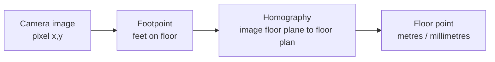

# Camera to Floor Basics

This series starts with the simplest question: how does a camera view become a point on a floor plan?

A camera image is made of pixels. A floor plan is measured in metres. The Continuous Tracking System (CTS) has to convert between those two spaces before it can answer room-level questions such as "who is in the kitchen?" or "did someone walk from the hall to the bathroom?"

## What the camera sees

A home camera usually sees a mix of floor, walls, furniture, doors, and people. CTS does not try to project every pixel in that image onto the floor. For person tracking, it only needs one point: where the person's feet touch the floor.

That point is called the footpoint. For a detection box, CTS starts with the bottom centre of the box:

```text
footpoint_px = ((x_min + x_max) / 2, y_max)
```

If pose keypoints are available, CTS also checks whether the ankles are visible. A clipped detection box or missing ankles can make the footpoint unreliable, even when the camera itself is calibrated.

## Pixels and floor coordinates

Pixel coordinates answer "where is this point in the camera image?" Floor coordinates answer "where is this point in the home?"



The domain type `FloorPoint` stores floor position in millimetres. The tracker state stores the same position in metres because the Kalman filter and covariance math are in metres.

## Homography

A homography is a plane-to-plane map. During calibration, the operator or auto-calibration flow supplies matching points:

| Camera image | Floor plan |
| --- | --- |
| this pixel on the floor | this known floor-plan point |

With enough matched floor points, `tracking-orchestrator/app/calibration/homography.py::compute_homography` fits the transform. Walls do not corrupt that fit because unpicked wall pixels are not part of the input.

At runtime, `tracking-orchestrator/app/tracking/floor_projector.py::project_with_covariance` projects the footpoint through the homography. Walls do not corrupt person localization either, because CTS projects the footpoint, not the image border or the wall behind the person.

## What happens when calibration is missing

Some cameras may not have a usable homography yet. CTS can still keep a person hypothesis (PH), the tracker object for one physical person, alive by creating a synthetic per-camera floor tile. Those points are marked `calibrated=False`. They are useful for continuity, but they do not carry homography-derived uncertainty and contribute less to fused floor position.

## Why footpoint reliability matters

Calibration answers "does this camera know the floor plane?" Footpoint reliability answers "is this particular detection's floor contact point trustworthy?"

CTS keeps unreliable observations instead of dropping them. It marks `footpoint_reliable=False` and inflates the measurement uncertainty before fusion. That lets another camera or the tracker prediction carry the estimate without pretending the bad footpoint is precise.

## Code references

| Concern | Code |
| --- | --- |
| Homography fit | `tracking-orchestrator/app/calibration/homography.py::compute_homography` |
| Footpoint projection | `tracking-orchestrator/app/tracking/floor_projector.py::project_with_covariance` |
| Footpoint reliability | `tracking-orchestrator/app/tracking/world/observation_model.py::footpoint_reliable` |
| Floor point domain type | `tracking-orchestrator/app/domain/__init__.py::FloorPoint` |

Next: [Why One Dot Jitters](./02-why-one-dot-jitters.md)
