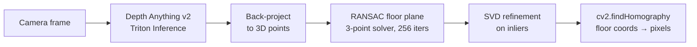
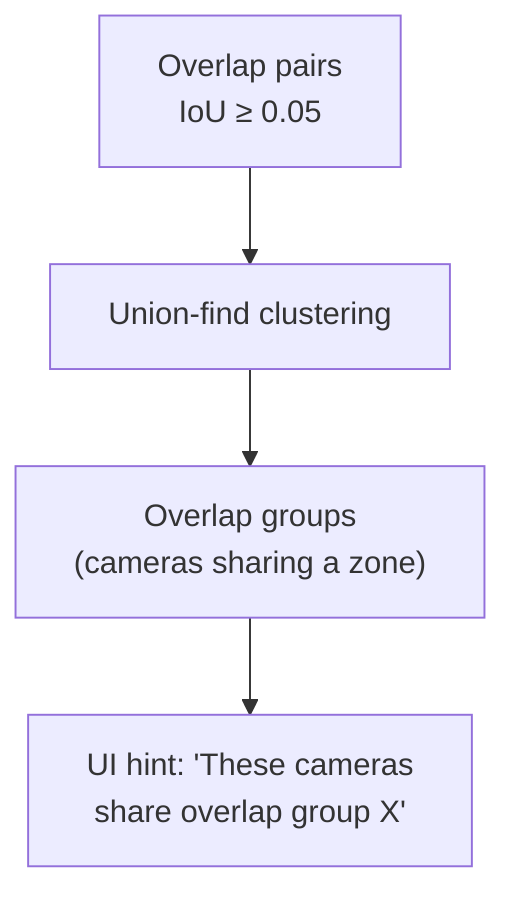

# Camera Calibration

How homography calibration, visibility polygons, overlap groups, and adjacency edges work together to enable cross-camera person tracking on a floor plan.

## Overview

CTS tracking within a single camera uses pixel coordinates. For cross-camera association, the system needs to know where each camera is looking on the floor plan. This requires three things:

1. **Homography**: a 3x3 matrix that maps camera pixel coordinates to floor-plan meter coordinates
2. **Visibility polygon**: the area on the floor plan that a camera can see, computed from the homography
3. **Adjacency edges**: directed transit-time constraints that gate which cameras a person could physically move between

With all three configured, the cross-camera associator can compute geometric scores: "these two detections are 1.2 meters apart on the floor plan." Without them, it falls back to appearance-only matching, which produces both false merges (different people linked because they look similar) and missed merges (the same person not linked because ReID similarity is below threshold).

## Homography calibration

A homography is a planar projective transformation. Given at least four pixel-to-floor-meter point correspondences, the system fits a 3×3 matrix `H` such that `H · [px, py, 1]ᵀ ∝ [fx, fy, 1]ᵀ`.

### Algorithm

The orchestrator uses OpenCV's `findHomography` with the RANSAC method:

```python
# tracking-orchestrator/app/calibration/homography.py
h_raw, _ = cv2.findHomography(src, dst, cv2.RANSAC, ransacReprojThreshold=3.0)
```

- **Input**: N ≥ 4 pixel → floor-meter point pairs
- **Output**: 3×3 matrix (row-major nested list) plus per-point reprojection residuals
- **RANSAC threshold**: 3.0 (pixel-space inlier distance)
- **Fails if**: points are collinear, fewer than 4 inliers, or `findHomography` does not converge

### Residuals and quality

After fitting, every input point is projected through the matrix and compared to its target:

```
residual[i] = euclidean_distance(H @ pixel[i], floor[i])
```

| Max residual | Status | Action |
|---|---|---|
| ≤ 0.25 m | `ok` | Accepted |
| ≤ 0.5 m | `warning` | Accepted, review recommended |
| > 0.5 m | `error` | Rejected with HTTP 400 |

Residuals are stored on `cts_cameras.homography_residuals` and displayed per-point in the calibration UI.

### Manual calibration (click-to-pick)

1. Load a camera snapshot
2. Click a point on the camera image to capture its pixel coordinate
3. Click the corresponding point on the floor plan to capture its meter coordinate
4. Repeat for at least 4 points spread across the camera frame
5. The homography preview updates on each point change (debounced)
6. Click **Calibrate** to save

Pixel coordinates are converted from screen-space to native camera resolution by compensating for `object-fit: contain` letterboxing. Floor coordinates are computed as `normalized_position × floor_plan_width_px × meters_per_pixel`.

### Auto-calibration (depth-based)

The auto-calibrate button uses the Depth Anything v2 model running on Triton to estimate metric depth from a single camera frame, then fits a floor plane via RANSAC and derives a homography without manual point placement:



**Confidence** is computed as `inlier_ratio × tightness` where `tightness = max(0, 1 − mean_inlier_distance / 0.2)`. Confidence below 0.10 rejects the result. A warning is shown below 0.50.

After auto-calibration, use the **Refine manually** button to populate 9 calibration points from the auto-computed matrix. Adjust any misaligned points, then re-save for improved accuracy.

## Visibility polygons

A visibility polygon is the projection of the camera's image boundary through the homography onto the floor plan. It answers: "what area of the floor plan does this camera see?"

### Computation

The function `compute_visibility_from_homography` in `backend/services/cts_visibility.py`:

1. Samples 80 points along the four edges of the camera image (20 points per edge)
2. Projects each through the homography matrix to get floor-meter coordinates
3. Dehomogenizes: `floor = [x/w, y/w]` for each projected point
4. Normalizes to [0, 1] relative to floor plan dimensions: `x_norm = floor_x_m / (fp_width_px × mpp)`
5. Returns 80 `[x_norm, y_norm]` pairs, or `None` if degenerate

The polygon is stored as `JSONB` on `cts_cameras.visibility_polygon` and updated automatically after every homography save.

### Degeneracy checks

The polygon computation returns `None` (degenerate) when any of these conditions hold:

| Condition | Meaning |
|---|---|
| `abs(w) < 1e-9` for any point | A boundary point projects to infinity (homography is singular) |
| `x_norm < -1.5` or `x_norm > 2.5` | Point projects more than 1.5 floor-plan-widths outside the plan |
| `y_norm < -1.5` or `y_norm > 2.5` | Same for Y axis |
| Floor plan dimensions ≤ 0 | Scale not configured |

When degenerate, the visibility polygon column stays `NULL`. The calibration result now includes `visibility_polygon_computed` (bool) and `visibility_polygon_warning` (string) so the operator knows immediately whether the coverage map will update.

### Floor plan scale

The most common cause of degenerate projections is an incorrect `floor_meters_per_pixel` value. This value converts floor-plan image pixels to real-world meters and is set in **Admin → Floor Plan → Upload tab**.

```text
mpp = known_real_world_distance_m / pixel_count_of_that_distance
```

For example: if a doorway known to be 1.0 m wide spans 68 pixels on the floor plan image, `mpp = 1.0 / 68 = 0.014706`.

If the uploaded floor plan has margins (borders, legends, whitespace), use the **Trim margins** crop tool before setting the scale. Draw a crop rectangle around the actual floor plan area and apply it: the cropped dimensions are used for all downstream calculations.

## Camera adjacency

The adjacency graph is a **directed transit-time graph** stored in the `cognitive_companion` database. An edge `A → B` with transit bounds `[min_s, max_s]` means: a person can walk from camera A's view into camera B's view in somewhere between `min_s` and `max_s` seconds.

### Why directed

`reachable(from_id=A, to_id=B, within_s=T)` checks only the path from A to B. A one-way edge `A → B` gates:
- Person walking A → B: checked (edge exists)
- Person walking B → A: not gated (falls back to appearance-only)

For bidirectional traffic (hallways, common areas), add both `A → B` and `B → A`. The Admin UI provides a symmetric checkbox: check "Also add reverse direction" to stage both edges with identical transit times in one operation.

### Overlap vs adjacency

These are distinct concepts:

| Type | Meaning | Transit bounds | Edge color |
|------|---------|---------------|------------|
| **Overlap** | Cameras share a physical viewing zone (e.g., two angles of the same doorway). Detections may be simultaneous. | 0–2 s | Green |
| **Adjacent** | Cameras are physically next to each other but do not overlap. Person moves sequentially between views. | 2–15 s | Purple |

Both must be configured for correct cross-camera association.

### Inference from coverage

The "Infer from coverage" button on the Adjacency page analyzes visibility polygons with Shapely geometry:

1. Computes IoU (intersection over union) for every camera pair
2. **IoU ≥ 0.05**: marks as overlap, suggests 0–2 s transit, creates bidirectional edges
3. **IoU < 0.05 but centroids within 35% of floor-plan width**: marks as adjacent, suggests 2–15 s transit, creates bidirectional edges
4. Cameras without visibility polygons are skipped and reported

Inference produces bidirectional edges for all detected pairs. Review the staged edges (transit times in particular) and adjust before saving.

## Overlap groups

Overlap groups are clusters of cameras whose visibility polygons have IoU above the overlap threshold. They are computed via union-find on the overlap pairs:



In the calibration UI, when the operator selects two cameras that belong to the same overlap group, a hint appears: "These cameras share overlap group X. Apply overlap defaults (0–2 s)." This helps configure adjacency for cameras that cover the same physical area.

### Declared overlap groups (uncalibrated cross-camera)

The IoU clustering above is a calibration-time hint and needs visibility polygons. For uncalibrated cameras that have no homography but still view the same space (a common home case: two shelf-top cameras seeing one room from opposite angles), an operator can declare an overlap group directly. Declared groups are stored in `cts_camera_overlap_groups` and served to the orchestrator at `GET /api/v1/cts/overlap_groups`. CTS uses a declared group two ways:

- **Group-appearance dedup**: two same-perspective uncalibrated observations from different cameras in the group are merged by appearance similarity (`dedup_group_appearance_min_sim = 0.75`), with a face-conflict block, since synthetic-tile floor distance cannot be compared across cameras.
- **Co-presence linking**: when two open PHs in the group resolve to the same committed identity at the same time (the opposite-perspective case, where direct appearance similarity is low), CTS writes a co-presence link instead of merging, so the system shows one person on two views rather than two people.

Operator declaration takes precedence; CTS can also mark a group as learned when two uncalibrated cameras consistently show co-present, identity-consistent PHs.

## Cross-camera association

When a person leaves camera A and appears in camera B, the cross-camera associator computes:

```text
geo_score = exp(−(dist_m / floor_sigma_m)²)
```

where `dist_m` is the Euclidean distance between the two detections' floor positions (computed via homography). This is combined with appearance similarity:

```text
combined = α × appearance_sim + (1 − α) × geo_score
```

| Condition | Behavior |
|---|---|
| Both cameras calibrated, same floor plan | Full geometric scoring |
| One camera uncalibrated | Neutral `geo_score = 0.5` |
| Different floor plan IDs | Pair pruned (cannot compare) |
| `geo_score` exceeds `max_floor_distance_m` | Pair pruned (too far apart) |
| Adjacency edge missing for this direction | Neutral `geo_score = 0.5` |

Without homography and adjacency, every cross-camera pair uses neutral geo scoring and relies solely on appearance similarity to decide merges.

### Zero-calibration cross-camera (learned topology)

The default design point is zero-calibration: cross-camera linking does not require homography. When a person crosses between cameras, CTS reuses the recently-closed PersonHypothesis on the new camera (cross-camera revival) instead of spawning a fresh UNKNOWN track. Two signals gate the link, so it stays safe without geometry:

- **Learned camera topology.** Each accepted handoff records a directed edge with a running transit-time distribution (`camera_topology_edges`). A candidate link must clear `plausible_transit >= cross_camera_min_plausibility = 0.05`. Unseen edges return the floor, so the first legitimate handoff is never blocked, and topology tightens as it learns.
- **Multi-view appearance.** The best cosine across the closed PH's view-binned prototypes and the new observation must clear `cross_camera_revive_appearance_min_sim = 0.60`. A recognized different-identity face blocks the link.

Homography, where it exists, remains an accuracy boost (full geometric scoring above), but it is optional. For opposite-perspective overlap, appearance similarity is intrinsically low, so identity travels through the shared multi-view gallery and the two views are joined by a co-presence link rather than a merge.

## End-to-end setup workflow

1. **Upload floor plan** (Admin → Floor Plan → Upload tab)
   - Select image, crop margins if needed
   - Set scale: click two points with a known real-world distance, or enter total width
   - Save

2. **Calibrate cameras** (Admin → CTS → Calibration)
   - Select a camera, load a snapshot
   - Click-to-pick at least 4 point correspondences, or use Auto-calibrate
   - Verify residuals and visibility polygon status in the result card
   - Repeat for all cameras

3. **Verify coverage** (Admin → CTS → Adjacency)
   - Check the Coverage Map: floor plan with camera polygon overlays
   - If polygons are missing, the calibration result will explain why

4. **Configure adjacency** (Admin → CTS → Adjacency)
   - Click "Infer from coverage" for a starting set of edges
   - Review and adjust transit times
   - Add manual edges with the symmetric checkbox for bidirectional paths
   - Save All

5. **Verify association** (check orchestrator logs)
   ```bash
   docker compose logs cts-orchestrator --tail=200 | grep "cross_cam\|reachable\|link_score"
   ```

## Next steps

- [Camera Setup Guide](/hardware/camera-setup): exposure, resolution, placement, and a post-mount validation checklist
- [Frame Processing Pipeline](./frame-pipeline.md): how calibrated floor positions flow through the pipeline
- [CC Integration](./cc-integration.md): how calibration data is served to the frontend
- [Architecture](/guide/architecture): overall system layout
