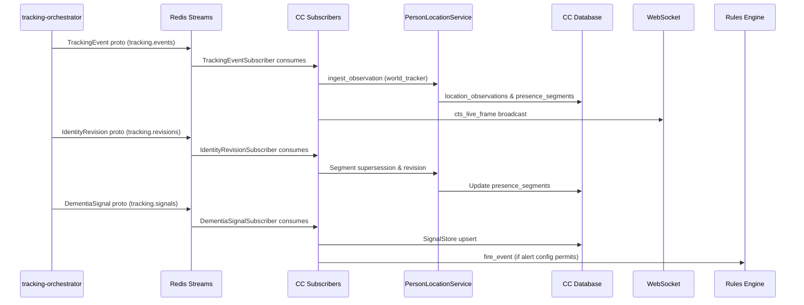

# Cognitive Companion Integration

This page covers how Cognitive Companion consumes CTS data. Every browser, MCP, and rule-engine path into CTS goes through the CC backend.

## Enabling CTS in CC

```yaml
# cognitive-companion/config/settings.yaml
cts:
  enabled: true
  consumer_id: "${HOSTNAME}"
  tracking_events_stream: "tracking.events"
  revisions_stream: "tracking.revisions"
  signals_stream: "tracking.signals"
  scene_samples_stream: "scene.samples"
  lock_seconds: 60
  jwt:
    private_key_pem: "${CTS_JWT_PRIVATE_KEY_PEM}"
    kid: "cts-svc-key-1"
  upstream:
    rtsp_ingress:
      url: "${CTS_INGRESS_URL}"
      timeout_s: 5.0
    tracking_orchestrator:
      url: "${CTS_ORCHESTRATOR_URL}"
      timeout_s: 5.0

cts_ui:
  calibration_enabled: true
  dashboard_enabled: true
  live_view_enabled: true
```

When `cts.enabled` is false, all CTS routers return `404 {"code": "cts.disabled"}` and no CTS subscribers are started.

## Stand up the CTS services

```bash
cd ../continuous-tracking
docker compose up -d postgres redis minio    # infra
docker compose up -d                          # services
```

The services are: `go2rtc` (RTSP proxy, port 1984), `rtsp-ingress` (Go, port 8090), `tracking-orchestrator` (Python, port 8000), Triton (gRPC 8701), Redis (6379), PostgreSQL (5432), MinIO (9000).

## Add cameras and calibrate

Add cameras through the admin UI at `/admin/cts/cameras` with an ID slug, display name, `rtsp_url`, and location. `rtsp-ingress` polls `GET /api/v1/cts/cameras` every 60 s and reconciles the running set with `go2rtc` automatically.

For multi-camera dwell and absence signals, calibration is required:

- **Homography**: at `/admin/cts/calibration`, click pixel-to-floor correspondences on a snapshot to fit a 3×3 matrix per camera via OpenCV RANSAC.
- **Privacy zones**: at `/admin/cts/privacy`, draw polygons over private regions. Frames are masked before they leave the LAN.
- **Adjacency graph**: at `/admin/cts/adjacency`, declare which cameras can see the same person consecutively, with min/max transit times.
- **Overlap groups**: at `/admin/cts/overlap-groups`, group cameras that share a physical field of view. These pairs skip transit-time budgets in cross-camera association and use a relaxed matching threshold.

## CC subscribers

When `cts.enabled` is true, the CC backend starts four Redis Streams subscribers that consume protobuf-encoded messages:

| Subscriber | Stream | Effect |
|------------|--------|--------|
| `TrackingEventSubscriber` | `tracking.events` | Ingests observations into `PersonLocationService` (`world_tracker` source tag) for room segment arbitration. Room name is taken from the `TrackingEvent` proto when present, or resolved from camera mapping. The proto uses `ph_id` as the physical-track identifier. `mean_quality` from the `IdentitySnapshot` is stored on the presence segment and surfaces as `quality` in `PersonLocationEnvelope`: quality is always server-computed, never client-inferred. Broadcasts `cts_live_frame` WebSocket messages for the live tracking view. |
| `IdentityRevisionSubscriber` | `tracking.revisions` | Applies segment supersession in `PersonLocationService` for identity revisions referencing `ph_id`. |
| `DementiaSignalSubscriber` | `tracking.signals` | Persists `DementiaSignal` via `SignalStore`. Before calling `fire_event`, checks the person's `cts_alert_config` in `household_members`. If the signal kind or severity is disabled for that person, the signal is stored for history but no rule is triggered. |
| `SceneSampleSubscriber` | `scene.samples` | Decodes tagged keyframe `SceneSample` protos, pulls the JPEG from MinIO, runs scene analysis (YOLO + Florence-2 + CLIP + hazards), and persists observations to semantic memory. |

::: info
CTS also publishes low-rate semantic state-change streams `tracking.presence` (appeared / disappeared) and `tracking.dwell` (started / ended). These let CC rules trigger on state changes instead of per frame, so rule load no longer scales with camera frame rate. The CTS-side emission and the per-camera throttle on `tracking.events` (`live_publish_max_hz`) are in place; migrating the CC rule triggers from per-frame `tracking.events` to these Tier-2 streams is a planned CC-side change, specified in the `CTS_ROBUSTNESS_M6` documents.
:::



## Review keyframes

The admin keyframes view at `/admin/cts/keyframes` shows one card per physical source frame. The
keyframe stage samples a frame whenever a tracked person triggers it, so a single frame that holds
two people can produce several trigger rows. The read model groups those rows back into one card
keyed by `(camera_id, minio_key, captured_at)` and lists every visible person on it.

Each card carries the server-owned identity state for every bounding box: the inferred identity from
raw inference, the effective identity after operator and inferred revision ranges apply, the
authority and decision source, a calibrated confidence or `Verified` for operator authority, a
conflict flag, the governing revision ID, and whether the person has a ReID candidate awaiting
review. The card summary, Unknown count, and conflict count are computed once at the BFF from this
per-bbox provenance. The browser derives none of it.

Filtering and pagination are server-side. The view filters by effective identity, camera, trigger
reason, time range, authority, decision source, conflict, and pending review. Filters apply before
grouped-frame pagination; a frame that matches an identity filter still returns all of its boxes so
the caregiver keeps the full context of who else was present.

The identity filter options come from the authoritative correction-target endpoint
(`GET /api/v1/cts/identity/correction-targets`, the active household roster), not from whatever
identities happen to appear on the current page, plus an explicit Unknown option. The list scans a
bounded recent window; when that window is full the response sets `truncated` so a caregiver knows
the count covers recent activity rather than all retained history.

The BFF does not copy or delete raw frames. Keyframe cards reference the `frames/...` MinIO objects
that RTSP ingress wrote, and the BFF resolves a short-lived presigned URL per request. If the
orchestrator returns a malformed envelope, the BFF returns `502` with code
`keyframe.upstream_contract` so contract drift is a visible incident rather than an empty page.

The same `KeyframeReadService.list_frames` function powers both the `GET /api/v1/cts/keyframes`
router and the `list_keyframe_frames` MCP tool.

## Correct an identity

A keyframe card and the Person Hypothesis inspector at `/admin/cts/hypotheses` open the same
correction workflow. One Vue component (`IdentityCorrectionWorkflow`), one composable
(`useIdentityCorrection`), and one BFF service back both surfaces, so the keyframe and PH paths never
drift apart. On a keyframe card the caregiver opens the detail overlay and clicks a labeled box; in
the PH inspector they open the Correct identity action on the selected track.

The workflow loads the identity list from `GET /api/v1/cts/identity/correction-targets`, the active
household roster. This list never depends on the ReID gallery, so a caregiver can still reassign a
person when the gallery is empty or stale. Clearing the selector does not submit anything. Setting a
person to Unknown is its own explicit action, not an empty selection.

Scope follows the entry point. From a keyframe box the default is this frame only, with the proposed
observation segment offered as an alternative. From the PH inspector the default is the proposed
segment. The orchestrator computes the segment by searching outward from the chosen observation and
stopping at the nearest discontinuity, split, merge, or prior operator boundary. The caregiver can
move the start and end to other observations inside the proposal, with each boundary showing its
capture time, thumbnail, and the reason it was chosen; a boundary that lands on a structural stop
(split, merge, or a prior operator range) is locked so it cannot be crossed.

Every apply call carries the proposal's version token. If the track changed since the proposal was
fetched, the orchestrator returns `409` with code `correction.stale_version`. The workflow then
re-fetches the proposal, shows the updated range, and requires the caregiver to confirm again rather
than silently retrying.

The audited actor comes from the request's authentication context. The browser payload never carries
an actor field, and the apply schema rejects one. Proposing a segment uses `cts.identity.view`;
applying or compensating a correction requires `cts.identity.correct`.

The browser shows raw ArcFace similarity only as a labeled detail value, never as a confidence
percentage. Operator corrections read `Verified` rather than a fabricated number. The "Verify ReID
crop" action appears only when the server marks a crop eligible; the ReID review queue that produces
that eligibility signal lands with a later milestone, so the action stays hidden until then. Identity
correction and bounding-box geometry editing stay separate revision types: the keyframe annotation
editor still handles box geometry, while identity reassignment flows through this workflow.

The proposal, apply, compensate, and job endpoints share one service function
(`IdentityCorrectionService`) that powers both the `/api/v1/cts/identity/corrections/*` routers and
the `propose_identity_correction` and `get_identity_correction_job` MCP tools.

## Tune the presence chain

`config/presence.yaml` defines the priority chain for person location resolution:

```yaml
providers:
  - name: night_anchor      # priority 90: bed-occupancy + light state
  - name: ha_bed_sensor     # priority 70: HA binary_sensor for bed
  - name: cts_location      # priority 50: CTS PersonLocationState
  - name: ha_device_tracker # priority 30: phone or watch tracker
  # plus stale_fallback and unknown_sentinel
```

Changes apply on `POST /api/v1/cts/presence-config/reload` without a restart.

## Rule examples

### Pacing detection

**Filters:**

| Filter | Config |
|--------|--------|
| `dementia_signal` | `kind: pacing`, `severity_min: warning`, `cooldown_minutes: 30` |
| `home_state` | `person_id: grandma`, gate on `at_home` |

**Pipeline:**

```text
1. presence_query        person_id: grandma  (output_key: presence)
2. condition             expression: presence_dwell_minutes > 5
                         on_true -> step 3, on_false -> end
3. notification          channels: [telegram, pwa_realtime_ai]
                         telegram_template: "Grandma is pacing in {{presence_room_name}}."
```

### Sundowning escalation

**Filters:** `dementia_signal` (`kind: sundowning_index`, `severity_min: info`), `time_range` (`16:00 - 21:00`)

**Pipeline:**

```text
1. notification          channels: [pwa_realtime_ai]
                         pwa_realtime_ai_template: "Hi grandma, the sun is going down. How about a glass of water?"
2. wait                  duration_minutes: 15
3. presence_query        person_id: grandma  (output_key: presence)
4. condition             expression: presence_recent_signals
                                       | filter(kind == "sundowning_index" and severity != "info")
                                       | length > 0
                         on_true -> step 5, on_false -> end
5. notification          channels: [telegram]
                         alert_level: warning
```

### Bathroom dwell anomaly

**Filters:** `dementia_signal` (`kind: bathroom_dwell_anomaly`, `severity_min: warning`, `cooldown_minutes: 30`)

The `cooldown_minutes` field checks `DementiaSignal.acknowledged_at` and suppresses the rule when a recent acknowledgment exists.

**Pipeline:**

```text
1. notification          channels: [telegram, pwa_popup_text]
                         alert_level: warning
                         telegram_template: "Grandma has been in the bathroom for {{trigger.signal.details.minutes}} min."
```

### Unexplained absence

**Filters:** `dementia_signal` (`kind: absence`, `severity_min: warning`), `home_state` (`grandma`, `away`)

**Pipeline:**

```text
1. notification          channels: [telegram]
                         alert_level: emergency
                         telegram_template: "Grandma left the house at {{trigger.signal.started_at}} and has not returned."
```

## Per-person alert configuration

Cognitive Companion supports multigenerational households where dementia-specific signals are relevant only for certain members. Each household member can be assigned an alert profile that controls which CTS signal kinds are dispatched and at what minimum severity.

### Alert profiles

| Profile | Signal kinds enabled |
|---------|---------------------|
| Senior | All 7 kinds: `pacing`, `room_revisit_rate`, `bathroom_dwell_anomaly`, `sundowning_index`, `nighttime_movement`, `stillness_anomaly`, `absence` |
| Adult | `absence`, `nighttime_movement`, `stillness_anomaly` (presence and sleep/rest only) |
| Presence only | `absence` only |
| Custom | Operator-selected subset |

### Setting an alert profile

The alert profile is captured in the household member enrollment dialog at `/admin/persons`. Select a profile when creating or editing a member. The Custom option exposes a grouped checkbox list and a minimum severity selector.

The profile is stored as `cts_alert_config` (JSONB) on the `household_members` table:

```json
{
  "enabled_kinds": ["absence", "nighttime_movement", "stillness_anomaly"],
  "min_severity": "info"
}
```

A `null` config is treated as permissive: all kinds at `info` severity.

### Enforcement layers

The profile is enforced at three points:

1. **Subscriber dispatch gate.** `DementiaSignalSubscriber` checks the config before calling `PipelineExecutor.fire_event`. The signal is always written to the database for history, but no rule is triggered when the kind or severity does not pass the gate.

2. **API read filter.** `GET /api/v1/cts/signals` and `GET /api/v1/cts/signals/unacknowledged` filter the response list against each person's config. This keeps the Alerts view quiet for household members who do not need dementia-specific alerts.

3. **Pipeline rule context filter.** Rules with a `dementia_signal` context filter can further narrow which signals trigger actions by specifying `kinds`, `person_ids`, `min_severity`, and `cooldown_minutes`.

### Signal kind reference

| Kind | Relevant for |
|------|-------------|
| `pacing` | Dementia (repetitive movement) |
| `room_revisit_rate` | Dementia (spatial disorientation) |
| `bathroom_dwell_anomaly` | Dementia, safety |
| `sundowning_index` | Dementia (evening agitation) |
| `nighttime_movement` | Safety, sleep quality |
| `stillness_anomaly` | Safety (falls, medical events) |
| `absence` | Presence (all member types) |
