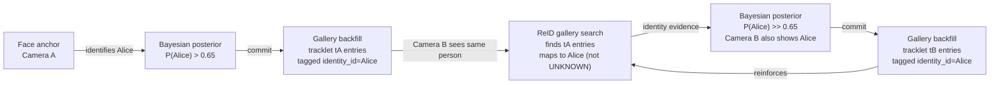

# Frame Processing Pipeline

The orchestrator's `FrameProcessingPipeline` (`app/pipeline/frame_pipeline.py`) processes each frame through 15 stages: from JPEG decode through person detection, privacy enforcement, ReID embedding, pose estimation, per-camera tracking, face identification, cross-camera association, Bayesian identity resolution, trajectory writing, keyframe sampling, identity revision, and event publishing.

```mermaid
flowchart TB
    FrameReady["FrameReady (MinIO key)"]
    Fetch["1. Frame fetch\nMinIO JPEG decode"]
    Detect["2. Person detection\nYOLO26L ONNX (Triton)"]
    Privacy["3. Privacy enforcement\nBlur zones, drop zones"]
    ReID["4. ReID embedding\nSOLIDER-REID ONNX (Triton)"]
    Pose["5. Pose estimation\nRTMPose ONNX (Triton)"]
    Tracker["6. Per-camera tracking\nBoT-SORT (Kalman + Hungarian)"]
    TrackletMgr["7. Tracklet management\nLifecycle, gallery append"]
    FaceID["8. Face identification\nArcFace (person-id-service)"]
    CrossCam["9. Cross-camera association\nAppearance + geometry scoring"]
    Identity["10. Bayesian identity resolution\nPrior × Face × ReID"]
    Committer["11. Identity committer\nBuffered window + face fast-path"]
    Trajectory["12. Trajectory writing\nFloor projection, dwells"]
    Keyframe["13. Keyframe sampling\nPeriodic + identity change"]
    Revision["14. Identity revisions\nCross-table rewrite"]
    Publish["15. Event publishing\ntracking.events Redis Stream"]

    FrameReady --> Fetch
    Fetch --> Detect
    Detect --> Privacy
    Privacy --> ReID
    ReID --> Pose
    Pose --> Tracker
    Tracker --> TrackletMgr
    TrackletMgr --> FaceID
    FaceID --> CrossCam
    CrossCam --> Identity
    Identity --> Committer
    Committer --> Trajectory
    Trajectory --> Keyframe
    Keyframe --> Revision
    Revision --> Publish
```



## 1. Frame fetch

JPEG frames are fetched from MinIO using the key published in the `FrameReady` proto message. Frames older than 30 s are dropped as stale replay backlog (they are XACK'd normally to keep the pending-entry list clean, but pipeline work is skipped).

The fetched image is compared against the `FrameReady`-reported dimensions. A mismatch (e.g., from EXIF rotation or thumbnail storage) is logged and the actual image shape is used for all downstream coordinate transforms.

## 2. Person detection

YOLO26L ONNX runs on Triton, returning normalized bounding boxes (`[x1, y1, x2, y2]` in `[0, 1]` space) with confidence scores. The default confidence threshold is 0.25.

Post-decode IoU deduplication suppresses near-duplicate detections that survive the model's baked NMS. A greedy algorithm processes boxes in descending confidence order: a box is suppressed if its IoU with any already-kept box exceeds `detection_iou_dedup_threshold` (default: 0.55). This is belt-and-braces: the ONNX model already applies NMS, but double detections still occur at scene boundaries.

## 3. Privacy zone enforcement

Operator-drawn privacy polygons (configured at `/admin/cts/privacy`) are applied in two passes:

- **Blur/mask**: pixels inside privacy zones are obscured in the frame before any further processing. This affects crops, keyframes, and the published frame URL.
- **Detection drop**: detections whose foot-point (bbox bottom-center) falls in a drop zone are discarded before tracking. A Prometheus counter (`privacy_detections_dropped_total`) tracks the drop rate per camera.

## 4. ReID appearance embedding

Per-detection person crops are extracted at native resolution and sent to the SOLIDER-REID ONNX model on Triton. The resulting 768-dimensional L2-normalized embedding is used by:

- The tracker's appearance cost matrix for within-camera data association
- The cross-camera associator's gallery similarity scoring
- The identity resolver's gallery k-NN search for identity evidence

Crops are extracted as `np.ascontiguousarray(image[y1:y2, x1:x2])` with bounds clamped to the frame dimensions. If the ReID embedder is unavailable, an empty embedding list is returned and the tracker falls back to IoU-only matching.

## 5. Pose estimation

Per-detection crops are sent to the RTMPose ONNX model on Triton. The 17 COCO keypoints feed into:

- **Posture classification**: `classify_posture(pose_result, bbox)` uses keypoint geometry (ear-to-hip ratio, ankle visibility, horizontal spine angle) to classify as `lying`, `sitting`, `standing`, or `unknown`.
- **Motion energy tracking**: `MotionEnergyTracker` computes mean keypoint velocity in pixels per second, used by the stillness anomaly signal.

Crops smaller than 16×32 pixels are skipped with a `pose_skipped` debug log.

## 6. Per-camera tracking (BoT-SORT)

Each camera gets an isolated `PerCameraTracker` instance. The tracker maintains per-person Kalman filter states and associates detections frame-to-frame using the Hungarian algorithm.

### Kalman filter state

The 8-dimensional state vector follows the BoT-SORT formulation:

```
x = [cx, cy, aspect_ratio, height, v_cx, v_cy, v_ar, v_h]^T
```

| Index | Symbol | Description |
|-------|--------|-------------|
| 0 | `cx` | Bounding box center x (normalized) |
| 1 | `cy` | Bounding box center y (normalized) |
| 2 | `a` | Aspect ratio (width / height) |
| 3 | `h` | Height (normalized) |
| 4-7 | `v_*` | Velocities for each observable |

The 4-dimensional observation vector is `z = [cx, cy, a, h]^T`. The state transition matrix `F` is the identity plus `Δt = 1` on the velocity-to-position terms. The observation matrix `H` extracts the first four components.

| Parameter | Default | Description |
|-----------|---------|-------------|
| Process noise | 0.05 | Diagonal of `Q` (8×8) |
| Measurement noise | 0.5 | Diagonal of `R` (4×4) |
| Initial covariance | 10.0 | Diagonal of `P` (8×8) |

### Association cost

The Hungarian algorithm minimizes a combined cost matrix over detected-to-track assignments:

```
cost(i,j) = (1 - α) × IoU_cost(i,j) + α × embedding_distance(i,j)
```

| Parameter | Default | Description |
|-----------|---------|-------------|
| `appearance_weight` (α) | 0.5 | Appearance weight in association cost |
| `match_thresh` | 0.4 | Minimum IoU to accept a match (effective: accept when `IoU >= 0.6`) |
| `track_high_thresh` | 0.6 | Matches above this confidence are treated as confident extensions |
| `track_low_thresh` | 0.1 | Matches below this are treated as noise |

Tracks without embedding history use IoU-only cost (`α = 0`) to avoid artificial advantage from a neutral zero-vector embedding.

### Track lifecycle

| Parameter | Default | Description |
|-----------|---------|-------------|
| `max_time_lost` | 30 frames | Frames without a match before termination |
| `min_hits` | 3 frames | Consecutive matches before a track is "confirmed" |
| `dedup_iou_threshold` | 0.7 | New tracklets (age = 1) overlapping stable tracks (age >= 5) by more than this IoU are dropped |
| `dedup_min_age` | 5 frames | Minimum age for a track to be considered "stable" for dedup |

The dedup mechanism suppresses ghost re-detections: when the detector produces a double bounding box for a person already being tracked, the younger duplicate is silently dropped.

## 7. Tracklet management

The `TrackletManager` bridges per-frame LocalTracks to persistent Tracklets. It runs even with zero detections so tracklets with no corresponding detection are marked lost and eventually closed.

### Lifecycle

| Parameter | Default | Description |
|-----------|---------|-------------|
| `min_hit_ratio` | 0.5 | Minimum ratio of hits to age for a tracklet to stay active |
| `close_grace_frames` | 15 | Frames without detection before a tracklet is closed (at 5 fps, 3 seconds) |
| `min_detection_confidence` | 0.3 | Detections below this confidence do not extend the tracklet |

### Stability gate

Tracklets with `frames_alive < min_frames_to_publish` (default: 3) are withheld from cross-camera association, identity resolution, trajectory writing, and event publishing. They continue accumulating evidence in memory but produce no external outputs until they cross the gate, suppressing false-positive flashes from detector noise.

A Prometheus gauge (`tracklets_held_below_stability_gate`) reports the per-camera count of held tracklets.

### Gallery append

Each frame the tracklet is alive, a quality score is computed from the detection:

```
quality = 0.4 × size_score + 0.6 × detection_confidence
```

Where `size_score` is the bbox area normalized by `0.1%` of the camera's resolution. If `quality >= gallery_min_quality` (0.5) and the ReID embedding is present, a `GalleryEmbedding` is persisted:

| Field | Value |
|-------|-------|
| `gallery_entry_id` | Random UUID |
| `identity_id` | `""` (backfilled later by the identity resolver: see [Identity feedback loop](#identity-feedback-loop)) |
| `embedding` | 768-dim float list |
| `origin_tracklet_id` | The tracklet's ID |
| `quality` | Composite quality score |
| `face_confirmed` | `False` |

Gallery entries are capped at 20 per tracklet. The limit is enforced before persistence; later entries are silently skipped.

## 8. Face identification

Per-camera, rate-limited calls to the person-identification-service. Person crops are sent at native resolution to `POST /api/v1/identify`. The ArcFace-based service returns face detections with identity assignments and confidence scores.

| Parameter | Default | Description |
|-----------|---------|-------------|
| `face_id_cooldown_s` | 5.0 | Minimum seconds between calls per camera |
| `face_id_timeout_s` | 2.0 | HTTP request timeout |
| `face_id_min_confidence` | 0.4 | Global minimum ArcFace confidence |
| `face_id_enabled` | true | Master switch |
| Per-camera overrides | camera_id to `FaceIdCameraConfig` | Enable/disable per camera, override min confidence |

Face identification can be disabled per camera (e.g., top-down surveillance views where faces are not visible). Each `FaceAnchor` carries `person_id`, `confidence`, `tracklet_id`, and `camera_id`. The identity resolver uses these as high-weight evidence (3× over ReID).

## 9. Cross-camera association

The `CrossCameraAssociator` merges tracklets from different cameras into `GlobalTrack` entities. It runs once per frame over all active tracklets that have passed the stability gate.

### Scoring function

Each candidate pair of tracklets from different cameras is scored:

```
combined = α × appearance_sim + (1 - α) × exp(-(dist_m / sigma)²)
```

| Parameter | Default | Description |
|-----------|---------|-------------|
| `alpha` | 0.7 | Appearance weight |
| `sigma_m` | 1.5 | Floor-plane distance decay sigma |
| `max_floor_distance_m` | 8.0 | Pairs beyond this distance are pruned |
| `min_link_score` | 0.55 | Minimum combined score to link |
| `within_group_min_score` | 0.35 | Relaxed threshold for overlap groups |
| `unknown_merge_appearance_threshold` | 0.92 | Same-camera UNKNOWN merge threshold |

### Appearance similarity

Gallery entries are queried per tracklet (up to 10 per side, newest first). The mean embedding per tracklet is computed and cosine similarity between the two means is returned. When only one side has gallery entries, a conservative 0.5 is returned instead of 0.0: this allows the geometry component to carry the pair above the threshold when cameras share physical space. When neither side has entries, 0.0 is returned.

### Floor geometry

When both tracklets carry calibrated floor points (projected through the per-camera homography matrix), the Euclidean distance on the floor plane is computed. The score follows an exponential decay: `exp(-(dist_m / sigma)²)`. When floor projection is unavailable, geometry returns 1.0 (binary adjacency gate). Pairs exceeding `max_floor_distance_m` are pruned entirely.

### Adjacency graph and overlap groups

Two mechanisms govern which camera pairs are considered:

- **Adjacency edges**: operator-configured directed edges with min/max transit times. The `reachable()` method uses Dijkstra's algorithm for transitive reachability with a time budget. The budget is the camera pair's `max_transition_seconds`, capped upward by the older tracklet's age.
- **Overlap groups**: cameras sharing a physical field of view (e.g., two angles of the same room). These are configured at `/admin/cts/overlap-groups`. Within-group pairs skip the transit-time budget entirely and use the relaxed `within_group_min_score` threshold.

### Merge algorithm

Candidate pairs are scored and sorted by combined score descending. A greedy merge algorithm processes them:

1. Both tracklets in the same existing GlobalTrack: skip.
2. One in an existing GlobalTrack, the other unassigned: extend the existing GlobalTrack.
3. Both in different new clusters: merge the clusters.
4. Neither assigned: create a new GlobalTrack.

Remaining unassigned tracklets attempt to join existing GlobalTracks via a second pass with adjacency/overlap checks. Same-camera UNKNOWN tracklets with appearance similarity >= 0.92 are merged to prevent duplicate UNKNOWN GlobalTracks for the same person across tracklet lifecycles.

## 10. Bayesian identity resolution

The `IdentityResolver` maintains a posterior probability distribution for each GlobalTrack over `{known_identities ∪ UNKNOWN}`. Three evidence sources are combined via pointwise multiplication, with missing sources treated as uniform (weight = 1.0) to avoid dilution:

```
posterior(identity) ∝ prior(identity) × face_likelihood(identity) × reid_likelihood(identity)
```

### Temporal prior

Encodes continuity from the previous identity assignment. The previous MAP identity receives `prior_weight = 0.6` of the probability mass. The remaining mass is spread uniformly over other known identities. An `unknown_mass` floor (0.05) ensures UNKNOWN always has at least 5% prior probability.

Identity persists for `prior_maintenance_max_age_s` (120 s) without new evidence. Beyond that window, the prior alone cannot sustain a commit: all three evidence sources must contribute for the commit rule to fire.

### Face likelihood

Face anchors from the person-identification-service carry a `p_face` probability derived from a sigmoid of confidence and quality. The face anchor with the highest `confidence × quality` product is selected per GlobalTrack. Face evidence receives a `face_weight_multiplier` of 3.0 over ReID evidence: ArcFace is more reliable than body appearance for disambiguating identities in multi-person households.

When multiple face anchors exist for different tracklets in the same GlobalTrack (cross-camera), they vote independently and the highest-confidence anchor is used.

### ReID likelihood

Gallery k-NN search retrieves similar embeddings from the full gallery. The process:

1. Collect gallery entries for all tracklets in the GlobalTrack (up to 20 per tracklet).
2. Compute the mean embedding as the query vector.
3. Run `search_similar()` (pgvector HNSW with StreamingDiskANN) against the entire gallery.
4. Map each result to an identity: entries with a non-empty `identity_id` contribute to that identity's likelihood; entries with empty `identity_id` (tracklet-generated, pre-backfill) map to UNKNOWN.
5. Similarity scores pass through a logistic curve (midpoint at 0.70 similarity, steepness `k = 10`) to produce per-identity likelihoods.

### Identity feedback loop

A critical design element is the gallery identity backfill mechanism. When a face anchor identifies a person on one camera, the resolved identity is stamped onto all gallery entries for that GlobalTrack's tracklets. This creates a self-reinforcing cycle:



Without backfill, all tracklet-generated gallery entries carry `identity_id=""` (empty string). The ReID search maps these to UNKNOWN, providing zero identity evidence. The entire identity burden falls on face anchors alone: when a person's face is not visible, they show as UNKNOWN on all cameras.

With backfill, once a face anchor seeds the identity on one camera, the gallery entries become identity-tagged. When the same person appears on another camera (face hidden), the ReID search finds the tagged entries and provides identity evidence, allowing the posterior to commit the same identity. This is essential for multi-camera, multi-person households.

## 11. Identity committer

The `IdentityCommitter` buffers per-frame posterior evidence and emits commit decisions. Two paths exist:

**Buffered windowed commit.** Posterior evidence accumulates over a configurable window (default: 3 s). At flush, the commit rule is applied:

```
commit if: top_prob >= commit_prob (0.65)
          AND margin >= commit_margin (0.25)
          AND sensory_evidence_present (face or ReID, not prior alone)
```

**High-confidence face fast-path.** Face anchors with confidence >= 0.85 trigger an immediate commit that bypasses the 3-second buffer. The commit rewrites history back to the GlobalTrack's `started_at` time via cross-table identity rewriting.

**Dense scene detection.** When two or more candidate identities each have posterior > 0.3, escalated thresholds are used (`commit_prob_dense = 0.80`, `commit_margin_dense = 0.20`) to prevent confident-but-wrong commits from ambiguous ReID evidence in multi-person frames.

## 12. Trajectory writing

The `TrajectoryWriter` records two types of data in TimescaleDB hypertables:

- **`person_trajectories`**: one row per frame per tracked person, with identity, room, floor-projected coordinates (in mm), posture, motion energy, and identity confidence. Points are written regardless of identity status: UNKNOWN trajectories are recorded and relabeled if identity is later resolved.
- **`room_dwells`**: continuous intervals in a room with entry/exit times, cumulative dwell, still-seconds, min/max/mean motion energy, and dominant posture.

Floor projection uses per-camera 3×3 homography matrices calibrated via OpenCV RANSAC from operator-provided pixel-to-floor correspondences. When homography is unavailable, uncalibrated `(0, 0)` floor points are written.

## 13. Keyframe sampling

The `KeyframeSampler` saves tagged JPEG keyframes to the `tagged_keyframes` table and publishes `SceneSample` protos to the `scene.samples` Redis stream. Two triggers:

- **Periodic**: one keyframe per tracklet per configurable sampling interval.
- **Identity change**: an immediate keyframe when a tracklet's identity is revised, tagged with `tag_reason="identity_changed"`.

Keyframes carry annotations (tracklet ID, camera ID, identity ID, bounding box) used by the CC-side `SceneSampleSubscriber` for downstream scene analysis.

## 14. Identity revisions

When the committed identity changes (new assignment, reassignment, or demotion to UNKNOWN), an `IdentityRevision` proto is published to `tracking.revisions`. The revision carries the full posterior distribution as `IdentityCandidate` entries, the previous and new identity IDs, and evidence metadata. A rate limiter caps revisions at 3 per GlobalTrack per minute.

When the identity committer is enabled, the `PostgresIdentityRewriter` performs retroactive cross-table rewriting: trajectory points, room dwells, and dementia signals for the affected GlobalTrack are relabeled from the old identity to the new identity, covering the window from `applies_from` to `applies_to`.

## 15. Event publishing

The final `TrackingEvent` proto is published to `tracking.events`. It carries per-frame detections enriched with `tracklet_id` and `global_track_id`, the posterior's top identity per GlobalTrack (published even before formal commit, so the Live View sees the current best guess immediately), pose keypoints, per-tracklet foot-point trails, and posterior evidence (top probability, top-2 probability, face anchor flag).

On the CC side, the `TrackingEventSubscriber` decodes this proto, builds a `global_track_id -> identity_id` mapping from the `IdentityRevision` sub-messages, and assigns `identity_id`, `display_name`, and `identity_confidence` to each detection in the WebSocket broadcast.
