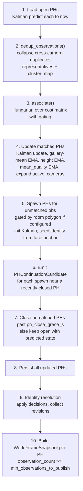

# Frame Processing Pipeline

The orchestrator's `FrameProcessingPipeline` (`app/pipeline/frame_pipeline.py`) processes each frame through 17 stages: from JPEG decode through person detection, privacy enforcement, spatial floor projection, ReID and pose inference, face identification, world tracking (which includes pre-association cross-camera dedup and Bayesian identity resolution), detection backfill, PH lifecycle management, posture classification, trajectory writing, keyframe sampling, identity revision, trail management, durable provenance persistence, governed ReID candidate creation, and event publishing. (A conditional fall-detection stage also runs between posture classification and trajectory writing when `fall_detection.enabled`; it is omitted from the count and diagram here because it is off by default.)

```mermaid
flowchart TB
    FrameReady["FrameReady (MinIO key)"]
    Fetch["1. Frame fetch\nMinIO JPEG decode"]
    Detect["2. Person detection\nYOLO26L ONNX (Triton)"]
    Privacy["3. Privacy enforcement\nBlur zones, drop zones"]
    Spatial["4. Spatial projection\nFloor-point homography per detection"]
    Inference["5. ReID + Pose inference\nSOLIDER-REID + RTMPose (Triton)"]
    FaceID["6. Face identification\nArcFace (person-id-service)"]
    World["7. World tracking\nKalman predict, pre-association dedup,\nHungarian association, identity resolution"]
    Backfill["8. Detection backfill\nEnrich detections with PH assignments"]
    ClosePH["9. PH lifecycle\nClose terminated PersonHypotheses"]
    Posture["10. Posture classification\nKeypoint geometry analysis"]
    Trajectory["11. Trajectory writing\nFloor projection, dwells"]
    Keyframe["12. Keyframe sampling\nPeriodic + identity change"]
    Revisions["13. Identity revisions\nCross-table rewrite"]
    Trails["14. Trail management\nPer-PH foot-point trail buffer"]
    Provenance["15. Provenance persistence\nDurable identity-decision audit rows"]
    ReIDCandidate["16. ReID candidate creation\nGoverned pending_review gallery writes"]
    Publish["17. Event publishing\ntracking.events Redis Stream"]

    FrameReady --> Fetch
    Fetch --> Detect
    Detect --> Privacy
    Privacy --> Spatial
    Spatial --> Inference
    Inference --> FaceID
    FaceID --> World
    World --> Backfill
    Backfill --> ClosePH
    ClosePH --> Posture
    Posture --> Trajectory
    Trajectory --> Keyframe
    Keyframe --> Revisions
    Revisions --> Trails
    Trails --> Provenance
    Provenance --> ReIDCandidate
    ReIDCandidate --> Publish
```



## 1. Frame fetch

JPEG frames are fetched from MinIO using the key published in the `FrameReady` proto message. Frames older than 30 s are dropped as stale replay backlog (they are XACK'd normally to keep the pending-entry list clean, but pipeline work is skipped).

The fetched image is compared against the `FrameReady`-reported dimensions. A mismatch (e.g., from EXIF rotation or thumbnail storage) is logged and the actual image shape is used for all downstream coordinate transforms.

## 2. Person detection

YOLO26L ONNX runs on Triton, returning normalized bounding boxes (`[x1, y1, x2, y2]` in `[0, 1]` space) with confidence scores. The default confidence threshold is 0.25.

Post-decode IoU deduplication suppresses near-duplicate detections that survive the model's baked NMS. A greedy algorithm processes boxes in descending confidence order: a box is suppressed if its IoU with any already-kept box exceeds `detection_iou_dedup_threshold` (default: 0.55). This is belt-and-braces: the ONNX model already applies NMS, but double detections still occur at scene boundaries.

## 3. Privacy zone enforcement

Operator-drawn privacy polygons (configured at `/admin/cts/privacy`) are applied in two passes:

- **Blur/mask**: pixels inside privacy zones are obscured in the frame before any further processing. This affects crops, keyframes, and the published frame URL.
- **Detection drop**: detections whose foot-point (bbox bottom-center) falls in a drop zone are discarded before tracking. A Prometheus counter (`privacy_detections_dropped_total`) tracks the drop rate per camera.

## 4. Spatial projection

`SpatialProjectionStage` computes the calibrated floor-plane coordinate (`FloorPoint`) for every surviving detection using the per-camera 3x3 homography matrix fitted by the calibration tool. The result is carried on the detection's `floor_point` field with `calibrated=True` for cameras that have been calibrated, and `calibrated=False` with `(0, 0)` coordinates for uncalibrated cameras.

Floor projection runs **before** ReID and pose inference so that the cross-camera dedup pass (inside the world tracker) can use per-detection floor positions at the time of association.

## 5. ReID and pose inference

Per-detection person crops are extracted at native resolution and sent in parallel to two Triton models:

- **SOLIDER-REID** (768-dimensional L2-normalized embedding): used by the world tracker for cross-camera appearance similarity and by the Bayesian identity resolver for gallery k-NN search.
- **RTMPose** (17 COCO keypoints): used by the posture classifier and the motion energy tracker. Crops smaller than 16x32 pixels are skipped.

If the ReID embedder is unavailable, an empty embedding list is returned and the tracker falls back to geometry-only association.

## 6. Face identification

Per-camera, rate-limited calls to the person-identification-service send person crops to `POST /api/v1/identify`. The ArcFace-based service returns face detections with identity assignments and confidence scores.

| Parameter | Default | Description |
|-----------|---------|-------------|
| `face_id_cooldown_s` | 5.0 | Minimum seconds between calls per camera |
| `face_id_timeout_s` | 2.0 | HTTP request timeout |
| `face_id_min_confidence` | 0.4 | Global minimum ArcFace confidence |
| `face_id_enabled` | true | Master switch |
| Per-camera overrides | camera_id to `FaceIdCameraConfig` | Enable/disable per camera, override min confidence |

Face identification can be disabled per camera (e.g., top-down surveillance views where faces are not visible). Each `FaceAnchor` carries `person_id`, `confidence`, `tracklet_id`, and `camera_id`. The identity resolver uses these as high-weight evidence (3x over ReID).

## 7. World tracking

`WorldTrackingStage` builds `WorldObservation` objects for each detection (using a synthetic virtual-tile floor point when a camera is uncalibrated), then calls `WorldTracker.step`. The tracker runs 10 numbered steps:



**Steps 1-3: predict and associate.** All open PHs are loaded and their Kalman states predicted forward to the current timestamp. `dedup_observations()` then collapses detections from different calibrated cameras that are within `dedup_max_distance_m` (default: 0.6 m) and not in identity conflict into single representative observations. The Hungarian algorithm solves the assignment over a cost matrix (geometric + appearance + height) with a Mahalanobis gate (`gate_chi2 = 9.21`, chi-squared 99%, 2 dof) and an identity-conflict hard gate.

**Steps 4-5: update and spawn.** Matched PHs receive a Kalman update, gallery-mean EMA (`alpha = 1 / min(count+1, 100)`), height EMA (`alpha = 0.1`), mean-quality EMA (`0.1 * obs.quality + 0.9 * prev`), and accumulate all contributing camera IDs. Unmatched observations spawn new PHs (gated by room polygon when configured), seeded with face anchor identity if present.

**Steps 6-7: continuations and grace.** For each spawn, recently closed PHs within `inferred_handoff_max_s` (600 s) and `inferred_handoff_max_distance_m` (5.0 m) emit a `PHContinuationCandidate`. Unmatched PHs past `ph_close_grace_s` (5.0 s) are closed; those within the grace window keep their predicted state.

**Steps 8-10: persist, resolve, snapshot.** All updated PHs are persisted. The Bayesian identity resolver runs on every PH that received an observation. `WorldFrameSnapshot` objects are built for PHs with `observation_count >= min_observations_to_publish` (3).

### Pre-association cross-camera dedup

Before the Hungarian assignment runs, `dedup_observations()` (`app/tracking/world/dedup.py`) collapses detections from different cameras that correspond to the same physical person into a single representative observation.

The dedup gate passes a pair of observations when all three conditions hold:

1. The two detections are from **different** cameras.
2. Both have `calibrated=True` floor points within `dedup_max_distance_m` (default: 0.6 m) of each other.
3. When both carry committed face anchors, the face identities do not conflict (`dedup_require_no_face_conflict: true`).

Pairs that pass the gate are joined by a union-find algorithm; each resulting cluster elects one representative via `_select_representative()` (highest quality, ties broken deterministically). The cluster membership map propagates all source camera IDs back to the winning PH.

| Config knob | Default | Description |
|-------------|---------|-------------|
| `dedup_enabled` | `true` | Master switch for pre-association dedup |
| `dedup_max_distance_m` | `0.6` | Floor-plane distance gate in metres |
| `dedup_require_no_face_conflict` | `true` | Do not collapse observations with conflicting face identities |

Uncalibrated cameras: `dedup_observations()` skips observations with `calibrated=False`. For uncalibrated home cameras, identity crosses cameras only through the shared ReID gallery, cross-GT face propagation, and PH continuation.

The integration proof lives in `tests/integration/test_world_tracker_e2e.py::test_hallway_bathroom_one_person`.

### PersonHypothesis (PH) management and identity resolution

The `WorldTracker` maps confirmed per-camera tracks to `PersonHypothesis` (PH) entities. Each PH:

- carries a `ph_id` (UUID, the single physical-track identifier on the wire after R3).
- maintains a `mean_quality` field (exponential moving average of per-observation quality scores, added in migration `0002_quality`).
- is the entity that receives Bayesian identity resolution.

**Quality capture.** Each observation's quality score is computed from the detection's confidence and the crop size, then used to update the PH's `mean_quality`. The same `CropQuality` scorer is used for observations as for gallery entries; there is no parallel scorer. The `mean_quality` field travels to CC via the `IdentitySnapshot` proto and then through the `quality` field on `PersonLocationEnvelope`.

**Bayesian identity resolution.** The `IdentityResolver` maintains a posterior probability distribution for each PH over `{known_identities u UNKNOWN}`. Three evidence sources are combined via pointwise multiplication, with missing sources treated as uniform (weight = 1.0):

```
posterior(identity) proportional to prior(identity) x face_likelihood(identity) x reid_likelihood(identity)
```

**Temporal prior.** Encodes continuity from the previous identity assignment. The previous MAP identity receives `prior_weight = 0.6` of the probability mass. Identity persists for `prior_maintenance_max_age_s` (120 s) without new evidence; beyond that window, the prior alone cannot sustain a commit.

**Face likelihood.** Face anchors carry a `p_face` probability derived from a sigmoid of confidence and quality. Face evidence receives a `face_weight_multiplier` of 3.0 over ReID evidence: ArcFace is more reliable than body appearance for disambiguating identities in multi-person households.

**ReID likelihood.** Gallery k-NN search (pgvector HNSW with StreamingDiskANN) retrieves similar embeddings and maps them to identities via a logistic curve.

**Commit rule:**

```
commit if: top_prob >= commit_prob (0.65)
          AND margin >= commit_margin (0.25)
          AND sensory_evidence_present (face or ReID, not prior alone)
```

High-confidence face anchors (confidence >= 0.85) trigger an immediate commit bypassing the 3-second buffer.

**Identity feedback loop.** When a face anchor identifies a person on one camera, the resolved identity is stamped onto all gallery entries for that PH's detections, creating a self-reinforcing cycle that allows cross-camera identity carry even when a face is not visible on the second camera.

## 8. Detection backfill

`DetectionBackfillStage` enriches each detection in `ctx.domain_detections` with the `ph_id` assigned by the world tracker. This ensures downstream stages (posture, trajectory, publish) all read the same identity from the detection object rather than maintaining separate maps.

## 9. PH lifecycle (ClosePHStage)

`ClosePHStage` closes any PersonHypothesis that was active in the previous frame but no longer has an active detection in this frame. It writes the final trajectory and dwell segments for closed PHs so that dwell intervals are closed promptly rather than on the next detection.

## 10. Posture classification

`PostureStage` produces soft posture evidence for each detection rather than a single hard label. The 17 COCO keypoints drive geometric scorers (torso angle, knee bend, head-spine alignment, shin-drop geometry) into a `PostureScores` record with continuous evidence for `lying`, `sitting`, and `standing_walking`, plus a keypoint-confidence value. Soft scoring lets several weak cues accumulate instead of firing on one threshold. In a bedroom, a lying prior is added when the body is occluded.

Fusion and the final label happen in stage 11. `GlobalPostureTracker` keeps each camera's latest scores, fuses them quality-weighted across the person's active cameras, and applies hysteresis before committing a posture. Crops without pose output (smaller than 16x32 px or from cameras with pose disabled) contribute `unknown`. See [Handling noisy readings](./tracking-concepts.md#handling-noisy-readings) for the full position and posture fusion model.

## 11. Trajectory writing

`TrajectoryStage` records two types of data in TimescaleDB hypertables:

- **`person_trajectories`**: one row per frame per tracked person, with identity, room, floor-projected coordinates (in mm), posture, motion energy, and identity confidence. Points are written regardless of identity status: UNKNOWN trajectories are recorded and relabeled if identity is later resolved.
- **`room_dwells`**: continuous intervals in a room with entry/exit times, cumulative dwell, still-seconds, min/max/mean motion energy, and dominant posture.

When homography is unavailable, uncalibrated `(0, 0)` floor points are written.

## 12. Keyframe sampling

`KeyframeStage` saves tagged JPEG keyframes to the `tagged_keyframes` table and publishes `SceneSample` protos to the `scene.samples` Redis stream. Two triggers:

- **Periodic**: one keyframe per PH per configurable sampling interval.
- **Identity change**: an immediate keyframe when a PH's identity is revised, tagged with `tag_reason="identity_changed"`.

Keyframes carry annotations (ph_id, camera_id, identity_id, bounding box) used by the CC-side `SceneSampleSubscriber` for downstream scene analysis.

## 13. Identity revisions

When the committed identity changes (new assignment, reassignment, or demotion to UNKNOWN), an `IdentityRevision` proto is published to `tracking.revisions`. The revision carries the full posterior distribution as `IdentityCandidate` entries, the previous and new identity IDs, and evidence metadata. A rate limiter caps revisions at 3 per PH per minute.

When the identity committer is enabled, the `PostgresIdentityRewriter` performs retroactive cross-table rewriting: trajectory points, room dwells, and dementia signals for the affected PH are relabeled from the old identity to the new identity, covering the window from `applies_from` to `applies_to`.

## 14. Trail management

`TrailsStage` maintains an in-memory ring buffer of foot-point trail positions per PH (default: last 30 positions). These trails are published in the `TrackingEvent` proto and consumed by the CC live view to render person movement paths on the floor plan.

## 15. Provenance persistence

`ProvenancePersistStage` durably persists every identity decision that revises a PH's previous
identity (`revises_previous=True`), unconditionally. It runs immediately before the per-camera
publish throttle, and deliberately outside it: a decision that revises identity is audit data a
caregiver-facing read model joins against, so it must never be dropped just because the frame
that carried it was rate-limited for live-view publishing. The stage is a no-op when no
`identity_provenance_repo` is configured.

## 16. ReID candidate creation

`ReIDCandidateStage` is the only pipeline path that writes to the ReID gallery. For each
committed, face-matched detection it evaluates a governed eligibility gate
(`evaluate_candidate`, `app/tracking/identity/candidate_eligibility.py`) and, when it passes,
creates a `pending_review` candidate with crop and frame provenance, `origin_tracklet_id`, `ph_id`,
and model/preprocessing versions. A face-derived candidate requires the direct recognized ArcFace
identity to equal the committed identity with calibrated confidence at or above the authority
threshold; without a deployed calibration artifact the stage produces no candidates rather than
falling back to raw similarity. Like provenance persistence, this runs ahead of the publish
throttle because candidate creation is audit-visible governance data. The per-(identity,
orientation) cap on gallery growth counts `pending_review` and `operator_verified` rows together.

## 17. Event publishing

`PublishStage` assembles and publishes the final `TrackingEvent` proto to `tracking.events`. It carries per-frame detections enriched with `ph_id`, the posterior's top identity per PH (published even before formal commit, so the live view sees the current best guess immediately), pose keypoints, per-PH foot-point trails, and posterior evidence (top probability, top-2 probability, face anchor flag).

On the CC side, the `TrackingEventSubscriber` decodes this proto, builds a `ph_id -> identity_id` mapping from the `IdentityRevision` sub-messages, and assigns `identity_id`, `display_name`, and `identity_confidence` to each detection in the WebSocket broadcast.
