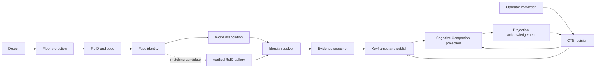

# Identity integrity architecture

Identity integrity keeps a physical track, a model inference, and a caregiver correction from
silently becoming the same thing. This architecture gives Continuous Tracking System (CTS)
developers and operators one set of boundaries for identity authority, ReID learning data, and
downstream corrections.

::: info Implementation status
The architecture decisions on these pages are accepted. The documentation and synthetic failure
baseline were established on June 19, 2026. Resolver, schema, gallery, correction, UI, calibration,
and rollout work is delivered in separate changes. The current gaps are listed below so accepted
behavior is not mistaken for deployed behavior.
:::

## When to use this section

Use these pages when changing PH association, identity evidence, ArcFace response fields, the ReID
gallery, keyframe identity displays, or correction projections into Cognitive Companion.

The three architecture decisions define separate concerns:

| Decision | Question it answers |
| --- | --- |
| [Identity authority and Unknown](/features/continuous-tracking/identity-integrity/identity-authority) | Which evidence may assign a household identity, and when must the result be Unknown? |
| [ReID gallery governance](/features/continuous-tracking/identity-integrity/reid-gallery-governance) | Which body embeddings may vote, how are they reviewed, and what is deleted after rejection? |
| [Identity revision projections](/features/continuous-tracking/identity-integrity/revision-projections) | How does an immutable inference become a corrected effective label across services? |

## System at a glance

A `PersonHypothesis` (PH) remains the one persistent world-coordinate track. Identity is a governed
property of that PH. The system does not create a parallel identity tracker.

Five concepts stay separate throughout this flow.

| Concept | Owner | Meaning |
| --- | --- | --- |
| Observation association | CTS world tracker | Chooses which physical observation updates which PH |
| Inferred identity | CTS resolver | Stores what the models and prior reported at observation time |
| Effective identity | CTS revision projection | Applies authority and corrections to the label consumers use |
| Operator correction | CTS correction service | Records immutable truth over an explicit observation range |
| Learning data | CTS gallery service or ArcFace enrollment | Uses its own review and provenance rules |

## Current implementation baseline

The following gaps are present in the initial baseline. They are characterization targets, not accepted
exceptions.

| Area | Current behavior | Accepted direction |
| --- | --- | --- |
| Temporal prior | `resolver.prior_maintenance_max_age_s` is `120.0`; ordinary held decisions can rewrite `current_identity_committed_at` | A 30-second window measured from independent qualifying evidence |
| Duplicate active identity | `enable_duplicate_active_identity_guard` is `false`; the resolver records a shadow mismatch | At most one open global PH may hold a household identity |
| ReID gallery | `reid_gallery` has `face_confirmed` but no lifecycle state or crop provenance | Pending review, operator verified, or rejected; only verified rows vote |
| Gallery seeding | A recognized face is required, but the face identity is not compared with the seed label | The direct face identity must equal the candidate identity |
| Keyframes | Bbox rows contain each visible identity, while the list card exposes the trigger PH identity | One physical-frame card aggregates every effective bbox identity |
| Face confidence | Person identification reports raw ArcFace cosine similarity as `confidence` | Distinct `raw_similarity` and nullable `calibrated_confidence` fields |
| CC assertions | `cc.identity_assertions` uses separate text fields | One raw protobuf payload in a coordinated producer and consumer cutover |

## Data ownership

CTS tables live in the `continuous_tracking` PostgreSQL schema. Cognitive Companion uses its own
Alembic-managed database. The gallery table is `reid_gallery`; there is no `identity_gallery`
table.

| Object | Current purpose | Identity owner |
| --- | --- | --- |
| `person_hypotheses` | Persistent PH and current identity | CTS association state |
| `world_observations` | Observation history linked to PHs | CTS correction boundary source |
| `reid_gallery` | 768-dimensional body embeddings | CTS governed gallery |
| `tagged_keyframes` | Sampling-trigger rows that reference raw frames | CTS physical-frame read model |
| `keyframe_bbox_annotations` | Every persisted bbox for a sampled frame | CTS bbox identity projection |
| `ph_revisions` | Existing PH identity revision audit | CTS revision lineage |
| `cts_identity_revision_log` | Applied CTS revision IDs in Cognitive Companion | Cognitive Companion projection audit |
| `person_location_history` | Location history with revision supersession | Cognitive Companion location projection |

## Identity-related configuration

These values describe the initial baseline in `tracking-orchestrator/config/settings.yaml` and
`person-identification-service/config/settings.yaml`.

| Name | Current value | Current mode |
| --- | --- | --- |
| `face_id.enabled` | `true` | Face identification calls are live |
| `face_id.min_confidence` | `0.6` | Raw service response gate for face anchors |
| `resolver.face_commit_min_confidence` | `0.70` | Current uncalibrated face-lock gate |
| `resolver.commit_prob` | `0.65` | Posterior commit threshold |
| `resolver.commit_margin` | `0.15` | Posterior margin threshold |
| `resolver.prior_maintenance_max_age_s` | `120.0` | Current value; accepted value is 30 seconds |
| `resolver.enable_quality_gate` | `true` | Enforced |
| `resolver.enable_flip_debounce` | `true` | Enforced |
| `resolver.enable_sticky_maintenance` | `true` | Enforced |
| `resolver.enable_duplicate_active_identity_guard` | `false` | Shadow comparison only |
| `resolver.enable_multiview_gallery` | `true` | Live gallery query and seeding path |
| `pipeline.adaptive_reid.enabled` | `false` | Live inference skipping is disabled |
| `pipeline.adaptive_reid.shadow` | `true` | Shadow evaluation only |
| `recognition.threshold` | `0.4` | Raw ArcFace recognized threshold |
| `recognition.unknown_threshold` | `0.25` | Raw ArcFace unrecognized threshold |

## Service and storage ownership

All local compose services join the external `nanai` Docker network. MinIO is external to these
compose files.

| Service | Default host port | Database or state | Identity responsibility |
| --- | ---: | --- | --- |
| Shared PostgreSQL | deployment configured | `continuous_tracking`, `cognitive_companion`, `person_identification` | Separate data ownership per service |
| Redis | `6379` | Redis Streams and consumer state | Cross-service event transport |
| Triton | `8700`, `8701`, `8702` | Model repository | Detector, ReID, pose, and ArcFace inference |
| Tracking orchestrator | `8500` | `continuous_tracking` | PH, resolver, gallery, keyframes, and corrections |
| RTSP ingress | `8090` | Redis and MinIO | Frame publication |
| go2rtc | `1984` | Camera proxy configuration | Camera session proxy |
| Cognitive Companion backend | `8000` | `cognitive_companion` | BFF and downstream projections |
| Cognitive Companion frontend | `8081` | None | Caregiver administration |
| Person identification | `8200` | `person_identification` | ArcFace enrollment and identification |

RTSP ingress stores source JPEGs under
`frames/{camera_id}/{YYYY/MM/DD/HH}/{frame_index}-{capture_time}.jpg`. A keyframe references this raw
object. It is not a separately rendered image. Governed ReID review crops use separate immutable
object keys once that lifecycle is implemented.

## Synthetic characterization

The baseline includes synthetic fixtures for seven failure modes: exchanged labels, one person handed between
two PHs, duplicate active identity, prior timestamp renewal, mismatched gallery seeding, keyframe
identity collapse, and a missing calibration artifact. Private household frames and populated
manifests stay outside Git.

The characterization tests use strict xfails tied to the milestone that removes each defect. An
unexpected pass fails the test run, which forces the xfail to be removed when the behavior changes.

## Related pages

- [Cross-repository identity contracts](/features/continuous-tracking/identity-integrity/contracts)
- [Visitor identities](/features/continuous-tracking/identity-integrity/visitor-identities) (written
  for a caregiver, not an engineer: what is stored about a recurring unnamed visitor and how to name
  or dismiss one)
- [Identity-integrity verification](/development/identity-integrity-verification)
- [Tracking concepts](/features/continuous-tracking/tracking-concepts)
- [CC integration](/features/continuous-tracking/cc-integration)
