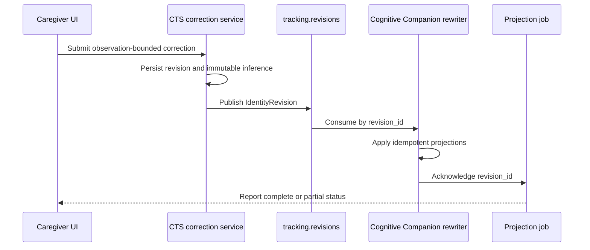

# Identity revision projections

Status: deployed, June 20, 2026.

This decision defines how a caregiver correction changes the label shown by CTS and Cognitive
Companion without rewriting the original model inference.

::: info Implementation status
Deployed. A single CTS correction service owns operator corrections. It writes observation-bounded
revision ranges, creates a projection job per revision, and publishes a protobuf `IdentityRevision`
on `tracking.revisions` with typed range and projection fields. Cognitive Companion supersedes the
affected `PersonLocationHistory`, `PersonLocationState`, and `cts_dementia_signals` rows while
retaining the originals, records `CtsIdentityRevisionLog` with the revision-range lineage, and posts
a projection acknowledgement back to CTS. A correction job completes only after
the CTS internal projection and the Cognitive Companion projection both acknowledge the same
`revision_id`. Explicit `inferred_identity_id` and `effective_identity_id` provenance fields remain
deployed across all tracking APIs.
:::

## Keep inferred and effective labels separate

`inferred_identity_id` is immutable resolver output. `effective_identity_id` is the revision-aware
label used by consumers.

`person_id` remains the live identity key inside Cognitive Companion. The BFF maps explicit CTS
provenance fields into that internal identity key; it does not deprecate `person_id`.

## Bound corrections by observations

An operator correction:

- targets observation boundaries rather than arbitrary timestamps;
- may cover one frame or a caregiver-confirmed segment;
- stops at PH split, merge, or earlier operator-revision boundaries;
- preserves the original inference and evidence;
- changes the live PH label only when the corrected range reaches the live edge;
- cannot be superseded by an inferred revision.

CTS is the source of truth. Each revision has a stable `revision_id`, actor, reason, observation
range, expected version, evidence summary, and revision lineage.

## Track projection jobs

A correction creates an idempotent projection job. Each required projection records an
acknowledgement using the same `revision_id`.

Required projections include configured CTS history and read models plus Cognitive Companion
location, presence, keyframe, and signal projections. A job is complete only after every required
projection acknowledges the revision.

Retries do not duplicate rows, WebSocket events, or audit records. A partial failure remains
visible as a job state.

### Job status in the caregiver UI

The correction workflow does not report success when the apply request returns. Apply returns
immediately with the job in `applying`, because the projections run after the revision publishes. The
UI polls `GET /api/v1/cts/identity/corrections/jobs/{revision_id}` until the job reaches a terminal
state and only then confirms the correction.

The status panel shows each required projection as a chip that flips from waiting to acknowledged as
counts arrive, so a caregiver can see, for example, that the Cognitive Companion projection applied
four rows. A `failed` job shows the last error and a Retry control that re-checks the job; because
projections retry idempotently by `revision_id`, retrying never duplicates rows. The accepted
correction is not rolled back when a projection fails.

## Use compensating revisions

Undo creates a compensating revision that reverses or replaces an earlier effective projection.
The original correction, review event, revision, and acknowledgement records remain immutable.

## Preserve wire compatibility

New protobuf fields use new tag numbers. The `IdentityRevision` message gained typed fields 18 to
25 for revision kind, range start and end, range authority, range and correction IDs, required
projections, and the revision schema version. These are real proto fields, not JSON folded into
`evidence_json`. Old readers ignore the additions, and new readers accept messages that do not yet
include the additive fields during the stated compatibility window.

CTS Redis streams carry raw protobuf bytes. Compatibility adapters live at one decode boundary and
have an explicit removal condition.

## Operational consequences

- A correction request may return before all projections complete.
- APIs expose revision and job status instead of claiming immediate global consistency.
- Keyframe cards show effective identity; detail views retain inference and revision history.
- Operators can retry a failed projection by `revision_id`.

## Review checklist

- [ ] Original inferred identity remains immutable.
- [ ] Correction ranges use observation boundaries.
- [ ] Live labels change only when the range reaches the live edge.
- [ ] Every projection is idempotent by `revision_id`.
- [ ] Completion requires all configured acknowledgements.
- [ ] Undo creates a compensating revision.

## Related pages

- [Identity authority and Unknown](/features/continuous-tracking/identity-integrity/identity-authority)
- [ReID gallery governance](/features/continuous-tracking/identity-integrity/reid-gallery-governance)
- [Cross-repository identity contracts](/features/continuous-tracking/identity-integrity/contracts)

