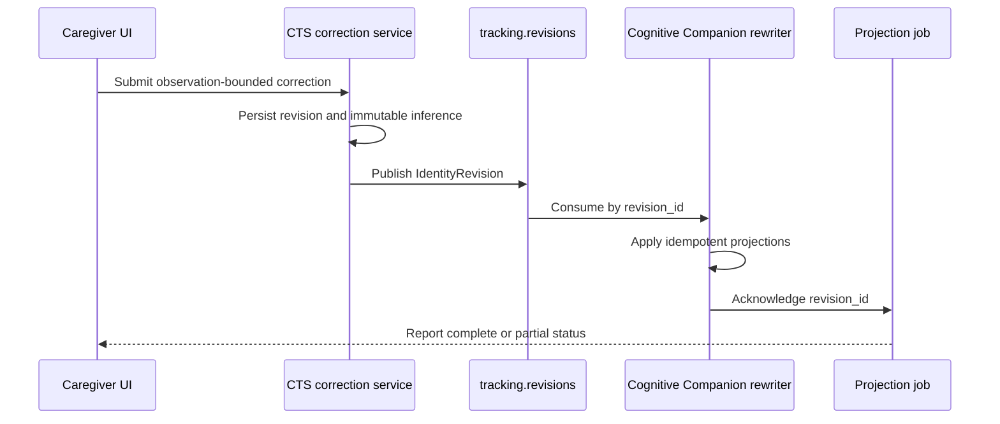

# Identity revision projections

Status: deployed, June 20, 2026.

This decision defines how a caregiver correction changes the label shown by CTS and Cognitive
Companion without rewriting the original model inference.

::: info Implementation status
Deployed. A single CTS correction service owns operator corrections. It writes observation-bounded
revision ranges, creates a projection job per revision, and publishes a protobuf `IdentityRevision`
on `tracking.revisions` with typed range and projection fields. Cognitive Companion supersedes the
affected `PersonLocationService` presence segments and `cts_dementia_signals` rows while
retaining the originals, records `CtsIdentityRevisionLog` with the revision-range lineage, and posts
a projection acknowledgement back to CTS. A correction job completes only after
the CTS internal projection and the Cognitive Companion projection both acknowledge the same
`revision_id`. Explicit `inferred_identity_id` and `effective_identity_id` provenance fields remain
deployed across all tracking APIs.

Supersession is always bounded: an operator revision rewrites only the rows inside its explicit
`range_start`/`range_end`; an automatic (range-less) revision rewrites only rows within
`cts.revision_horizon_s` of the revision time. A replacement row for a superseded
`cts_dementia_signals` row re-derives its `signal_id` from the new identity rather than reusing the
superseded row's ID, so `signal_id` lookups never point at the wrong identity mid-supersession.
:::

## Keep inferred and effective labels separate

`inferred_identity_id` is immutable resolver output. `effective_identity_id` is the revision-aware
label used by consumers.

`person_id` remains the live identity key inside Cognitive Companion. The BFF maps explicit CTS
provenance fields into that internal identity key; it does not deprecate `person_id`.

## Bound corrections by observations

An operator correction:

- targets observation boundaries rather than arbitrary timestamps;
- may cover one frame or a caregiver-confirmed segment;
- stops at PH split, merge, or earlier operator-revision boundaries;
- preserves the original inference and evidence;
- changes the live PH label only when the corrected range reaches the live edge;
- cannot be superseded by an inferred revision.

CTS is the source of truth. Each revision has a stable `revision_id`, actor, reason, observation
range, expected version, evidence summary, and revision lineage.

## Bound automatic revisions by a horizon

Not every revision comes from an operator. A resolver-driven revision (for example, the resolver
overturning its own earlier commit) carries no operator-supplied range. Cognitive Companion bounds
that case with `cts.revision_horizon_s` (default 600 seconds), which mirrors the CTS resolver's own
`resolver.revision_horizon_s`. The rewriter only supersedes `PersonLocationService` presence segments and
`cts_dementia_signals` rows whose window falls inside that horizon of the revision time, never a
PH's entire history.

The two constants must change together. A drift between them lets Cognitive Companion rewrite more
or less history than the CTS resolver's own revision contract promises. There is no schema
migration for this: both sides read the same conceptual bound from their own config.

## Track projection jobs

A correction creates an idempotent projection job. Each required projection records an
acknowledgement using the same `revision_id`.

Required projections include configured CTS history and read models plus Cognitive Companion
location, presence, keyframe, and signal projections. A job is complete only after every required
projection acknowledges the revision.

Retries do not duplicate rows, WebSocket events, or audit records. A partial failure remains
visible as a job state.

### Job status in the caregiver UI

The correction workflow does not report success when the apply request returns. Apply returns
immediately with the job in `applying`, because the projections run after the revision publishes. The
UI polls `GET /api/v1/cts/identity/corrections/jobs/{revision_id}` until the job reaches a terminal
state and only then confirms the correction.

The status panel shows each required projection as a chip that flips from waiting to acknowledged as
counts arrive, so a caregiver can see, for example, that the Cognitive Companion projection applied
four rows. A `failed` job shows the last error and a Retry control that re-checks the job; because
projections retry idempotently by `revision_id`, retrying never duplicates rows. The accepted
correction is not rolled back when a projection fails.

## Use compensating revisions

Undo creates a compensating revision that reverses or replaces an earlier effective projection.
The original correction, review event, revision, and acknowledgement records remain immutable.

## Preserve wire compatibility

New protobuf fields use new tag numbers. The `IdentityRevision` message gained typed fields 18 to
25 for revision kind, range start and end, range authority, range and correction IDs, required
projections, and the revision schema version. These are real proto fields, not JSON folded into
`evidence_json`. Old readers ignore the additions, and new readers accept messages that do not yet
include the additive fields during the stated compatibility window.

CTS Redis streams carry raw protobuf bytes. Compatibility adapters live at one decode boundary and
have an explicit removal condition.

## Operational consequences

- A correction request may return before all projections complete.
- APIs expose revision and job status instead of claiming immediate global consistency.
- Keyframe cards show effective identity; detail views retain inference and revision history.
- Operators can retry a failed projection by `revision_id`.

## Unknown-segment backfill

A resident tracked as Unknown all morning who is face-identified at noon previously kept an
unlabeled morning forever: the resolver only builds a revision when a prior identity existed, the
cross-table rewriter refuses identity-NULL rows, and Cognitive Companion had no rows to supersede.
Identity-continuity M04 closes this gap.

**Trigger.** On a qualifying first commit of a previously Unknown PersonHypothesis, `UnknownBackfillService`
fires when all three conditions hold: the decision has no previous identity, the decision names a
real identity, and the commit's authority is the calibrated ArcFace-authority rung (`direct_face`).
Posterior commits never trigger a backfill; the backfilled label inherits the full trust of the
segment, so only the strongest evidence class may write history.

**The NULL-only invariant.** Backfill only ever fills NULL identity. It never changes a non-NULL
identity value in any table, and it never crosses an operator range, an earlier decision naming a
different identity, or the configured cap.

**Range computation.** The range starts at the PH's birth time and clips forward, in order, past:
the end of the latest earlier decision on the PH naming a different identity; the end of any
overlapping operator range (an operator range covering the live edge skips the backfill entirely,
since operator authority always outranks an automatic process); and the configured maximum span
(`resolver.backfill_max_range_s`, default 4 hours). A range that collapses to empty is skipped.

**Staged rollout.** Three keys under `resolver:` in settings.yaml: `enable_unknown_backfill`
(default false), `backfill_shadow` (default true), `backfill_max_range_s` (default 14400 seconds).
Flag off restores prior behavior instantly. Shadow mode computes the range and emits metrics and
logs only, with no database or stream writes. Enabled mode records an `inferred` revision range,
relabels the identity-NULL `person_trajectories` and `room_dwells` rows, and publishes one
`IdentityRevision` with `revision_kind=inferred_backfill`, `range_authority=inferred`, and
`required_projections=[cc]` for Cognitive Companion to project.

**Wire shape.** The published revision carries an empty `previous_identity_id` (promoting from
Unknown) and the same `revision_id` on its `IdentityRevisionRange` row, so the CTS-internal
projection and the Cognitive Companion projection acknowledge in step. The job stays `applying`
until Cognitive Companion also acknowledges; the CTS-internal projection acknowledges synchronously
as soon as the range is recorded and the rows are relabeled.

**Reading the backfilled range.** The effective-identity overlay that already serves operator
corrections needs no new code: an inferred range is just another live range, and the overlay
already prefers operator authority over inferred and, among inferred or operator ranges, the newest.
Keyframes and read models over a backfilled segment resolve to the identity automatically.

**Reversal.** Every write is keyed by `revision_id`. `scripts/rollback_backfill.py` takes a
revision_id and restores `identity_id` to NULL on the exact rows a backfill relabelled, defaulting
to a dry run. It does not retire the underlying revision range; an operator who also wants the
overlay to stop reporting the backfilled label uses the existing compensating-revision flow.

## Review checklist

- [ ] Original inferred identity remains immutable.
- [ ] Correction ranges use observation boundaries.
- [ ] Live labels change only when the range reaches the live edge.
- [ ] Every projection is idempotent by `revision_id`.
- [ ] Completion requires all configured acknowledgements.
- [ ] Undo creates a compensating revision.
- [ ] An automatic (range-less) revision rewrites only rows within `cts.revision_horizon_s`, never
      a PH's entire history.
- [ ] A replacement signal row re-derives its `signal_id`; it never copies the superseded row's ID.

## Related pages

- [Identity authority and Unknown](/features/continuous-tracking/identity-integrity/identity-authority)
- [ReID gallery governance](/features/continuous-tracking/identity-integrity/reid-gallery-governance)
- [Cross-repository identity contracts](/features/continuous-tracking/identity-integrity/contracts)

