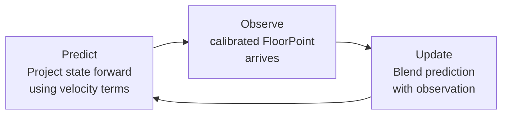
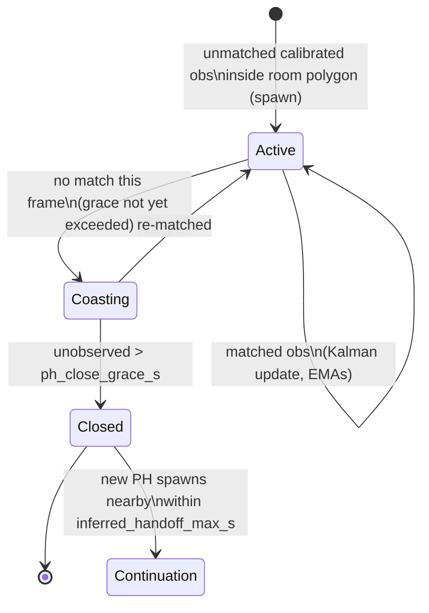
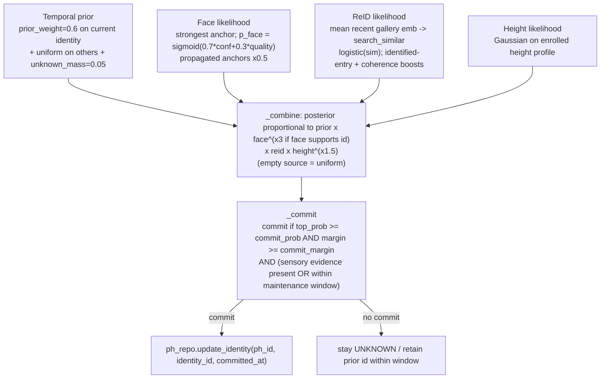
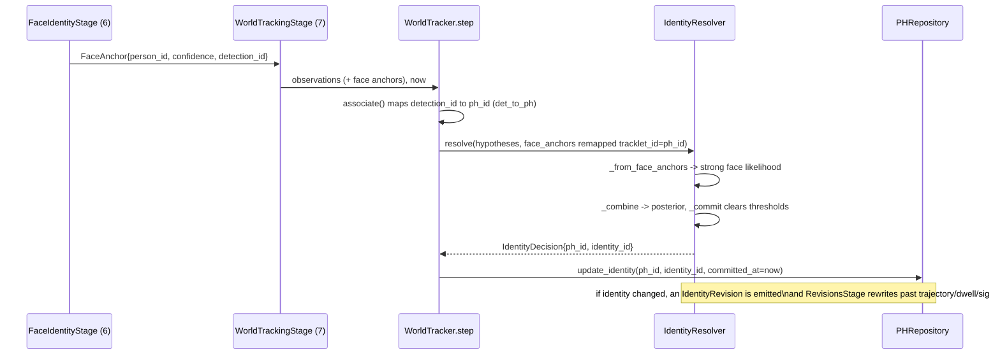
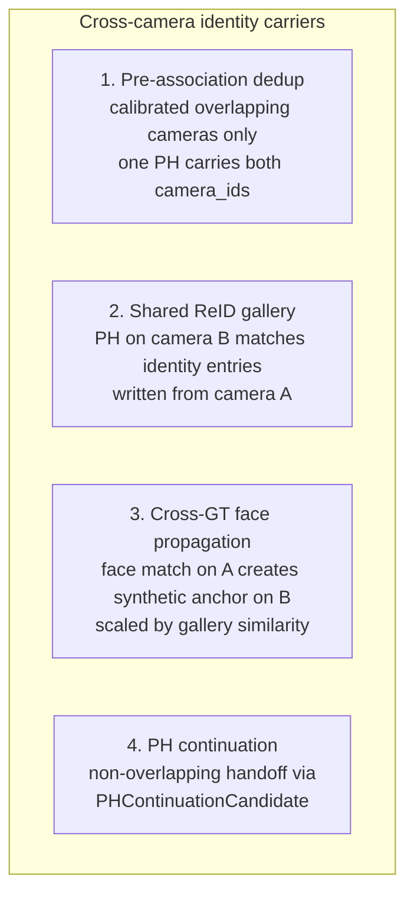

# Tracking Concepts

Explanations of the core algorithms used by the world-coordinate tracker (`app/tracking/world/tracker.py`). These concepts underpin the [Frame Processing Pipeline](./frame-pipeline.md).

## Bounding box and IoU

A bounding box is a rectangle that encloses a detected person. CTS uses axis-aligned boxes described by four pixel coordinates: `(x_min, y_min, x_max, y_max)`.

**Intersection over Union (IoU)** measures how much two bounding boxes overlap:

```
IoU = area(A n B) / area(A u B)
```

```
+------------------+
|    Box A         |
|       +----------+--------+
|       |   n      |        |
+-------+----------+        |
        |    Box B          |
        +-------------------+

IoU = (area of overlap) / (area of A + area of B minus area of overlap)
```

| IoU value | Meaning |
|-----------|---------|
| 1.0 | Boxes are identical |
| 0.5 | Roughly half the combined area is shared |
| 0.25 | Minimal but meaningful overlap |
| 0.0 | No overlap |

IoU is used in the detection dedup step: newly decoded bounding boxes whose IoU with an already-kept box exceeds `detection_iou_dedup_threshold` (default: 0.55) are suppressed before the tracker sees them. The world tracker's association uses floor-plane Mahalanobis distance, not IoU.

## Kalman filter

A Kalman filter is a recursive state estimator. Given a noisy stream of floor-position observations, it maintains a smoothed estimate of a person's position and velocity and predicts where they will be in the next frame.

### State vector

The world tracker uses a 4-dimensional floor-plane state (`app/tracking/world/kalman.py`):

```
x = [x_m, y_m, vx_m_s, vy_m_s]^T
```

| Component | Meaning |
|-----------|---------|
| `x_m`, `y_m` | Position on the shared floor plane in metres |
| `vx_m_s`, `vy_m_s` | Velocity in metres per second |

The observation is `z = [x_m, y_m]^T` from the per-camera homography (the calibrated `FloorPoint`). Velocity is inferred from the sequence of floor positions, not measured from the frame directly.

### Predict and update

Each frame, the filter runs two steps:



- **Predict**: advances the position by `velocity * dt` and decays velocity toward zero over `velocity_decay_s` (default: 3.0 s). This is where the filter extrapolates a person's floor position when no observation arrives.
- **Update**: blends the prediction with the observed floor point using the Kalman gain, weighted by `observation_noise_m` (default: 0.25 m, the calibration residual 95th percentile).

The result is a track that tolerates brief observation gaps and produces smooth floor positions even when the detector or homography is noisy.

### Mahalanobis gating

Before the Hungarian assignment, pairs whose squared Mahalanobis distance exceeds `gate_chi2 = 9.21` (chi-squared 99%, 2 dof) are excluded. This prevents the solver from assigning a detection to a PH on the opposite side of the room.

## Hungarian algorithm

The Hungarian algorithm (also called the Munkres algorithm) solves the **assignment problem**: given a cost matrix where `cost[i][j]` is the cost of assigning track `i` to detection `j`, find the globally optimal one-to-one assignment that minimizes total cost.

```
Tracks:      T1   T2   T3
            +-------------------------------+
Detection D1| 0.1  0.8  0.9 | <- cheapest: T1
Detection D2| 0.7  0.2  0.8 | <- cheapest: T2
Detection D3| 0.9  0.7  0.3 | <- cheapest: T3
            +-------------------------------+
Optimal assignment: D1->T1, D2->T2, D3->T3  (total cost: 0.6)
```

A greedy approach (each detection picks its cheapest track independently) would fail when two detections compete for the same track. The Hungarian algorithm solves this globally and runs in O(n^3) time, which is fast enough for typical frame sizes (fewer than 20 people per camera).

Any detection left unmatched after the assignment spawns a new track. Any track left unmatched increments its lost counter.

## World tracker association

The world tracker combines the Kalman filter, Hungarian algorithm, and appearance embeddings into a single floor-plane tracker. There is no per-camera tracker; one `WorldTracker` instance processes observations from all cameras in a single pass.

### Association cost

The cost matrix (`app/tracking/world/cost_matrix.py`) passed to the Hungarian algorithm is a weighted blend of three components:

```
cost(PH i, observation j) = alpha_geo * geo_cost + alpha_app * app_cost + alpha_height * height_cost
```

| Component | Default weight | Measurement |
|-----------|----------------|-------------|
| `geo_cost` | `alpha_geo = 0.5` | Normalized Mahalanobis distance on the floor plane |
| `app_cost` | `alpha_app = 0.4` | Cosine distance between PH gallery mean and observation embedding |
| `height_cost` | `alpha_height = 0.1` | Gaussian score on height difference |

Two hard gates return `GATE_INF` (never match):
- Geometric gate: squared Mahalanobis distance `> gate_chi2 (9.21)`.
- Identity-conflict gate: the observation carries a committed face `person_id` that differs from the PH's identity at confidence `>= face_conflict_threshold (0.70)`.

### PH lifecycle



| Parameter | Default | Meaning |
|-----------|---------|---------|
| `min_observations_to_publish` | 3 | Minimum observations before a PH appears in downstream outputs |
| `ph_close_grace_s` | 5.0 s | Grace period before an unmatched PH is closed |
| `inferred_handoff_max_s` | 600 s | Window for linking a new PH to a recently closed one |
| `inferred_handoff_max_distance_m` | 5.0 m | Max floor distance for a continuation link |

A PH with `observation_count < min_observations_to_publish` is tracked internally but produces no `WorldFrameSnapshot` and no downstream output, filtering out single-frame detection noise.

## PersonHypothesis (PH)

A **PersonHypothesis** (PH, frozen dataclass in `domain/__init__.py`) is the world-level entity representing one tracked person. It is the single physical-track identifier in the system. Every downstream output -- trajectory rows, room dwells, dementia signals, Redis stream events, and MCP tool responses -- references the `ph_id` (a UUID string) as the primary identity anchor.

A PH aggregates evidence from multiple cameras simultaneously. When two calibrated cameras share a field of view, the pre-association dedup pass ensures they produce exactly one PH, not two.

Key PH fields:

| Field | Meaning |
|-------|---------|
| `state_mean` | `(x, y, vx, vy)` floor-plane metres and m/s (Kalman mean) |
| `state_cov` | 16 floats, 4x4 row-major covariance |
| `born_at`, `last_seen_at`, `closed_at` | Lifecycle timestamps |
| `last_seen_camera`, `active_cameras` | Camera attribution; `active_cameras` accumulates every camera that has contributed |
| `observation_count` | Total observations folded in; gates publication via `min_observations_to_publish` |
| `current_identity_id`, `current_identity_committed_at` | The committed identity and when it was committed |
| `gallery_mean` | Online L2-normalised EMA of SOLIDER embeddings; `alpha = 1 / min(count+1, 100)` |
| `height_estimate_m` | EMA of height estimates (`alpha = 0.1`) |
| `mean_quality` | EMA of per-observation `CropQuality` scores: `0.1 * obs.quality + 0.9 * prev`. Travels to CC as the `quality` field on `PersonLocationEnvelope`. |

**Uncalibrated cameras.** When a camera has no homography, `SpatialProjectionStage` yields `FloorPoint(calibrated=False)`. `WorldTrackingStage._synthetic_floor_point` maps the bbox centre into a 4 m virtual room offset into a per-camera 200 m tile, still flagged `calibrated=False`. The Kalman filter and per-camera tracking work on the virtual tile; `dedup_observations` skips uncalibrated observations. For uncalibrated home cameras, identity crosses cameras only through the shared ReID gallery, cross-GT face propagation, and PH continuation.

### Quality and provenance

Each observation contributes a quality score from `CropQuality` (`app/pipeline/crop_quality.py`). The PH's `mean_quality` accumulates these scores across frames. Downstream consumers receive `quality` as an explicit field in the response envelope; they never compute it client-side.

## Cross-camera dedup

When two cameras see the same person simultaneously (the canonical case: a hallway camera and an adjacent camera at a bathroom door), naive association would produce two PHs for one person. The pre-association floor-point dedup (`dedup_observations()`) prevents this.

Before the Hungarian assignment runs, all detections with calibrated floor positions are grouped by floor proximity and identity compatibility. Each group elects one representative detection. Only representatives enter the `associate()` call, preserving the 1-to-1 contract of the Hungarian solver. After association, the cluster membership map propagates all source camera IDs back to the winning PH.

See [Frame Pipeline stage 7](./frame-pipeline.md#7-world-tracking) for the configuration knobs and the integration proof.

## PH continuation

When a person leaves the camera field and then re-enters, the world tracker detects the handoff via `PHContinuationCandidate`. When a new PH spawns, the tracker looks back at recently closed PHs: if a closed PH is within `inferred_handoff_max_s` (600 s) and `inferred_handoff_max_distance_m` (5.0 m), a `PHContinuationCandidate` is emitted with both PH IDs, the elapsed time, and the spatial distance.

The continuation candidate carries `predecessor_identity_id`, so the CC side can inherit the prior identity without waiting for the Bayesian resolver to re-accumulate evidence. The Bayesian identity resolver then runs normally on the new PH; the prior built from the inherited gallery and face lock maintains the identity across the gap.

## Identity resolver

For each PH that received an observation this frame, `IdentityResolver.resolve` (`app/tracking/identity_resolver.py`) builds a posterior over `{enrolled identities} ∪ {UNKNOWN}` from four parts and applies a commit rule.



Commit thresholds: `commit_prob = 0.65`, `commit_margin = 0.15`; in dense scenes (2 or more identities with posterior > 0.3) `commit_prob_dense = 0.80`, `commit_margin_dense = 0.20`. The temporal prior alone cannot commit an identity: at least one sensory source (face or ReID) must support the top identity unless the PH is inside its maintenance window.

**Face lock and maintenance window.** When a face anchor's confidence clears `face_commit_min_confidence = 0.70`, the resolver sets a face lock on the PH. A face-locked identity is held without fresh face evidence for `face_lock_maintenance_max_age_s = 300 s`. Without a face lock, an existing identity is held by the prior for `prior_maintenance_max_age_s = 120 s`. After the window expires with no sensory evidence, the identity decays.

## How a face signal updates a PH

This is the exact stage-by-stage path when ArcFace identifies a person on a camera:



The key detail: `FaceIdentityStage` produces anchors keyed by `detection_id` (the PH does not exist yet at stage 6). After association, `WorldTracker._resolve_identities` remaps each anchor's `tracklet_id` to the assigned `ph_id` using `det_to_ph`. The identity-conflict hard gate in the cost matrix simultaneously prevents a strong, differing face from being matched to the wrong PH.

## How identity crosses cameras



Path 1 requires calibration (dedup skips uncalibrated observations). Paths 2 to 4 are the only carriers for uncalibrated home cameras. Propagation (path 3) is gated twice: gallery similarity `>= cross_gt_face_propagation_threshold (0.78)` and `synthetic_confidence = source_confidence * gallery_sim >= face_commit_min_confidence (0.70)`.

## Next steps

- [Frame Processing Pipeline](./frame-pipeline.md): how all of these concepts fit into the full 15-stage pipeline
- [CC Integration](./cc-integration.md): how identity assignments and quality propagate to the WebSocket live view
