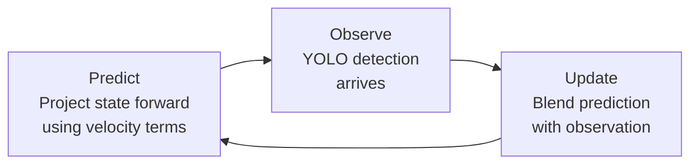
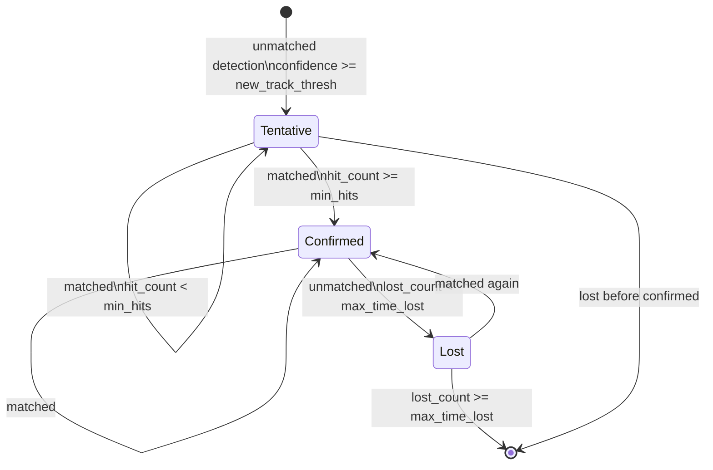

# Tracking Concepts

Explanations of the core algorithms used by the per-camera tracker and the world-level tracker (`app/tracking/world/tracker.py`). These concepts underpin the [Frame Processing Pipeline](./frame-pipeline.md).

## Bounding box and IoU

A bounding box is a rectangle that encloses a detected person. CTS uses axis-aligned boxes described by four pixel coordinates: `(x_min, y_min, x_max, y_max)`.

**Intersection over Union (IoU)** measures how much two bounding boxes overlap:

```
IoU = area(A n B) / area(A u B)
```

```
+------------------+
|    Box A         |
|       +----------+--------+
|       |   n      |        |
+-------+----------+        |
        |    Box B          |
        +-------------------+

IoU = (area of overlap) / (area of A + area of B minus area of overlap)
```

| IoU value | Meaning |
|-----------|---------|
| 1.0 | Boxes are identical |
| 0.5 | Roughly half the combined area is shared |
| 0.25 | Minimal but meaningful overlap |
| 0.0 | No overlap |

IoU is used in two places in the tracker:

- **Association gate**: a detection is only accepted as a match for an existing track when `IoU >= match_thresh` (default: 0.2). This prevents the Hungarian solver from assigning a detection to a track on the opposite side of the frame.
- **Dedup filter**: a newly created track that overlaps a stable existing track by `IoU > dedup_iou_threshold` (default: 0.6) is dropped immediately to prevent ghost duplicate tracks.

## Kalman filter

A Kalman filter is a recursive state estimator. Given a noisy stream of observations (bounding box positions from YOLO), it maintains a smoothed estimate of the person's current position and predicts where they will be in the next frame.

### State vector

The 8-dimensional state vector follows the BoT-SORT formulation:

```
x = [cx, cy, a, h, v_cx, v_cy, v_a, v_h]^T
```

| Component | Meaning |
|-----------|---------|
| `cx`, `cy` | Bounding box center coordinates |
| `a` | Aspect ratio (width / height) |
| `h` | Height |
| `v_cx`, `v_cy`, `v_a`, `v_h` | Frame-to-frame velocities of the above |

The observation vector is just the first four components: `z = [cx, cy, a, h]^T`. Velocities are inferred from the sequence of observations, not measured directly.

### Predict and update

Each frame, the filter runs two steps:



- **Predict**: multiplies the state by the transition matrix `F`, which adds velocity to position. This is where the filter extrapolates the person's location when no detection is present.
- **Update**: blends the prediction with the observed bounding box using the Kalman gain (a weighting that depends on how uncertain the prediction is versus how noisy the measurement is).

The result is a track that tolerates brief detection gaps and produces smooth bounding boxes even when the detector is noisy.

## Hungarian algorithm

The Hungarian algorithm (also called the Munkres algorithm) solves the **assignment problem**: given a cost matrix where `cost[i][j]` is the cost of assigning track `i` to detection `j`, find the globally optimal one-to-one assignment that minimizes total cost.

```
Tracks:      T1   T2   T3
            +-------------------------------+
Detection D1| 0.1  0.8  0.9 | <- cheapest: T1
Detection D2| 0.7  0.2  0.8 | <- cheapest: T2
Detection D3| 0.9  0.7  0.3 | <- cheapest: T3
            +-------------------------------+
Optimal assignment: D1->T1, D2->T2, D3->T3  (total cost: 0.6)
```

A greedy approach (each detection picks its cheapest track independently) would fail when two detections compete for the same track. The Hungarian algorithm solves this globally and runs in O(n^3) time, which is fast enough for typical frame sizes (fewer than 20 people per camera).

Any detection left unmatched after the assignment spawns a new track. Any track left unmatched increments its lost counter.

## BoT-SORT

BoT-SORT (Boosting Online Multi-Object Tracking with Appearance Features) combines the Kalman filter, Hungarian algorithm, and appearance embeddings into a single tracker.

### Association cost

The cost matrix passed to the Hungarian algorithm is a weighted blend:

```
cost(track i, detection j) = (1 - alpha) x IoU_cost(i, j) + alpha x appearance_cost(i, j)
```

where:
- `IoU_cost = 1 - IoU(predicted_bbox, detection_bbox)` -- spatial agreement
- `appearance_cost = cosine_distance(track_embedding, detection_embedding)` -- visual similarity
- `alpha = appearance_weight` (default: 0.15)

With `appearance_weight = 0.15`, spatial position (IoU) dominates the assignment. Appearance acts as a tiebreaker when two detections are at similar distances from a track. This is intentional: when a person turns away from the camera, their ReID embedding changes significantly, but their bounding box position barely moves. Weighting IoU heavily prevents the tracker from losing the track due to an appearance change.

After the Hungarian step, a match is **accepted only if** `IoU >= match_thresh` (default: 0.2). Appearance similarity alone cannot force a match. This prevents the solver from pairing a detection with a distant track purely because their embeddings happen to be similar.

### Track lifecycle



| Parameter | Default | Meaning |
|-----------|---------|---------|
| `new_track_thresh` | 0.7 | Minimum detection confidence to spawn a new track |
| `min_hits` | 3 | Consecutive matches required before a track is "confirmed" |
| `max_time_lost` | 30 frames | Frames without a match before the track is terminated |

A confirmed track feeds into the world tracker and identity pipeline. Tentative tracks are tracked in memory but produce no outputs, filtering out single-frame detection noise.

## PersonHypothesis (PH)

A **PersonHypothesis** (PH) is the world-level entity representing one tracked person. It is the single physical-track identifier in the system. Every downstream output -- trajectory rows, room dwells, dementia signals, Redis stream events, and MCP tool responses -- references the `ph_id` (a UUID) as the primary identity anchor.

A PH aggregates evidence from multiple cameras simultaneously. When two cameras share a field of view (e.g., a hallway camera and a room camera at a doorway), the pre-association dedup pass ensures they produce exactly one PH, not two.

Key PH fields:

| Field | Description |
|-------|-------------|
| `ph_id` | UUID; the single physical-track identifier on the wire (after R3). |
| `identity_id` | The committed household-member identity, or `""` when unresolved (UNKNOWN). |
| `mean_quality` | Exponential moving average of per-observation quality scores. Travels to CC via the `IdentitySnapshot` proto and then as `quality` on `PersonLocationEnvelope`. |

### Quality and provenance

Each observation contributes a quality score (from `CropQuality`, a scorer that weights detection confidence and crop size). The PH's `mean_quality` accumulates these scores across frames. Downstream consumers (CC admin UI, MCP tools) receive `quality` as an explicit field in the response envelope; they never compute it client-side. This is design rule D5: quality is a first-class field, always server-computed.

## Cross-camera dedup

When two cameras see the same person simultaneously (the canonical case: a hallway camera and an adjacent camera at a bathroom door), naive association would produce two PHs for one person. The pre-association floor-point dedup (`dedup_observations()`) prevents this.

Before the Hungarian assignment runs, all detections with calibrated floor positions are grouped by floor proximity and identity compatibility. Each group elects one representative detection. Only representatives enter the `associate()` call, preserving the 1-to-1 contract of the Hungarian solver. After association, the cluster membership map propagates all source camera IDs back to the winning PH.

See [Frame Pipeline stage 7a](./frame-pipeline.md#7a-pre-association-cross-camera-dedup-u1) for the configuration knobs and the integration proof.

## Same-camera re-entry

When a track is lost and the person re-enters the same camera's field of view:

1. BoT-SORT creates a new confirmed track after `min_hits` frames.
2. The world tracker checks whether its ReID embedding is similar to any existing PH on the same camera.
3. If `appearance_sim >= same_camera_reentry_threshold` (default: 0.72) and the gap is small, the new track is merged into the existing PH.
4. The PH retains its identity assignment. The live view shows the correct label without re-running the full identity resolution pipeline.

## Next steps

- [Frame Processing Pipeline](./frame-pipeline.md): how all of these concepts fit into the full 15-stage pipeline
- [CC Integration](./cc-integration.md): how identity assignments and quality propagate to the WebSocket live view
