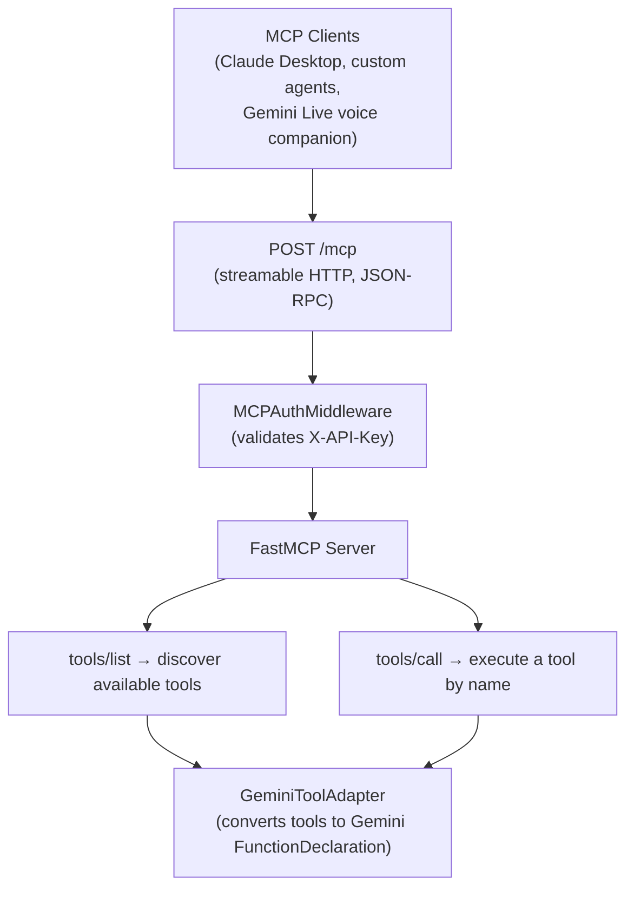

# MCP Integration

Cognitive Companion includes a [Model Context Protocol](https://modelcontextprotocol.io/) (MCP) server, built on the official MCP Python SDK, that exposes 39 tools for AI agent integration. Agents can discover system state, query sensor data, inspect enrollment and e-ink status, check person locations, review activity timelines and daily reports, explore semantic memory, trigger rule executions, author new rules, and inspect plugin metadata. The same tools are shared with the Gemini Live voice companion for function calling during conversations.

## What is MCP?

The Model Context Protocol is an open standard for connecting AI models to external tools and data sources. It provides a structured way for AI agents to:

- **Discover** available tools and their parameters
- **Execute** tools with validated inputs
- **Receive** structured responses

Cognitive Companion's MCP server allows external AI agents (Claude, GPT, custom agents) to interact with the senior care system as part of their tool-calling workflows.

## MCP and BFF parity guarantee

MCP tools and BFF router endpoints share one service layer (design rule D6). Any data exposed to the Vue UI through a router is exposed to MCP by reading the **same** service function, never a parallel query. Consequences:

- MCP tools contain no query logic of their own; they call service methods.
- Import-linter contracts enforce that `mcp/` may not import a repository directly.
- When a service response envelope changes, both the router and the MCP tool reflect the change automatically.
- Smoke tests in `backend/tests/mcp/` assert that every registered tool name resolves to a callable.

## Architecture

The MCP server is implemented using the official `mcp` Python SDK's `FastMCP` class. Tools are defined as decorated async functions with type hints that auto-generate JSON schemas. The server is mounted as an ASGI sub-application on FastAPI at `/mcp`, serving the standard MCP protocol via streamable HTTP transport.



A `GeminiToolAdapter` reads the same tool definitions and converts them to Gemini `FunctionDeclaration` format, so the voice companion can call tools during conversations without duplicating implementations.

## Available Tools

| Tool                       | Description                                                  | Parameters                                    |
|----------------------------|--------------------------------------------------------------|-----------------------------------------------|
| `get_rooms`                | List all configured rooms                                    | None                                          |
| `get_sensors`              | List sensors                                                 | `room_name`, `sensor_type` (optional filters) |
| `get_room_occupancy`       | Current occupancy from presence sensors                      | `room_name` (optional)                        |
| `get_recent_images`        | Recent camera images for a sensor                            | `sensor_id`, `limit`                          |
| `get_light_level`          | Illuminance from a HA sensor                                 | `entity_id`                                   |
| `get_alerts`               | Recent emergency alerts                                      | `resolved`, `room_name`, `limit` (optional)   |
| `get_event_logs`           | Rule execution event logs                                    | `rule_name`, `status`, `limit` (optional)     |
| `get_rules`                | Configured automation rules                                  | `enabled_only` (default true)                 |
| `get_conversation_history` | Recent conversation turns                                    | `session_id`, `limit` (optional)              |
| `get_person_locations`     | Current location of all tracked members                      | None                                          |
| `get_enrolled_persons`     | Household members with face enrollment data                  | None                                          |
| `get_person_sightings`     | Camera sighting history for a person                         | `person_id`, `limit`                          |
| `get_person_activities`    | Recent detected activities (eating, sleeping, etc.)          | `person_id`, `activity_type`, `minutes`       |
| `get_workflow_executions`  | Recent pipeline workflow executions                          | `rule_name`, `status`, `limit` (optional)     |
| `get_rule_pipeline`        | Pipeline step definitions for a rule                         | `rule_id`                                     |
| `trigger_rule`             | Manually trigger a rule's pipeline execution                 | `rule_id`                                     |
| `get_eink_display_status`  | Active e-ink image state for one or all displays             | `sensor_id` (optional)                        |
| `get_local_datetime`       | Current local date and time for the household's timezone     | None                                          |
| `get_weather`              | Current weather from Home Assistant                          | None                                          |
| `get_person_timeline`      | Chronological timeline of activities and sightings for a person | `person_id`, `minutes` (optional)          |
| `get_daily_report`         | End-of-day wellness report for one or all members            | `person_id`, `report_date` (optional)       |
| `get_open_sessions`        | Currently open activity sessions (meals, bathroom, etc.)     | `person_id`, `activity_type` (optional)     |
| `submit_user_response`          | Record user response to an interactive prompt step    | `execution_id`, `step_id`, `action`         |
| `get_recent_scene_objects`  | Recent object presence in a room                        | `room_id`, `since_minutes`                   |
| `get_scene_observations`    | Search scene observations with vector similarity        | `query_text`, `room_id`, `limit` (optional)  |
| `get_person_movements`      | Movement transitions for a person between rooms         | `person_id`, `semantic`, `since_minutes` (optional) |
| `get_room_trend`            | Room-level trend state from object presence data        | `room_id`, `since_hours` (optional)          |
| `search_similar_scenes`     | Vector search across scene embeddings                   | `query_embedding`, `room_id`, `limit` (optional) |
| `get_tracking_status`       | Overall CTS tracking status and active PH count        | (none) |
| `get_person_location`       | Current location envelope for one person (with quality/staleness) | `person_id` |
| `get_recent_dementia_signals` | Recent dementia signals for a person with signal envelopes | `person_id`, `limit` (optional) |
| `query_knowledge_base`      | Semantic search over the knowledge repository           | `query` |
| `get_current_quiz_question` | Current question in an active quiz session              | `session_id` |
| `submit_quiz_answer`        | Record an answer to a quiz question                     | `session_id`, `answer` |
| `complete_quiz_session`     | Close a quiz session                                    | `session_id` |
| `list_rules`                | List all rules with summary info                        | (none) |
| `list_plugin_metadata`      | Metadata for all registered steps, filters, and channels | `kind` (optional: `"step"`, `"filter"`, `"channel"`) |
| `get_rule_bundle`           | Export a rule as a portable bundle                      | `rule_id` |
| `import_rule_bundle`        | Validate or commit a rule bundle                        | `bundle` (RuleBundle dict), `mode` (`"preview"` or `"commit"`) |

## Authentication

MCP tools require authentication via the API key. The key is configured in `config/auth.yaml`:

```yaml
api_keys:
  - key: ${CC_MCP_API_KEY}
    name: mcp_agent
    permissions:
      - mcp_readonly
```

The `mcp_readonly` permission grants access to the `/mcp` endpoint. Pass the key via the `X-API-Key` header or `Authorization: Bearer <key>` header.

## Endpoint

The MCP server is available at a single endpoint:

| Method | Path   | Description                                      |
|--------|--------|--------------------------------------------------|
| `POST` | `/mcp` | MCP protocol endpoint (streamable HTTP, JSON-RPC) |

### Tool Discovery

```bash
curl -X POST \
  -H "X-API-Key: $CC_MCP_API_KEY" \
  -H "Content-Type: application/json" \
  -d '{"jsonrpc":"2.0","method":"tools/list","id":1}' \
  http://localhost:8000/mcp
```

### Tool Execution

```bash
curl -X POST \
  -H "X-API-Key: $CC_MCP_API_KEY" \
  -H "Content-Type: application/json" \
  -d '{"jsonrpc":"2.0","method":"tools/call","params":{"name":"get_person_sightings","arguments":{"person_id":"grandma"}},"id":2}' \
  http://localhost:8000/mcp
```

## Integration Patterns

### With Claude Desktop

Configure Claude Desktop's MCP settings to point to your Cognitive Companion instance:

```json
{
  "mcpServers": {
    "cognitive-companion": {
      "url": "http://your-cc-host:8000/mcp",
      "headers": {
        "X-API-Key": "your_mcp_key"
      }
    }
  }
}
```

### With Custom Agents

Any agent framework that supports the MCP protocol can integrate with Cognitive Companion by pointing to the `/mcp` endpoint. The standard JSON-RPC interface handles tool discovery and execution.

### Example Agent Workflow

An AI agent monitoring the household might:

1. Call `get_person_locations` to check where everyone is
2. Call `get_enrolled_persons` to see which household members are tracked
3. Call `get_person_activities` to check if lunch has been eaten
4. If lunch has not been detected, call `trigger_rule` on the lunch reminder rule
5. Call `get_alerts` to check for any unresolved emergencies

## Voice Companion Integration

A configurable subset of MCP tools is also available to the Gemini Live voice companion via function calling. When the senior asks a question like "what's the weather?" or "where is everyone?", Gemini pauses audio generation, calls the appropriate tool, and incorporates the result into its spoken response. Tool results are never displayed raw to the user; they always flow through Gemini's natural language audio response.

The voice-enabled tool subset is configured in `settings.yaml`:

```yaml
mcp:
  gemini_tools:
    - "get_rooms"
    - "get_room_occupancy"
    - "get_person_locations"
    - "get_alerts"
    - "get_weather"
    - "get_local_datetime"
    - "get_person_activities"
    - "get_enrolled_persons"
```

Destructive tools like `trigger_rule` are excluded from the voice subset by default.

## Network Considerations

The MCP server runs on the same backend instance, so no additional deployment is needed. Since Cognitive Companion runs on-premise without a public endpoint, MCP clients must be on the same local network. For remote agent access, consider:

- VPN or tailnet for secure remote access
- A reverse proxy with authentication for controlled exposure

## Adding New Tools

1. Add a `@_register` decorated async function in `backend/mcp/server.py`. Type hints on parameters auto-generate JSON schemas.
2. Add the tool name to `config/settings.yaml` under `mcp.tools`.
3. If the tool should be available in voice conversations, also add it to `mcp.gemini_tools`.

See the [development guide](/development/extending-pipeline) for more details.
