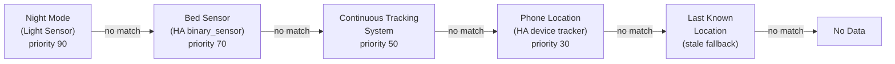

# Person Identification and Tracking

Cognitive Companion uses GPU-accelerated face recognition to identify household members across camera feeds, then fuses those detections with Home Assistant presence sensors for whole-house location tracking.

## Face Recognition

The person identification system runs as a [companion microservice](https://github.com/SilverMind-Project/person-identification-service) using InsightFace (buffalo_l model pack) with ArcFace 512-dimensional embeddings.

### Enrollment

Upload 5-10 reference photos per person through the admin UI (**Members & Enrollment** page) or via the API. No model fine-tuning is needed because ArcFace generalizes from pretrained weights.

**Enrolling from the Admin UI:**

1. Go to **Members & Enrollment** in the admin console
2. Click the face-recognition icon next to a member
3. Upload reference photos (drag-and-drop or file picker)
4. The backend proxies the images to the person-ID service, which extracts face embeddings

**Best practices for reference photos:**

- Use photos with varied lighting conditions
- Include different angles (frontal, 3/4 profile)
- Ensure the face is clearly visible and unobstructed
- Avoid group photos; use one person per reference image
- Photos from deployment cameras give the best domain match

### Identification Pipeline

Two identification paths exist, depending on the calling system:

**Cognitive Companion batch path.** The CC backend sends batched frames:

1. Camera uploads a frame via `POST /api/v1/device/recamera`
2. The event aggregator batches frames (configurable size/window)
3. When a `person_identification` pipeline step executes, it sends the batch to `POST /api/v1/identify-batch`
4. The service returns per-frame face detections with identity, confidence, and bounding box

**Continuous Tracking crop-based path.** The CTS orchestrator sends per-detection person crops:

1. The frame pipeline extracts person crops from YOLO detections at native resolution
2. Each crop is encoded as a JPEG and sent individually to `POST /api/v1/identify`
3. The service returns face detections within the crop, with normalized bounding boxes mapped back to the original frame
4. Face results are rate-limited per camera (default cooldown: 5 s) and associated with tracked individuals via `tracklet_id`

CTS uses only the single-image endpoint so that person crops are sent at full resolution, preserving fine facial detail that would be lost in downscaled full-frame images.

For the floor-plane side of CTS, including camera calibration, measurement uncertainty, multi-camera
fusion, posture fusion, visibility polygons, and drift detection, read the progressive
[Continuous Tracking floor series](/features/continuous-tracking/01-camera-to-floor-basics).

### Annotated Images

When `include_annotated_image` is enabled in a pipeline step's config, the person-ID service returns a copy of each frame with bounding boxes and name labels drawn over detected faces. These annotated images are:

- Stored in `pipeline_data` under the `annotated_images` key
- Available for forwarding to downstream notification steps
- Useful for visual confirmation in Telegram and WebSocket alerts

### Confidence Thresholds

The recognition threshold is configured in the person-ID service's `config/settings.yaml` under `recognition.threshold` (default `0.4`). Detections below this threshold are reported as "unknown". Override it at deployment time with the `RECOGNITION_THRESHOLD` environment variable.

### Guest Image Saving

When the `save_guest_images` flag is set to `true` on an identification request, the person-ID service uploads the **full frame image** to MinIO whenever unidentified guests are detected. Images are stored under the `guests/` prefix organized by date:

```text
guests/2026-03-23/143022-123456_f0_2guests.jpg
guests/2026-03-23/143022-234567_f1_1guests.jpg
```

The filename encodes: `{UTC time}_{frame index}_{guest count}.jpg`. Metadata is recorded in the `guest_visits` hypertable for querying. Guest images are stored in MinIO (the shared S3-compatible object store), not on the local filesystem.

## Motion Direction Detection

Cross-frame centroid tracking classifies movement direction:

| Direction | Description |
| --- | --- |
| `left-to-right` | Moving across the frame from left to right |
| `right-to-left` | Moving across the frame from right to left |
| `towards-camera` | Face/body getting larger (approaching) |
| `away-from-camera` | Face/body getting smaller (leaving) |
| `stationary` | No significant movement between frames |

**Use case:** Door-mounted cameras can infer entering vs. leaving a room based on movement direction relative to camera placement.

## Camera Topology

Raw motion directions carry no room-level meaning on their own. Camera topology maps each raw direction to a semantic transition for a specific camera, so a rule can fire when someone *enters* the kitchen rather than just when motion is detected.

### Configuration

Add a `movement_map` to a sensor's `config_json` in the admin UI or via `PUT /api/v1/sensors/{id}`:

```json
{
  "movement_map": {
    "left-to-right": "entering",
    "right-to-left": "exiting",
    "towards-camera": "approaching_exit",
    "away-from-camera": "entering_depth",
    "stationary": "stationary"
  }
}
```

Valid semantic values: `entering`, `exiting`, `approaching_exit`, `entering_depth`, `stationary`. Any raw direction not present in the map is ignored.

### How it works

When a `person_identification` step runs and raw motion direction data is available from the person-ID service, `infer_room_transition()` in `backend/services/camera_topology.py` looks up the direction in the sensor's `movement_map` and returns a frozen `RoomTransition` dataclass:

```python
@dataclass(frozen=True)
class RoomTransition:
    person_id: str
    person_name: str
    sensor_id: str
    direction_raw: str        # e.g. "left-to-right"
    semantic: str             # e.g. "entering"
    from_room_id: str | None
    from_room_name: str | None
    to_room_id: str | None
    to_room_name: str | None
    confidence: float
```

Each computed transition is stored in `PersonLocationService` presence segments with the `direction_semantic` field populated. The `person_identification` step also writes transitions to `pipeline_data["room_transitions"]` for use in downstream steps and notification templates.

### Room Transition filter

The `room_transition` context filter lets rules fire only when a person makes a specific type of transition. Configure it on a rule alongside other context filters:

| Field | Type | Description |
| ----- | ---- | ----------- |
| `person_id` | str (required) | Person whose transitions to watch |
| `semantic` | str (optional) | Semantic transition type to match (e.g. `"entering"`) |
| `to_room_name` | str (optional) | Destination room name (case-insensitive) |
| `from_room_name` | str (optional) | Origin room name (case-insensitive) |
| `within_minutes` | int (default 5) | Lookback window for recent transitions |

**Example:** Fire a reminder rule only when grandma enters the kitchen:

```yaml
context_type: room_transition
config:
  person_id: grandma
  semantic: entering
  to_room_name: Kitchen
  within_minutes: 2
```

This filter is evaluated against `PersonLocationService` presence segments, so it works correctly across both direct camera detections and HA-sensor-inferred transitions.

## Whole-House Location Tracking

The presence system maintains real-time location state for each household member via `PersonLocationService` by fusing multiple data sources (`world_tracker`, `face_sighting`, `sensor`, `manual`). Source arbitration priority and per-source evidence aging govern active presence segments.

### Presence provider chain



| Provider | Display name | How it works |
|----------|-------------|--------------|
| `night_anchor` | Night Mode (Light Sensor) | Infers bedroom occupancy from bed-occupancy state combined with light sensor readings at night |
| `ha_bed_sensor` | Bed Sensor | HA `binary_sensor` (pressure or capacitance mat) directly under the mattress |
| `cts_location` | Continuous Tracking System | Multi-camera tracking pipeline: person detected and identified by the tracking orchestrator, ingested via `PersonLocationService` |
| `ha_device_tracker` | Phone Location | HA `device_tracker` entity (phone GPS or Wi-Fi fingerprint) |
| `stale_fallback` | Last Known Location | The most recent confirmed location from `PersonLocationService`, used when live sources go quiet |
| `unknown_sentinel` | No Data | No location information available |

The provider chain is configured in `config/presence.yaml` and reloaded without a restart via `POST /api/v1/cts/presence-config/reload`.

### Continuous Tracking System detections

When CTS is enabled, the tracking orchestrator identifies persons across multiple cameras and publishes `TrackingEvent` protos to Redis. The CC-side `TrackingEventSubscriber` ingests these into `PersonLocationService` with source tag `world_tracker`. Room name is resolved directly from the tracking observation or camera mapping.

### Home Assistant presence sensors

For rooms without cameras (such as bathrooms), HA presence sensors (PIR/mmWave) provide occupancy data. The `ha_bed_sensor` provider reads from a dedicated bed-occupancy binary sensor. The `ha_device_tracker` provider reads phone or watch location from HA's `device_tracker` entity.

### Location State and History

All person location state lives in `PersonLocationService` (`location_observations` and `presence_segments` tables):

- **Room name**: current room segment
- **Source**: canonical source tag (`world_tracker`, `face_sighting`, `sensor`, `manual`)
- **Last observed**: timestamp of the most recent evidence
- **Quiet gap / TTL**: per-source evidence aging automatically closes segments when a source goes quiet
- **History timeline**: `presence_history()` queries presence segments and bucketed observations over arbitrary time ranges. Query via `GET /api/v1/persons/{id}/history?hours=24`.

### Home Assistant Propagation

Person locations are pushed to Home Assistant `input_text` helpers:

```text
input_text.cc_{person_id}_location = "kitchen"
```

This allows HA automations and dashboards to display person locations and use them in conditions.

## PersonLocationService: single source of truth

`PersonLocationService` is the single source of truth for person location state in Cognitive Companion (established in R2). All location reads go through this service: the CTS subscriber writes to it, all routers read from it, and MCP tools query it via the same service function. No parallel query path exists.

The service reads from `presence_segments` and `location_observations` as its authoritative tables. The older `person_location_state` and `person_location_history` tables are deprecated (no new code may read or write them from filters or steps) and exist only to support the legacy presence-fusion chain until that chain is migrated.

### Unified location envelopes

Every person-location response carries four explicit data-quality fields that the server computes and the client renders, never invents:

| Field | Description |
|-------|-------------|
| `confidence` | Location confidence from the presence provider (0.0-1.0) |
| `quality` | PH `mean_quality` from the CTS wire, or 0 when location comes from a non-CTS provider |
| `staleness_seconds` | Seconds since the last observation |
| `source` | Canonical provenance badge: `observation`, `transition`, `manual_override`, or `ph_continuation` |

The `PersonLocationEnvelope` retains all prior `CurrentLocationOut` fields while adding the four quality fields, so existing consumers continue to work alongside new consumers that read the quality metadata.

MCP tools that return person locations use the same envelope via `envelope_to_mcp()`: the mapping is done once in `backend/schemas/cts_envelopes.py` and both the router and the MCP adapter call the same service function (design rule D6).

## API Endpoints

### Member Management

| Method | Path | Description |
| --- | --- | --- |
| `GET` | `/persons` | List all household members |
| `POST` | `/persons` | Register a new member |
| `GET` | `/persons/{id}` | Get member details |
| `PATCH` | `/persons/{id}` | Update a member |
| `DELETE` | `/persons/{id}` | Remove a member and their data |

### Face Enrollment

| Method | Path | Description |
| --- | --- | --- |
| `GET` | `/persons/enrolled` | List face enrollment status from person-ID service |
| `POST` | `/persons/{id}/enroll` | Upload reference photos to enroll a face (multipart) |
| `GET` | `/persons/{id}/enrollment` | Get enrollment details (embedding count, created date) |
| `DELETE` | `/persons/{id}/enrollment` | Remove face enrollment data |

### Location Tracking

| Method | Path | Description |
| --- | --- | --- |
| `GET` | `/persons/locations` | Current location of all tracked members |
| `GET` | `/persons/{id}/location` | Current location of a specific member |
| `GET` | `/persons/{id}/history` | Location timeline (`?hours=24`) |
| `GET` | `/persons/{id}/sightings` | Recent camera sightings (`?limit=20`) |

## Activity Tracking

The `activity_detection` pipeline step records detected activities for tracked persons:

| Activity Type | Description |
| --- | --- |
| `eating` | Person detected eating a meal |
| `sleeping` | Person detected sleeping or resting |
| `medication` | Person detected taking medication |

Activities are recorded as `PersonActivity` records and can be used as context filters in downstream rules. For example, a lunch reminder rule can check whether an `eating` activity was recently recorded before sending a reminder.

Query activities via `GET /api/v1/activities?person_id=...&activity_type=...`.

::: tip Person Tracking vs Activity Tracking
These two systems are independent. **Person tracking** identifies *who* is *where* using face recognition cameras and presence sensors. **Activity tracking** identifies *what* a person is doing using vision and logic LLMs. A rule can use both as separate context filters: for example, "only trigger when grandma is home in the kitchen AND no eating activity was recorded in the last 30 minutes."
:::

## Context Filters for Rules

Person tracking and activity data are available as rule context filters, allowing rules to fire only when specific presence or activity conditions are met.

### Person Presence Filter

The `person_presence` filter checks whether a person is home, away, or in a specific room.

| Config Field | Type | Description |
| ------------ | ---- | ----------- |
| `person_id` | string (required) | The household member to check |
| `status` | string | `home`, `away`, or `unknown` (default: `home`) |
| `room_name` | string | Optional room name; only applies when status is `home` |

**Examples:**

- **Person is home (any room):** `person_id: "grandma"`, `status: "home"`
- **Person is in a specific room:** `person_id: "grandma"`, `status: "home"`, `room_name: "Kitchen"`
- **Person is away:** `person_id: "grandma"`, `status: "away"`

The filter checks `PersonLocationService` presence state, which is continuously updated by camera tracking observations, reCamera face sightings, and HA sensor correlation. Locations older than their per-source quiet gap are considered stale and treated as away.

### Person Activity Filter

The `person_activity` filter checks whether a person performed a specific activity within a time window.

| Config Field | Type | Description |
| ------------ | ---- | ----------- |
| `person_id` | string (required) | The household member to check |
| `activity_type` | string (required) | Activity to look for (e.g. `eating`, `medication`) |
| `within_minutes` | number | Time window to search (default: 30) |

### Multi-Camera Room Mapping

Each camera sensor is associated with a room. When a face is detected on any camera, the person's location is updated to that camera's room. This enables room-level presence tracking across the house:

1. Place face-level cameras in each room for identification
2. Configure each camera sensor with the correct room assignment
3. `PersonLocationService` fuses all camera detections into a single location state per person
4. Cameras that cannot identify a person (top-down, rear-facing) can still be used for vision analysis; rules should reference the person's last known location from other cameras via the `person_presence` context filter

For doorway cameras that capture motion direction, the `include_motion` flag on the `person_identification` step provides `left-to-right`, `right-to-left`, `towards-camera`, and `away-from-camera` labels that downstream logic steps can use to infer room transitions.
