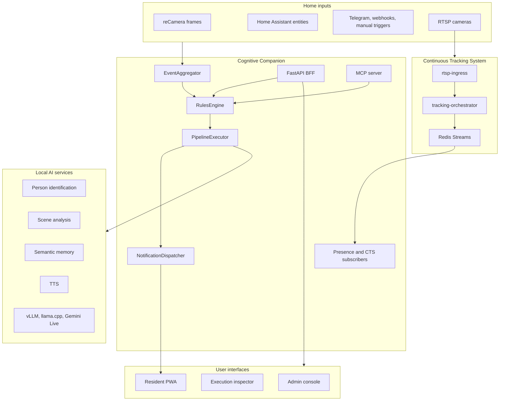

# Architecture

Cognitive Companion runs on-premise and brings together household sensors, local AI services, continuous tracking, caregiver-authored rules, and resident-facing feedback. The system is designed so private camera and care data stay on the local network unless an operator explicitly configures an outbound channel.

## System overview



## Data flow

1. Edge devices and Home Assistant send events or state changes to the backend.
2. The `EventAggregator` batches camera frames, applies cooldown windows, writes media to MinIO, and calls the workflow path.
3. The `RulesEngine` selects enabled rules for the trigger type, then applies context filters, dependencies, cool-off windows, daily limits, and concurrency limits.
4. The `PipelineExecutor` runs each matching rule's graph-shaped pipeline.
5. Step handlers call local AI services, query presence and memory, record activity, branch, wait, or dispatch actions.
6. The system publishes execution events to `/ws/pipeline` and records workflow detail for later inspection.
7. Output channels deliver resident prompts, caregiver alerts, Home Assistant actions, e-ink images, Telegram messages, webhooks, or realtime voice prompts.

## Graph pipelines

Each rule has its own directed pipeline graph. A step can expose one or more output ports, and each port can connect to a downstream step.

| Concept | Description |
| --- | --- |
| `PipelineStep` | A node with a step type, label, configuration, enabled flag, and canvas position |
| `PipelineEdge` | A directed connection from `source_step_id/source_port` to `target_step_id/target_port` |
| `StepMetadata.output_ports` | Ports available while authoring. Most steps use `main`; `condition` uses `true` and `false` |
| `StepResult.output_ports` | Ports activated during a run |
| `WorkflowExecution` | Runtime record with status, current step, pipeline data, graph snapshot, and timing data |

The graph model lets caregivers express conditional care flows without encoding rule-specific branches in Python. Rule import and export preserve labels, step configuration, canvas positions, and graph edges.

## Execution observability

The admin console uses one execution surface for live and historical runs. It is backed by two API levels:

| API | Purpose |
| --- | --- |
| `GET /api/v1/workflows/{execution_id}/detail` | Canonical inspector detail with graph snapshot, step timeline, output ports, resolved config, outputs, errors, and cancel or rerun flags |
| `GET /api/v1/pipeline/runs` | Lightweight recent or active run list for dashboards and live panels |
| `/ws/pipeline` | Live pipeline lifecycle events |

This split keeps live dashboards cheap while preserving a complete detail contract for review and debugging.

## Backend layers

```text
core/                    Foundation: config, database, auth, logging, exceptions, time, templates
models/                  SQLAlchemy ORM
schemas/                 Pydantic HTTP and import/export schemas
integrations/            Home Assistant, MinIO, AI services, CTS clients, Telegram, TTS
services/                Rules, execution, scheduling, presence, CTS subscribers, knowledge, activity
steps/, channels/, filters/   Auto-discovered plugin systems
routers/                 FastAPI BFF endpoints
mcp/                     MCP tools backed by shared service logic
websocket/               Companion and pipeline event WebSockets
main.py                  Service construction and lifespan wiring
```

Services are created during FastAPI startup and stored on `app.state`. Routers stay thin: they validate input, require permissions, call a service, and return typed schemas.

## Plugin systems

Cognitive Companion uses three auto-discovered plugin registries.

| Registry | Current built-ins | Purpose |
| --- | --- | --- |
| Step handlers | 24 | Pipeline nodes for perception, reasoning, state, knowledge, flow control, and actions |
| Notification channels | 7 | Resident and caregiver delivery paths |
| Context filters | 13 | Rule-level constraints such as room, time, presence, activity, scene state, and dementia signal |

Step metadata includes JSON Schema configuration, default values, UI hints, output schemas, tags, and output ports. The frontend loads this metadata from `/api/v1/pipeline/step-types`, so new step plugins appear in the rule canvas without hardcoded UI lists.

## Continuous tracking boundary

The optional Continuous Tracking System provides multi-camera person hypotheses, identity revisions, floor-plane positions, scene samples, and dementia or routine-change signals. Cognitive Companion consumes these through Redis Streams and CTS BFF routers.

CTS data ownership stays isolated:

- CTS subscribers live under `backend/services/cts/`.
- CTS enablement uses the shared `cts_enabled` dependency.
- Time conversion and injected service protocols are shared utilities.
- Identity corrections go through CTS identity endpoints.

The result is a consumer boundary: Cognitive Companion can present and act on CTS data without duplicating the tracking system's ownership of PH identity and signal generation.

## Interfaces

| Surface | Primary reader or user | Role |
| --- | --- | --- |
| Admin console | Caregiver and operator | Configure rooms, sensors, rules, graph pipelines, knowledge, CTS, and executions |
| Resident PWA | Resident | Voice interaction, popups, narrated content, reminders, prompts |
| MCP server | Agent or automation | Tool access to selected system capabilities |
| API | Frontend, devices, operators | BFF, device ingest, rules, execution, presence, CTS, knowledge, and admin operations |

## Operational implications

- Run PostgreSQL 18, Redis 8, MinIO, the FastAPI backend, and the Vue frontend for the core system.
- Optional AI and CTS services can be enabled independently, but features that depend on them degrade or fail according to their documented contracts.
- Use Python 3.14 for backend development.
- Use Node.js 24.16.x for frontend development.
- Use Alembic migrations for database schema changes.
- Use `make check` for the fast backend gate and `make check-all` for broader non-integration verification.

## Related pages

- [Quick Start](/guide/getting-started)
- [Composable Pipelines](/features/pipeline)
- [API Reference](/api/reference)
- [Continuous Tracking](/features/continuous-tracking)
