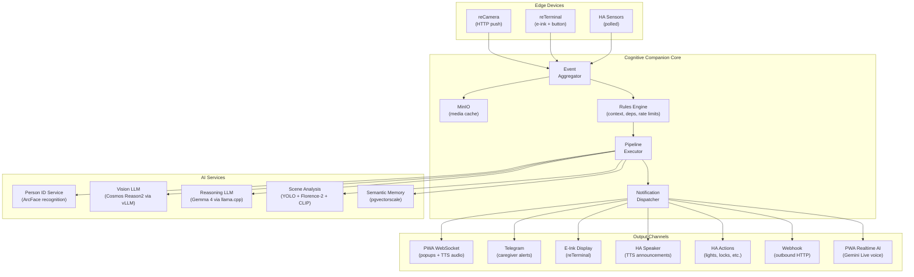
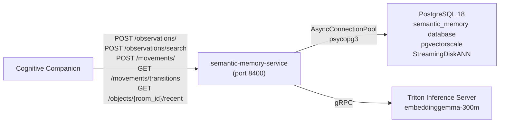
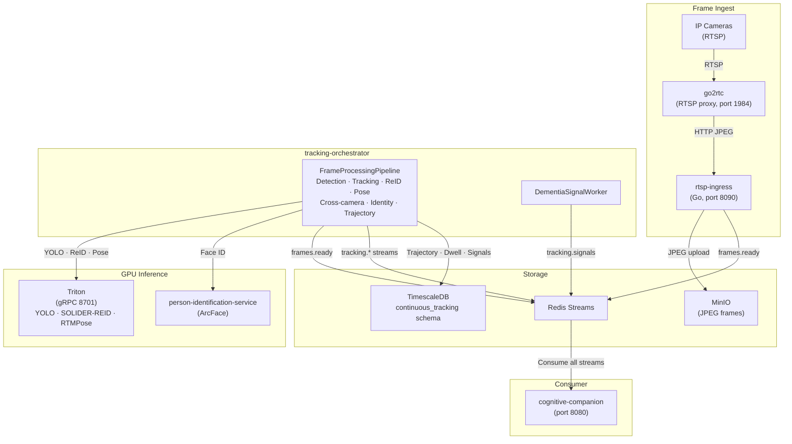

# Architecture

Cognitive Companion follows a layered architecture with clear separation between edge devices, AI processing, rule evaluation, and output dispatch. Every component runs on-premise.

## System Overview



## Data Flow

### 1. Event Ingestion

Edge devices send data to the backend via REST endpoints:

- **reCamera** devices POST image frames to `/api/v1/device/recamera` using device key authentication
- **Home Assistant** sensors are polled at a configurable interval (default: 30 seconds)
- **reTerminal** devices report button presses to `/api/v1/device/reterminal`
- **Occupancy duration events** are generated internally by the `SensorPollingService` when a presence sensor has been continuously occupied for at least the threshold configured in a matching rule (`occupancy_duration` trigger type)

### 2. Event Aggregation

The `EventAggregator` batches incoming sensor events before rule evaluation. This prevents individual frames from flooding the pipeline:

- **Batch size**: configurable number of frames per batch (default: 5)
- **Window**: maximum time to wait for a full batch (default: 10s)
- **Cooldown**: per-sensor minimum interval between batches (default: 30s)
- **Media lifecycle**: frames are stored in MinIO with pre-signed URLs and automatically cleaned up after a retention period

### 3. Rule Matching

Rules can be triggered by multiple sources: sensor events, cron schedules, webhooks, Telegram commands, manual execution, and occupancy duration. Each rule stores a `trigger_types: list[str]` JSON column. Cron schedules are managed through a separate `CronTrigger` model with a many-to-many join table, so multiple rules can share the same schedule and a single rule can have multiple cron expressions.

The `RulesEngine` evaluates each event against all enabled rules whose `trigger_types` contains the matching trigger type. A rule matches when:

- **Context filters** pass: room matches, current time is within the allowed range, day of week matches, required persons are present (or absent), required activities have (or haven't) occurred
- **Dependencies** are satisfied: dependent rules must have fired (or not fired) within their lookback window
- **Rate limits** allow: cool-off period has elapsed, daily trigger count hasn't been exceeded

### 4. Pipeline Execution

Each matched rule triggers its own composable pipeline via the `PipelineExecutor`. Step handlers are self-contained plugins in `backend/steps/builtin/`, each inheriting from `StepHandler` and auto-discovered via `StepRegistry` at startup. Steps execute in the configured order, sharing a `pipeline_data` dictionary that accumulates results:

```python
@dataclass
class TriggerContext:
    trigger_type: str       # "sensor_event", "cron", "manual", "webhook", "occupancy_duration", "telegram", "resume"
    sensor_id: str | None
    room_name: str | None
    media_paths: list[str]
    media_type: str | None
    webhook_payload: dict | None     # Payload from webhook and Telegram triggers
    occupancy_duration_minutes: float | None  # Set for occupancy_duration triggers

@dataclass
class StepResult:
    success: bool = True
    data: dict = field(default_factory=dict)   # Merged into pipeline_data
    should_continue: bool = True
    next_step_id: int | None = None            # For conditional branching
    wait_until: datetime | None = None         # For wait/resume
```

The same plugin pattern applies to notification channels (`ChannelRegistry`) and context filters (`FilterRegistry`). See [Composable Pipelines](/features/pipeline) for the full step type reference and [Extending the Pipeline](/development/extending-pipeline) for how to add new plugins.

### 5. Output Dispatch

The `NotificationDispatcher` routes alerts to channels based on the alert level defined in `notifications.yaml`:

- **WebSocket**: pushed to connected admin console clients in real-time
- **Telegram**: sent to caregiver chat IDs via bot API
- **E-Ink Display**: rendered as notification images for specific devices
- **TTS**: announced through Home Assistant media players
- **Home Assistant**: any HA service call (turn on lights, lock doors, etc.)

## Service Architecture

Services are instantiated in the FastAPI lifespan function and attached to `app.state`. The `PipelineExecutor` receives a `ServiceContainer` that bundles all shared services (LLM providers, HA client, DB session factory, etc.) and passes it to step plugins during execution. Routers access services via `app.state`:

```python
# In backend/main.py (lifespan):
services = ServiceContainer(
    db_session_factory=get_session,
    person_id_client=person_id_client,
    notification_dispatcher=notification_dispatcher,
    # ... other dependencies
)
app.state.pipeline_executor = PipelineExecutor(services)

# In a router:
pipeline_executor = request.app.state.pipeline_executor
```

This pattern ensures:

- **Single instances**: each service is created once and shared
- **Explicit wiring**: dependencies are visible in the lifespan function
- **Testability**: services can be replaced with mocks by modifying `app.state`
- **No circular imports**: routers never import service modules directly

## Core Foundation Layer

`backend/core/` is the foundation layer every other backend package depends on.
It is the most tightly tested and typed package in the codebase.

| Module | Responsibility | Public surface |
| --- | --- | --- |
| `config.py` | YAML configuration with `${ENV_VAR}` interpolation | `Settings` class, `settings` singleton |
| `database.py` | SQLAlchemy engine, session factory, PostgreSQL pool | `Database` class, `Base`, `init_db`, `get_db`, `get_session` |
| `auth.py` | API + device key resolution, fnmatch permission checks | `KeyStore` class, `AuthContext`, `get_auth_context`, `require_permission` |
| `exceptions.py` | HTTP-aware error hierarchy and FastAPI handler | `AppError`, `NotFoundError`, `ConflictError`, `AuthenticationError`, `PermissionDeniedError`, `ValidationError` |
| `logging.py` | Structured stdlib logging wrapper | `BoundLogger`, `get_logger`, `setup_logging` |
| `template.py` | `\{\{dotted.path\}\}` renderer used by pipeline step prompts | `render_template`, `resolve_path` |

### Design invariants

The layer is held to three invariants that are enforced by code review, by the
package test suite, and by a stricter per-module mypy override in
`pyproject.toml`:

1. **No upward dependencies.** Modules in `backend.core` do not import from
   `backend.services`, `backend.routers`, `backend.channels`, `backend.steps`,
   or any other higher-level package. `backend.models` is imported lazily only
   inside `Database.create_all` so that `Base.metadata` is populated before
   DDL is issued.
2. **No framework imports except at the FastAPI edge.** Only `auth.py` and
   `exceptions.register_exception_handlers` are allowed to touch FastAPI
   types. Everything else in `backend.core` is usable from CLI scripts,
   workers, and tests without dragging FastAPI into the import graph.
3. **Testability by construction.** Every stateful module-level singleton
   (`settings`, the default `Database`, the default `KeyStore`) is a thin
   facade over a class that can be instantiated directly in a test with no
   global reset. For example:

   ```python
   from backend.core.config import Settings
   from backend.core.database import Database
   from backend.core.auth import KeyStore

   s = Settings.from_dict({"llm": {"model": "fake"}})
   db = Database("sqlite:///:memory:")
   ks = KeyStore(api_keys=[{"key": "K1", "name": "admin", "permissions": ["*"]}])
   ```

### Quality bar

| Metric | Status |
| --- | --- |
| Tests | 113 pytest cases in `backend/tests/core/` |
| Branch coverage | ~98% on `backend/core/` |
| Typing | Strict mypy (`disallow_untyped_defs = true`) for `backend.core.*` only |
| Lint | `ruff` clean, including the enabled `B`, `SIM`, `PIE`, `PT`, `C4`, `T20`, `RUF` rule sets |
| Build | `make check` runs lint, strict type-check, and the core test suite as a single fast gate |

### Services layer

The `backend/services/` package is the next layer up and holds the business
logic: scheduling, condition evaluation, notification dispatch, workflow
orchestration, conversation management, RAG lookup, and media processing.

| Metric | Status |
| --- | --- |
| Tests | 177 pytest cases in `backend/tests/services/` |
| Branch coverage | 89-100% across 7 dedicated test suites |
| Scheduler | Refactored: module-level globals lifted into a `Scheduler` class for testability |
| Build | `make test-services` or `make check-all` (adds services to the pre-commit gate) |

The remaining services (person tracking, sensor polling, telegram trigger) are
integration-heavy and use extensive HTTP mocking in their test suites.

## Database

PostgreSQL 18 via `timescale/timescaledb-ha:pg18` with TimescaleDB, PostGIS, pgvector, and pgvectorscale (StreamingDiskANN) extensions. The shared instance hosts three databases: `cognitive_companion`, `continuous_tracking`, and `semantic_memory`. SQLAlchemy 2.0 ORM. Schema changes go through Alembic via `make migration` (autogenerate) and `make migrate` (apply). Tests use a PostgreSQL testcontainer started by the shared `db_engine` / `db_session` / `db_factory` fixtures in `backend/tests/conftest.py`.

`Database.create_all()` is used only in development and tests; it is not the production schema path.

Key models:

| Model | Purpose |
| ------- | --------- |
| `Rule` | Automation rule with trigger type, schedule, and rate limits |
| `PipelineStep` | One step in a rule's pipeline with type, config, and ordering |
| `WorkflowExecution` | Tracks a single pipeline run including paused/waiting state |
| `EventLog` | Audit trail for every rule execution with full pipeline data |
| `HouseholdMember` | Registered person with face-ID enrollment |
| `PersonSighting` | Camera detection record with location and confidence |
| `PersonActivity` | Detected activity (eating, sleeping, medication) |
| `ActiveImageState` | Per-device e-ink display state |
| `ImageTemplate` | E-ink template with background image and text regions |
| `MediaCache` | MinIO object tracking with pre-signed URLs and expiry timestamps |

## Semantic Memory Service

The `semantic-memory-service` is a standalone FastAPI microservice that provides time-series and vector-searchable memory for scene observations, person movement transitions, and object presence. Cognitive Companion writes observations and movements through its pipeline steps (`semantic_memory_query`, `semantic_memory_write`, `object_trend_analysis`) and reads them back via vector similarity search and temporal queries.



### Data model

| Table | Purpose | Vector columns |
| --- | --- | --- |
| `scene_observations` | Structured scene descriptions with hazard flags, object labels, and descriptions | `embedding` (CLIP, 768-dim), `description_embedding` (text, 768-dim) |
| `person_movements` | Room-to-room movement transitions with semantic direction | none |
| `object_presence` | Per-room object tracking with upsert semantics | none |

Vector similarity search uses `pgvectorscale` StreamingDiskANN indexes. Cosine distance (`<=>`) orders results. Both image (CLIP) and text (embeddinggemma-300m) embeddings are 768-dimensional, enabling combined scoring when both are provided.

### Design

- **No ORM**: All queries use raw SQL via `psycopg` async cursors. Pydantic models define the wire format.
- **No auth**: The service runs on the internal LAN. Authentication is handled by Cognitive Companion (the BFF).
- **Migrations on startup**: Alembic migrations run automatically via `alembic upgrade head` in the FastAPI lifespan. No manual migration step.
- **Graceful degradation**: Text embeddings are optional. When `TEXT_EMBEDDING_ENABLED=false` or Triton is unreachable, the service falls back to metadata-only search. The `TextEmbedder` ABC pattern with `NullTextEmbedder` ensures no exceptions bubble.

### External dependencies

| Dependency | Required | Notes |
| --- | --- | --- |
| PostgreSQL | Yes | Shared `timescale/timescaledb-ha:pg18` instance, `semantic_memory` database |
| Triton Inference Server | No | embeddinggemma-300m model for text embeddings. Disable with `TEXT_EMBEDDING_ENABLED=false`. |

See [CLAUDE.md](https://github.com/SilverMind-Project/semantic-memory-service/blob/main/CLAUDE.md) and [AGENTS.md](https://github.com/SilverMind-Project/semantic-memory-service/blob/main/AGENTS.md) for contributor documentation.

## Continuous Tracking System

The Continuous Tracking System (CTS) is a sibling service family at `continuous-tracking/` that provides multi-camera person tracking, identity resolution, and dementia-relevant behavioral signal detection. It is a standalone system that Cognitive Companion consumes via Redis Streams and a REST API.

### Services

| Service | Language | Port | Role |
|---------|----------|------|------|
| `go2rtc` | Go (upstream) | 1984 | RTSP proxy and JPEG multiplexer |
| `rtsp-ingress` | Go | 8090 | Motion-gated frame capture, MinIO upload, `frames.ready` publishing |
| `tracking-orchestrator` | Python 3.12 | 8000 | Frame processing pipeline, cross-camera tracking, identity resolution, signal detection |
| Triton Inference Server | C++/Python | 8701 (gRPC) | ONNX model serving: YOLO, SOLIDER-REID, RTMPose |

### Data flow



### Redis Streams

CTS publishes 5 protobuf-encoded Redis streams consumed by Cognitive Companion:

| Stream | Proto message | Content |
|--------|---------------|---------|
| `frames.ready` | `FrameReady` | Frame metadata published by rtsp-ingress |
| `tracking.events` | `TrackingEvent` | Per-frame detections, identities, pose, trails |
| `tracking.revisions` | `IdentityRevision` | Identity reassignments with posterior distribution |
| `tracking.signals` | `DementiaSignal` | Behavioral signal detections with severity and z-scores |
| `scene.samples` | `SceneSample` | Tagged keyframes for downstream scene analysis |

### Admin UI

The Cognitive Companion admin interface is built on a shared visualisation foundation:

- **One role-aware Tracking workspace** (`TrackingWorkspace.vue`, route `/tracking`): a single dashboard whose panels are projections of one data layer via the `usePersonPresence` composable. Administrators, caregivers, and medical reviewers see different default panels, not separately maintained pages.
- **Shared ECharts component library**: `components/charts/` and `components/dashboard/` provide `CcTimeSeriesChart`, `CcBarChart`, `CcDistributionChart`, `CcGaugeChart`, `CcHeatmapCalendar`, `CcScatterFloorCloud`, `CcMetricTile`, `CcProvenanceBadge`, and `CcSectionCard`. `components/process/` provides `CcDagChart`, `CcLiveActivityFeed`, and `CcStatusTimeline`. Every view uses these shared components; no view hand-rolls a chart of the same data shape.
- **Process Activity view** (`ProcessActivityView.vue`): real-time pipeline execution feed backed by `useLivePipeline` over the `/ws/pipeline` WebSocket channel and seeded by `GET /pipeline/runs?status=active`.
- **ECharts via `vue-echarts`**: only explicit module imports; no full-bundle import; no second charting library.
- **Bespoke canvas only for spatial domains**: floor plan overlays and bounding-box-on-keyframe views use SVG/Canvas, but must consume the same `--cc-` design tokens and the `useChartTheme` composable.

### Pipeline stages

The orchestrator's `FrameProcessingPipeline` runs 15 stages per frame:

1. Fetch JPEG from MinIO
2. Person detection via YOLO (Triton) + IoU dedup
3. Privacy zone enforcement (blur/mask + detection drop)
4. Spatial projection: per-detection floor-point homography
5. SOLIDER-REID appearance embedding + RTMPose pose estimation (Triton, in parallel)
6. Per-camera face identification (ArcFace, rate-limited)
7. World tracking: Kalman predict, pre-association cross-camera dedup, Hungarian association, PH update/spawn/close, Bayesian identity resolution
8. Detection backfill: enrich detections with ph_id assignments
9. PH lifecycle: close terminated PersonHypotheses
10. Posture classification: keypoint geometry analysis
11. Trajectory writing with floor projection and motion energy
12. Keyframe sampling (periodic + identity-change triggered)
13. Identity revision emission and cross-table rewriting
14. Trail management: per-PH foot-point ring buffer
15. Tracking event publishing to Redis Streams
16. A periodic signal worker loop (default: 60 s) computes dementia signals from trajectory and dwell data

### Dementia signals

Six signal kinds (seven including `room_revisit_rate`) are detected using robust z-scores against 30-day per-person baselines with hysteresis debounce:

| Kind | Detection method |
|------|-----------------|
| `pacing` | Room transition rate normalized for observation density |
| `sundowning_index` | Evening (17:00-22:00) activity vs 14-day evening baseline |
| `bathroom_dwell_anomaly` | Current bathroom dwell vs 30-day duration baseline, time-of-day aware |
| `nighttime_movement` | Room transitions during 22:00-06:00 vs 14-day baseline |
| `stillness_anomaly` | Sustained low motion energy in non-resting posture, posture-aware severity |
| `absence` | Gap since last detection exceeding threshold, context-aware via hourly activity |

See [Continuous Tracking](/features/continuous-tracking) for the full architecture, identity resolution model, and integration details.

## Security Model

### Authentication

Three key types with different resolution methods:

| Type | Format | Resolution |
| ------ | -------- | ----------- |
| API Key | Arbitrary string | `X-API-Key` header or `?api_key` query param |
| Device Key | 8-char uppercase alphanumeric | `device_key` in JSON body |
| MCP Key | Arbitrary string | `X-API-Key` header |

### Authorization

Permissions use `fnmatch` patterns matching against `METHOD /path`:

```yaml
caregiver:
  - "GET /api/v1/*"                    # Read everything
  - "POST /api/v1/alerts/*/action"     # Dismiss/assist alerts
```

### Network Model

The system is designed for local network deployment:

- No public endpoints required
- All LLM inference runs locally
- MCP tools are accessed over the local network
- External services (Telegram, Gemini) are optional outbound-only connections
