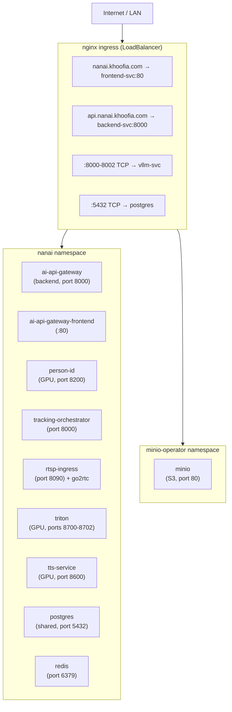

# Deployment

Cognitive Companion can be deployed via Docker Compose for single-machine setups or Kubernetes for cluster environments. Both options run the full stack on-premise with no cloud dependencies.

## Docker Compose

Each repository ships its own `docker-compose.yml`, so services are independently deployable. External dependencies (vLLM, Ollama, MinIO, Home Assistant, TTS) are expected to be running separately.

### Quick Start

```bash
# Clone both repositories
git clone https://github.com/SilverMind-Project/cognitive-companion.git
git clone https://github.com/SilverMind-Project/person-identification-service.git

# 1. Start the person identification service (GPU required)
cd person-identification-service
cp .env.example .env
docker compose up -d

# 2. Start Cognitive Companion (backend + frontend)
cd ../cognitive-companion
cp .env.example .env
# Edit .env with your API keys and service URLs
docker compose up -d

# 3. Verify
curl http://localhost:8000/api/v1/health
curl http://localhost:8200/health
```

### Cognitive Companion (`cognitive-companion/docker-compose.yml`)

| Service    | Container     | Port | Notes               |
| ------------ | --------------- | ------ | --------------------- |
| `backend`  | `cc-backend`  | 8000 | FastAPI backend     |
| `frontend` | `cc-frontend` | 80   | Vue 3 SPA via nginx |

The backend Dockerfile lives at `backend/Dockerfile` and uses the repository root as its build context (it needs `backend/`, `config/`, and `pyproject.toml`). The frontend Dockerfile lives at `frontend/Dockerfile`.

### Person Identification Service (`person-identification-service/docker-compose.yml`)

| Service     | Container   | Port | Notes                |
| ------------- | ------------- | ------ | ---------------------- |
| `person-id` | `person-id` | 8200 | GPU face recognition |

Requires the [NVIDIA Container Toolkit](https://docs.nvidia.com/datacenter/cloud-native/container-toolkit/latest/install-guide.html) for GPU access.

### Environment Variables

Each repository has its own `.env.example`. The Cognitive Companion `.env` configures all external service URLs:

```bash
# LLM Endpoints
VISION_MODEL_URL=http://localhost:8001/v1       # vLLM (Cosmos Reason2)
GEMMA_MODEL_URL=http://localhost:8080/v1        # llama.cpp (Gemma 4)

# Google Gemini (optional, for realtime voice)
GEMINI_API_KEY=

# TTS Service
TTS_API_URL=http://localhost:8600/v1

# Home Assistant
HOME_ASSISTANT_URL=http://homeassistant.local:8123
HOME_ASSISTANT_TOKEN=

# MinIO
MINIO_ENDPOINT=http://localhost:9000
MINIO_ACCESS_KEY=minioadmin
MINIO_SECRET_KEY=minioadmin

# Person Identification Service
PERSON_ID_SERVICE_URL=http://localhost:8200

# Telegram notifications
TELEGRAM_BOT_TOKEN=
TELEGRAM_CAREGIVER_CHAT_ID=

# API keys
CC_ADMIN_API_KEY=change-me-admin-key
CC_CAREGIVER_API_KEY=change-me-caregiver-key
CC_MCP_API_KEY=change-me-mcp-key
```

::: tip
When running inside Docker, use `host.docker.internal` instead of `localhost` to reach services on the host machine. If external services are on different machines, use their LAN IP addresses.
:::

### External Services

The following services run **outside** Docker Compose and must be accessible from the backend container:

| Service                       | Purpose                             | Default URL                       |
| ------------------------------- | ------------------------------------- | ----------------------------------- |
| **Person ID Service**         | Face recognition + motion detection | `http://localhost:8200`           |
| **vLLM** (Cosmos-Reason2)     | Vision model serving                | `http://localhost:8001/v1`        |
| **llama.cpp** (Gemma 4)       | General reasoning                   | `http://localhost:8080/v1`        |
| **MinIO**                     | S3-compatible object storage        | `http://localhost:9000`           |
| **Home Assistant**            | Sensor integration                  | `http://homeassistant.local:8123` |
| **TTS service**               | Text-to-speech                      | `http://localhost:8600/v1`        |

### Persistent Volumes

| Volume           | Compose File                  | Container Path | Contents                                     |
| ------------------ | ------------------------------- | ---------------- | ---------------------------------------------- |
| `backend-data`   | cognitive-companion           | `/app/data`    | PostgreSQL data, media cache                 |
| `person-id-data` | person-identification-service | `/app/data`    | ONNX model files, model cache |

### Frontend Image

The frontend uses a multi-stage Docker build:

1. **Build stage.** Node 20 builds the Vue 3 SPA with Vite.
2. **Serve stage.** nginx 1.27-alpine serves the static files and proxies `/api/` and `/ws` to the backend.

The nginx config automatically routes API calls to the backend container (`cc-backend:8000`), so the frontend works without any additional proxy configuration.

---

## Kubernetes

For cluster deployments, Kubernetes manifests are provided in each repository's `kubernetes/` directory.

### Architecture



### Design Principles

- **Single namespace (`nanai`)**: all application workloads, databases, and shared infrastructure run in the same namespace for simplified DNS (`postgres.nanai.svc.cluster.local`) and RBAC.
- **ClusterIP services**: all services use ClusterIP, routed through a single nginx ingress. No unnecessary LoadBalancer IPs.
- **Secrets separated from ConfigMaps**: sensitive values (API keys, tokens) in Kubernetes Secrets; service URLs and non-sensitive config in ConfigMaps.
- **Health probes**: readiness and liveness probes on all pods for automatic restart and traffic routing.
- **Kustomize base + overlay**: portable base manifests in `kubernetes/` use `IMAGE_PLACEHOLDER`; the `overlays/local/` directory patches in registry images and cluster-specific values.

### Manifest Structure

All subproject manifests are consolidated under `kubernetes/` at the root, organized by service and infrastructure layer.

```text
kubernetes/
├── namespace.yaml                   # nanai namespace (restricted PodSecurity)
├── kustomization.yaml               # Root aggregator
├── infrastructure/
│   ├── postgres.yaml                # Shared TimescaleDB StatefulSet + headless Service
│   ├── postgres-configmap.yaml      # Database init script (creates 3 databases)
│   └── redis.yaml                   # Redis StatefulSet + Service
├── cognitive-companion/
│   ├── deployment.yaml              # Backend deployment (PostgreSQL env vars)
│   ├── frontend-deployment.yaml     # Vue 3 frontend deployment
│   ├── services.yaml                # Backend + frontend ClusterIP services
│   ├── configmap.yaml               # settings.yaml, auth.yaml, notifications.yaml
│   ├── pvc.yaml                     # Backend data PVC
│   └── secrets.yaml                 # cc-secrets + nanai-postgres credentials
├── continuous-tracking/
│   ├── orchestrator.yaml            # Deployment + Service + HPA + PDB + SA
│   ├── rtsp-ingress.yaml            # Deployment + go2rtc sidecar + NetworkPolicy
│   ├── triton.yaml                  # Triton Inference Server + PVC
│   ├── configmap.yaml               # Orchestrator + ingress + go2rtc configs
│   └── secrets.yaml                 # cts-minio + cc-service-tokens
├── person-identification/
│   ├── deployment.yaml              # GPU deployment (nvidia.com/gpu: 1)
│   ├── service.yaml                 # ClusterIP on port 8200
│   └── pvc.yaml                     # Data PVC
├── tts-service/
│   ├── deployment.yaml              # GPU deployment
│   ├── service.yaml                 # ClusterIP on port 8600
│   └── pvc.yaml                     # Data PVC
└── overlays/
    └── local/
        ├── kustomization.yaml       # localhost:32000 image patches
        └── patches/                 # Per-service image + ingress patches
```

### Services

| Service | Name | Port | Type |
| --------- | ------ | ------ | ------ |
| Backend API | `ai-api-gateway-svc` | 8000 | ClusterIP |
| Frontend | `ai-api-gateway-frontend-svc` | 80 | ClusterIP |
| Person ID | `person-id-svc` | 8200 | ClusterIP |
| TTS | `tts-svc` | 8600 | ClusterIP |
| Tracking Orchestrator | `tracking-orchestrator` | 8000 | ClusterIP |
| Triton | `triton` | 8701 (gRPC) | ClusterIP |
| RTSP Ingress | `rtsp-ingress` | 8090 | ClusterIP |
| **Infrastructure** | | | |
| PostgreSQL (shared) | `postgres` | 5432 | Headless |
| Redis | `redis` | 6379 | Headless |

### Deploying to a Local Cluster

```bash
# 1. Create the namespace
kubectl apply -f kubernetes/namespace.yaml

# 2. Fill in secrets (base64-encoded values)
#    echo -n "your-value" | base64
vi kubernetes/cognitive-companion/secrets.yaml
vi kubernetes/continuous-tracking/secrets.yaml

# 3. Deploy everything via Kustomize
kubectl apply -k kubernetes/overlays/local/

# 4. Check status
kubectl -n nanai get pods
kubectl -n nanai get svc
kubectl -n nanai get ingress
```

### Ingress Configuration

The local overlay includes a TLS ingress for the API:

| Host | Backend |
| ------ | --------- |
| `api.nanai.khoofia.com` | `ai-api-gateway-svc:8000` |

TLS certificates are provisioned automatically by cert-manager with the `letsencrypt-prod` ClusterIssuer.

### GPU Scheduling

The person-ID deployment requests a GPU via the NVIDIA device plugin:

```yaml
resources:
  requests:
    nvidia.com/gpu: "1"
  limits:
    nvidia.com/gpu: "1"
```

This requires the [NVIDIA GPU Operator](https://docs.nvidia.com/datacenter/cloud-native/gpu-operator/latest/getting-started.html) or the microk8s `gpu` addon enabled on the cluster.

### Persistent Volumes

| PVC | Size | Contents |
| ----- | ------ | ---------- |
| `data-postgres-0` | 100Gi | PostgreSQL data (3 databases, all extensions) |
| `data-redis-0` | 20Gi | Redis AOF persistence |
| `cc-backend-data` | 5Gi | Backend runtime data |
| `person-id-data` | 5Gi | ONNX model files, model cache |
| `tts-service-data` | 20Gi | TTS model cache |
| `triton-models` | 50Gi | Triton ONNX models |

For production, use a cloud-provider storage class. For local microk8s, use `microk8s-hostpath`.

### Migrating from previous deployments

If you're replacing older per-service Kubernetes manifests:

| Change | Previous | Current |
| -------- | ---------- | --------- |
| Namespace | `default` / `cts` (split) | `nanai` (unified) |
| PostgreSQL | 3 separate containers | 1 shared `timescale/timescaledb-ha:pg18` |
| Manifest location | `subproject/kubernetes/` | `kubernetes/<service>/` (consolidated) |
| Config | Inline env vars in deployment | ConfigMap + Secret |
| Health probes | Varies | Readiness + liveness on all pods |
| Manifest format | Individual YAML files | Kustomize base + overlays |

The unified deployment uses the same service names (`ai-api-gateway-svc`, `person-id-svc`), so applying the new manifests replaces old ones in-place. Verify the new pods are healthy before removing any old resources.
