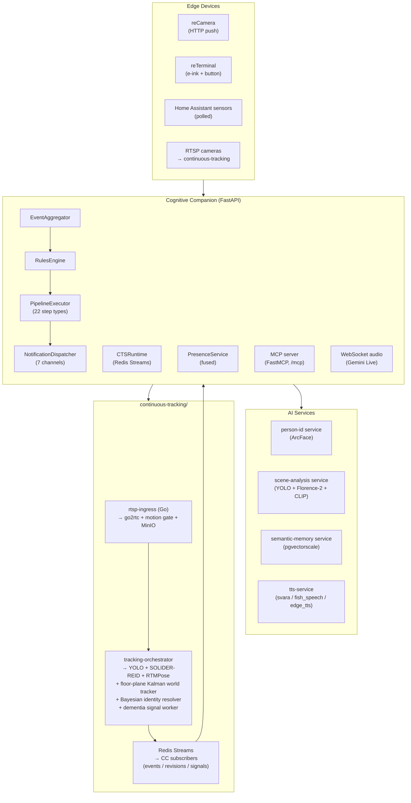

# Introduction

Cognitive Companion is a privacy-first, on-premise AI system for senior care in multigenerational households. It combines safety monitoring, cognitive support, and a personal knowledge repository. Camera feeds and sensor data flow through composable rule-based pipelines; vision and language models run entirely on local hardware.

## The problem

Seniors experiencing cognitive decline face a difficult tradeoff: full-time monitoring that strips away independence, or no monitoring at all. Existing solutions tend toward one extreme:

- **Basic motion sensors** trigger too many false alarms and lack context awareness.
- **Cloud-based AI cameras** send private footage off-premises and require internet connectivity.
- **Full automation systems** remove the daily routines that maintain cognitive function.

## The approach

Cognitive Companion addresses this through six design choices:

1. **Context-aware perception.** Vision LLMs analyze what is happening in each frame rather than flagging all motion. A person in the kitchen at noon is routine; at 3 AM, it warrants attention.
2. **Composable pipelines.** Each rule assembles its own sequence of steps in any order. Rules are not constrained to a fixed trigger-action template.
3. **Reminders over automation.** The system delivers suggestions and alerts without acting on the senior's behalf, preserving daily routines and decision-making agency.
4. **Local inference.** All models run on-premise through vLLM, llama.cpp, and sibling services. Camera frames stay in local MinIO storage. No footage leaves the network unless an outbound channel is explicitly configured.
5. **Multigenerational interfaces.** Caregivers receive alerts through Telegram, webhooks, or the admin console. Seniors interact through voice, popup notifications, e-ink displays, and TTS.
6. **Personal knowledge repository.** Caregivers curate facts about people, places, and routines. The system generates narrated info cards, review-gated quizzes, and a voice Q&A interface backed by RAG, helping seniors stay connected to their own history.

## How it works

**Event flow:**

1. Edge devices (cameras, sensors, RTSP streams) send data to the backend or stream into the continuous-tracking service.
2. The `EventAggregator` batches frames per sensor with windowing and cooldown.
3. The `RulesEngine` matches each event against enabled rules using context filters, dependencies, and rate limits.
4. Each matching rule's composable pipeline executes via the `PipelineExecutor`.
5. Pipeline steps perform person identification, scene analysis, presence queries, LLM reasoning, condition branching, wait and resume, activity recording, daily reports, knowledge retrieval, and so on.
6. Outputs flow to any combination of channels: PWA popup, Telegram, e-ink display, HA Speaker TTS, PWA TTS announcement, PWA Realtime AI, and outbound webhooks.

## Key capabilities

| Capability | Description |
| --- | --- |
| 22 pipeline step types | `llm_call`, `person_identification`, `scene_analysis`, `semantic_memory_query`, `semantic_memory_write`, `object_trend_analysis`, `presence_query`, `home_state`, `notification`, `ha_action`, `activity_detection`, `activity_session_start`, `activity_session_end`, `daily_report`, `verification`, `condition`, `wait`, `interactive_prompt`, `info_card`, `quiz_start`, `recamera_media_poll`, `cts_window_poll`. |
| 7 notification channels | `pwa_popup_text`, `pwa_realtime_ai`, `pwa_tts_announcement`, `telegram`, `eink`, `ha_speaker_tts`, `webhook`. |
| 13 context filters | `room`, `time_range`, `day_of_week`, `person_presence`, `person_activity`, `room_transition`, `person_movement_memory`, `scene_contains`, `scene_trend`, `home_state`, `presence_status`, `presence_dwell`, `dementia_signal`. |
| 6 trigger types | `sensor_event`, `cron`, `manual`, `webhook` (HMAC), `telegram` (bot command), `occupancy_duration`. |
| Person tracking | ArcFace face recognition fused with HA presence sensors, with whole-house location. |
| Multi-camera tracking | Optional `continuous-tracking-service` for floor-plane Kalman world tracking, Bayesian identity resolution, and dementia signal generation. |
| Activity tracking | Detect and record activities; duration-aware sessions; end-of-day wellness rollup with optional LLM summary. |
| Voice companion | Realtime conversations via Google Gemini Live with WebSocket audio and tool calling. |
| Knowledge repository | Caregiver-curated facts with narrated info cards, review-gated quizzes, and voice Q&A backed by RAG (Triton embeddings + pgvector + LLM synthesis). |
| Visual pipeline builder | Drag-and-drop step ordering, dynamic step palette, per-step config dialogs. |
| Presence fusion | Priority-ordered chain: bed sensor, CTS, HA device tracker, fallback. Configured in `config/presence.yaml`. |
| E-ink displays | Per-device notification images with template editor and refresh suppression. |
| MCP tool server | Over 30 tools (read-only plus rule triggering, rule authoring, and interactive response recording). |
| Plugin systems | Step handlers, channels, and filters auto-discovered as Python files. |
| RBAC | API keys, hardware device keys, and `fnmatch` permission patterns. |

## Technology stack

| Layer | Technology |
| --- | --- |
| Backend | Python 3.12, FastAPI, SQLAlchemy 2.0, Pydantic 2, APScheduler |
| Frontend | Vue 3, Vuetify 3, Vite |
| Database | PostgreSQL 18 (TimescaleDB, PostGIS, pgvectorscale) with Alembic migrations |
| Vision LLM | Cosmos-Reason2-8B via vLLM |
| General LLM | Gemma 4 26B via llama.cpp `llama-server` |
| Voice | Google Gemini 2.5 Flash (Live API) |
| Face recognition | InsightFace `buffalo_l` with ArcFace embeddings |
| Scene analysis | YOLO11x, Florence-2-large, CLIP ViT-L/14 |
| Semantic memory | PostgreSQL + pgvectorscale |
| Knowledge embeddings | embeddinggemma-300m via Triton Inference Server |
| Multi-camera tracking | YOLO26L + SOLIDER-REID + RTMPose + floor-plane Kalman world tracker (Triton for inference) |
| Object storage | MinIO (S3-compatible) |
| Logging | Python stdlib logging via a thin `BoundLogger` |

## Next steps

- [Quick Start](/guide/getting-started): install and run the system.
- [Architecture](/guide/architecture): deep dive into the system design.
- [Composable Pipelines](/features/pipeline): full pipeline step reference and worked examples.
- [Continuous Tracking](/features/continuous-tracking): multi-camera tracking and dementia signals.
- [Development Setup](/development/setup): set up a development environment.
