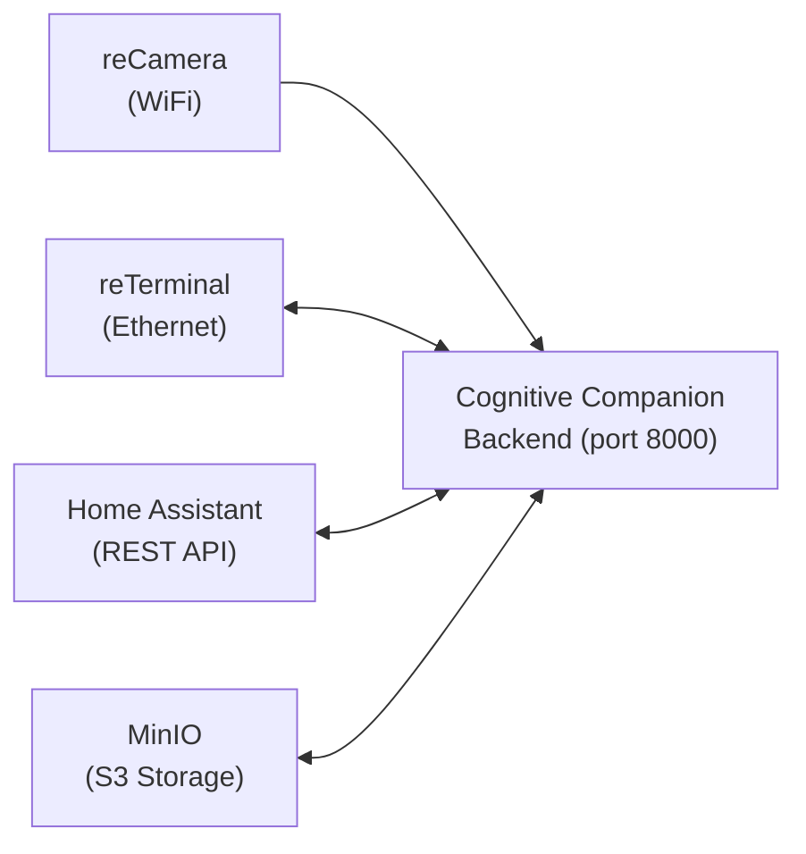

# Hardware integration

Cognitive Companion is designed to work with affordable, readily available edge hardware. This page covers the supported devices and how they integrate with the system.

## Inference hardware

Continuous Tracking can keep its stateful services on a home server while
moving detector, pose, body ReID, and face inference to a separate accelerator.

- [Run CTS inference on Jetson Orin Nano Super](/hardware/jetson-cts) covers the
  six-camera recommendation, eight-camera qualification gates, the three CTS
  models, the complete five-model Buffalo_L pack, and production metrics.
- [Model quantization and accelerator portability](/hardware/model-quantization)
  explains calibration, PTQ, QAT, sparse INT8, Triton internals, and paths for
  Intel or AMD discrete GPUs.
- [Camera setup and tuning guide](/hardware/camera-setup) covers exposure,
  resolution, mount angle, privacy zones, and a validation checklist for each
  newly mounted camera.

## Supported devices

### Seeed reCamera

<div class="hw-spec">
<dl>
<dt>Type</dt><dd>Compact Linux camera module</dd>
<dt>Purpose</dt><dd>Image capture and upload</dd>
<dt>Interface</dt><dd><code>POST /api/v1/device/recamera</code></dd>
<dt>Auth</dt><dd>8-character device key in JSON body</dd>
</dl>
</div>

The reCamera is a compact Linux-based camera module from Seeed Studio. It captures images and uploads them to the Cognitive Companion backend for processing.

**Integration flow:**

1. reCamera runs its on-device YOLO11 model and produces a JSON payload containing the JPEG image and detection results
2. The payload is POSTed to `/api/v1/device/recamera` with the device key as the `?api_key=` query parameter
3. The backend optionally rotates the image and applies a label filter before uploading to MinIO
4. The event aggregator batches the frame with others from the same sensor
5. When a batch is ready, matching rules are evaluated and pipelines execute

**Payload format:**

The reCamera posts a JSON object with this structure:

```json
{
  "code": 0,
  "data": {
    "image": "<base64-encoded JPEG>",
    "labels": ["person"],
    "boxes": [[x1, y1, x2, y2, score, class_id]],
    "count": 287,
    "perf": [[model_id, preprocess_ms, inference_ms]],
    "resolution": [1280, 720]
  },
  "name": "invoke",
  "type": 1
}
```

`data.labels` lists the object classes detected by the YOLO11 model and can be used to filter which images are forwarded to the pipeline.

**Device key configuration:**

```yaml
# In config/auth.yaml
device_keys:
  - key: "RCAM0001"
    name: "Kitchen reCamera"
    device_type: recamera
    sensor_id: recamera_kitchen
    permissions:
      - "device:recamera"
```

**Per-camera options:**

Configure per-camera behavior in `config/settings.yaml` under the `cameras` key, using the `sensor_id` as the key:

```yaml
cameras:
  recamera_kitchen:
    rotate: 90           # clockwise rotation before storage (90, 180, 270)
    label_filter:
      labels: ["person"] # labels to match against payload.data.labels
      mode: "any"        # "any": at least one match; "all": every label must match
```

| Option | Description |
| ------ | ----------- |
| `rotate` | Rotates the JPEG clockwise before uploading to MinIO. Useful for cameras mounted at non-standard angles. Accepted values: `90`, `180`, `270`. Omit to skip rotation. |
| `label_filter.labels` | List of YOLO11 label strings. Images are only forwarded when the detected labels satisfy the filter. |
| `label_filter.mode` | `"any"` (default): pass if at least one label matches. `"all"`: pass only when every configured label is detected. |

When a label filter is configured and the image does not match, the endpoint returns `{"status": "filtered", "reason": "label_filter"}` and the image is not saved or forwarded to the pipeline.

**Placement tips:**

- Mount at doorways to leverage motion direction detection (entering vs. leaving)
- Ensure adequate lighting for face recognition. ArcFace works best with even illumination.
- Consider the field of view. Wider angles capture more context but reduce face resolution.
- For multi-camera setups, assign each camera to a room for location tracking
- Use `rotate` when the camera must be mounted sideways or upside-down due to physical constraints

### Seeed reTerminal

<div class="hw-spec">
<dl>
<dt>Type</dt><dd>Color e-ink display module</dd>
<dt>Chip</dt><dd>ESP32</dd>
<dt>Purpose</dt><dd>Notification display and button input</dd>
<dt>Image poll</dt><dd><code>GET /api/v1/image/active</code> (device key auth)</dd>
<dt>Button input</dt><dd><code>POST /api/v1/device/reterminal</code></dd>
</dl>
</div>

The reTerminal is an ESP32-based color e-ink display module from Seeed Studio. It serves as the household's notification display and physical interaction point.

**E-ink display integration:**

1. The reTerminal polls `GET /api/v1/image/active` at regular intervals
2. The backend identifies the device by its device key and returns its specific active image
3. When a notification is sent to the e-ink channel, the image updates on the next poll
4. Expired images automatically fall back to the default template

**Button integration:**

1. Physical button presses on the reTerminal are sent to `POST /api/v1/device/reterminal`
2. Button events can trigger rules (e.g., "request assistance" button)
3. Button presses can also acknowledge/dismiss active alerts

**Configuration:**

```yaml
# In config/auth.yaml
device_keys:
  RTRM0001:
    sensor_id: hallway_display
    device_type: reterminal
```

### Home Assistant Sensors

<div class="hw-spec">
<dl>
<dt>Type</dt><dd>Various smart home sensors</dd>
<dt>Purpose</dt><dd>Presence detection, light levels, audio playback</dd>
<dt>Interface</dt><dd>Home Assistant REST API (polled)</dd>
</dl>
</div>

The backend polls Home Assistant entities at a configurable interval (default: 30 seconds). Supported sensor types:

#### Presence Sensors (PIR/mmWave)

Binary sensors that detect room occupancy. Used for:

- **Room occupancy tracking**: determine which rooms are occupied
- **Person location inference**: correlate presence sensor data with camera sightings to track people in rooms without cameras (e.g., bathrooms)
- **Bathroom monitoring**: configurable time limit triggers alerts for extended bathroom occupancy

#### Light Sensors

Illuminance sensors used for context-aware rules:

- Available as context data in pipeline steps
- Queryable via the `get_light_level` MCP tool
- Can inform vision analysis prompts (e.g., "analyze this low-light image")

#### Media Players

Smart speakers, tablets, and other audio devices used for:

- **TTS announcements**: speak notification messages aloud
- **Home Assistant announce service**: broadcast to multiple rooms

## Network requirements

All devices must be on the same local network as the Cognitive Companion backend. There is no cloud relay; communication is direct.



**Recommended network setup:**

- Dedicated VLAN or subnet for IoT/camera devices
- Backend server on the same subnet (or with routing configured)
- Home Assistant accessible from the backend via its REST API
- MinIO accessible from the backend for media storage

## Add new hardware

The system is designed to accommodate new edge devices. Any device that can make HTTP requests can integrate:

1. **Define a device key** in `config/auth.yaml` with the appropriate sensor ID and type
2. **Create a sensor** in the admin console matching the device
3. **Implement the upload.** POST images to `/api/v1/device/recamera` or a custom endpoint.
4. For display devices, poll `GET /api/v1/image/active` with the device key

For truly custom integrations, you can also create a new router endpoint in `backend/routers/` following the [adding a new API endpoint](/development/extending-pipeline#adding-a-new-api-endpoint) guide.
