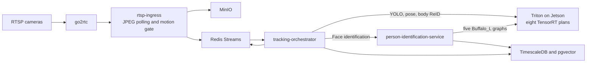

# Run Continuous Tracking inference on Jetson Orin Nano Super

This guide explains how to move the latency-sensitive vision models used by the
Continuous Tracking System (CTS) from a larger NVIDIA server to an NVIDIA
Jetson Orin Nano Super with 8 GB of unified memory.

The current recommendation is to qualify six cameras first. Eight cameras may
be practical after target-device benchmarks and a sustained thermal test.
Twelve cameras are outside the recommended operating envelope for this model
set and polling rate.

::: warning Current status
The eight quantized ONNX graphs pass output-regression tests on representative
household images. TensorRT plans still need to be built and benchmarked on the
target Jetson. The numbers on this page are accuracy measurements, current DGX
traffic observations, and Jetson acceptance targets. They are not measured
Jetson throughput results.
:::

## When to use this guide

Use this deployment shape when:

- camera frames and face embeddings must remain on the local network;
- CTS inference should run on a low-power system separate from databases and
  storage;
- six to eight cameras are polled at up to five frames per second;
- the operator can collect private calibration images from the actual cameras;
- occasional missed frames are acceptable, but a growing inference queue is
  not.

Keep PostgreSQL, Redis, MinIO, Cognitive Companion, and the tracking
orchestrator on a separate host when possible. The Jetson should primarily run
Triton and the selected inference engines. This leaves more of its 8 GB unified
memory available for TensorRT plans, activations, CUDA contexts, and camera
preprocessing.

CTS supports caregiver awareness and activity tracking. It is not a medical
device or a life-safety system.

## Recommendation at a glance

| Decision | Recommendation | Reason |
| --- | --- | --- |
| Initial camera count | 6 | Leaves room to measure thermal, memory, and queue behavior before increasing load. |
| Conditional camera count | 8 | Requires detector p95 below 140 ms, stable memory headroom, and no sustained queue growth. |
| Twelve cameras | Do not target on this device | The worst-case detector demand reaches 7.5 full batch-8 executions per second before pose, ReID, or face work. |
| Detector | YOLO26L, selective INT8 QAT | Plain PTQ missed the detector recall gate. |
| Pose | RTMPose-m, INT8 stem with higher-precision remainder | Wider INT8 coverage caused excessive keypoint displacement. |
| Body ReID | SOLIDER, selective INT8 | Embedding direction remained stable on the calibration set. |
| Face detection | SCRFD from `buffalo_l`, selective INT8 | Face-anchor scores, boxes, and landmarks stayed within the drift limits. |
| Face recognition | ArcFace from `buffalo_l`, selective INT8 | 512-dimensional embeddings retained high cosine similarity. |
| 2D landmarks | Buffalo_L 2D106, selective INT8 | Pixel-space landmark error remained below the regression gate. |
| 3D landmarks | Buffalo_L 3D68, first-convolution INT8 | Broader PTQ failed, while the narrow accepted region retained XY landmark accuracy. |
| Face attributes | Buffalo_L gender/age, selective INT8 | Gender agreement and age error passed the validation gates. |
| Depth | Omit Depth Anything V2 | It is not required by the active posture path and consumes memory and execution time. |
| Structured sparsity | Do not claim or enable by default | The current checkpoints are dense and do not satisfy the required 2:4 weight pattern. |

## Deployment architecture

The Jetson is an inference appliance in this design. Camera ingest, orchestration,
state, and storage retain their existing service boundaries.



The Jetson model repository and build scripts are in the
[`continuous-tracking` repository](https://github.com/SilverMind-Project/continuous-tracking/tree/main/triton-models-jetson).
The dedicated Compose file loads the three CTS graphs and all five Buffalo_L
graphs. The person-identification service remains a separate API process and
uses Triton over gRPC.

For copy commands, Jetson software checks, engine construction, memory
fragmentation recovery, service switching, and Git LFS handling, follow the
[repository deployment runbook](https://github.com/SilverMind-Project/continuous-tracking/blob/main/docs/jetson-int8-deployment.md).

## Understand the incoming workload

Capacity starts with camera cadence, not peak TOPS.

The current `rtsp-ingress` defaults are:

| Setting | Value | Effect |
| --- | --- | --- |
| `frame_interval_ms` | `200` | Poll each camera up to 5 times per second. |
| `motion_threshold` | `0.02` | Filter frames with little grayscale change. |
| `static_sample_interval_s` | `5` | Publish an occasional frame even without motion. |
| `pipeline.batch_window_s` | `0.5` | Allow CTS to collect frames across cameras before a detector call. |
| `pipeline.max_batch_size` | `8` | Flush after eight accumulated frames. |
| `triton.detector_static_batch_size` | `8` | Pad every YOLO request to the fixed exported shape. |

The motion gate changes average demand substantially, but production sizing
must also cover periods when several cameras see motion at once.

### Worst-case detector demand

Assume every poll publishes a frame and cross-camera batching fills each
batch of eight:

| Cameras | Incoming frames/s | Full batch-8 detector calls/s | Time available per call |
| ---: | ---: | ---: | ---: |
| 4 | 20 | 2.5 | 400 ms |
| 6 | 30 | 3.75 | 267 ms |
| 8 | 40 | 5.0 | 200 ms |
| 12 | 60 | 7.5 | 133 ms |

The detector cannot consume its entire time allowance. Pose, ReID, face
recognition, preprocessing, gRPC transfer, scheduling, and thermal variation
need headroom. For eight cameras, use these detector targets:

- p95 below `200 ms` is the minimum needed to avoid detector backlog at five
  full calls per second;
- p95 below `140 ms` is the qualification target, leaving about 30 percent of
  the interval for the remaining work and timing variation;
- a growing Triton queue or stale-frame counter is a failure even when average
  latency looks acceptable.

### Current DGX traffic snapshot

The following aggregate snapshot was taken on June 7, 2026 from the existing
four-camera DGX deployment. The orchestrator had been running for about 44
hours. These values describe current usage and are not Jetson predictions.

| Observation | Value |
| --- | ---: |
| Frames consumed by the current orchestrator process | about 140,000 |
| YOLO detector requests | about 135,000 |
| Pose requests | about 46,000 |
| ReID requests | about 46,000 |
| RTSP frames published by the ingress process | about 187,000 |
| RTSP frames filtered by motion gate | about 2.27 million |
| Share of decoded polls published | 7.61% |
| Active camera workers | 4 |

The detector request count is close to the consumed-frame count. Under this
sparse motion workload, many fixed batch-8 requests therefore contain
duplicate padding rather than eight distinct camera frames. More active
cameras can improve batching efficiency, but they also raise worst-case
throughput demand.

Triton cumulative timing counters on the DGX reported:

| Model | Requests | Mean request | Mean compute | Mean queue |
| --- | ---: | ---: | ---: | ---: |
| YOLO26L | 135,259 | 107.7 ms | 106.7 ms | 0.09 ms |
| RTMPose-m | 46,006 | 3.07 ms | 2.68 ms | 0.08 ms |
| SOLIDER ReID | 46,006 | 16.9 ms | 11.4 ms | 5.19 ms |

These cumulative means include the current DGX engine builds and shared server
load. They should be used as a traffic profile and comparison baseline only.
The Jetson must be measured independently because TensorRT tactics, memory
bandwidth, clocks, and thermal limits differ.

## Model set and precision policy

The deployment uses explicit Q/DQ ONNX graphs. TensorRT reads the
`QuantizeLinear` and `DequantizeLinear` nodes and builds a mixed-precision
engine.

| Triton model | Input contract | Quantized region | Q/DQ pairs | Q/DQ ONNX size |
| --- | --- | --- | ---: | ---: |
| `person-detector` | Fixed `[8,3,640,640]` | YOLO backbone convolutions after QAT | 166 | 99.8 MB |
| `pose-rtmpose` | Dynamic batch 1 to 8, `[3,256,192]` | Three stem convolutions | 6 | 54.4 MB |
| `reid-solider` | Dynamic batch 1 to 8, `[3,384,128]` | Supported Conv and MatMul regions | 152 | 113.8 MB |
| `face-detector-scrfd` | Fixed batch 1, `[1,3,640,640]` | Convolutions except sensitive prediction heads | 92 | 17.0 MB |
| `face-recognition-arcface` | Fixed batch 1, `[1,3,112,112]` | Early backbone convolutions | 22 | 174.4 MB |
| `face-landmark-2d106` | Fixed batch 1, `[1,3,192,192]` | Narrow convolution region | 2 | 5.0 MB |
| `face-landmark-3d68` | Fixed batch 1, `[1,3,192,192]` | First convolution only | 2 | 143.6 MB |
| `face-attribute-genderage` | Fixed batch 1, `[1,3,96,96]` | Narrow convolution region | 2 | 1.3 MB |

The Q/DQ ONNX files total about 609.4 MB. This is not the runtime memory
requirement. TensorRT plans, activation workspaces, CUDA allocations, pinned
host memory, and the operating system also consume unified memory.

Use a sustained-load target of at least `1.5 GB` available memory. A run that
uses swap, repeatedly reclaims memory, or approaches out-of-memory termination
does not pass qualification.

## Accuracy regression results

Calibration and validation used 128 resident-labeled keyframes balanced across
four cameras. Forty-nine crops contained a face that SCRFD could align for
ArcFace. The images remain private and are excluded from Git.

| Model | Acceptance measure | Result |
| --- | --- | --- |
| YOLO26L | Recall at IoU 0.50 | `0.959` |
| YOLO26L | Precision agreement at IoU 0.50 | `0.944` |
| YOLO26L | Median matched IoU | `0.993` |
| YOLO26L | Confidence MAE | `0.0354` |
| RTMPose-m | Mean keypoint displacement | `1.96 px` |
| RTMPose-m | p95 keypoint displacement | `7.00 px` |
| SOLIDER ReID | Minimum embedding cosine | `0.9722` |
| SOLIDER ReID | Median embedding cosine | `0.9826` |
| SCRFD | Detection-threshold agreement | `0.999981` |
| SCRFD | Box MAE on active anchors | `0.0270` |
| ArcFace | Minimum embedding cosine | `0.9883` |
| ArcFace | Median embedding cosine | `0.9973` |
| 2D106 landmarks | Mean pixel error | `0.10 px` |
| 2D106 landmarks | p95 pixel error | `0.32 px` |
| 3D68 landmarks | Mean XY pixel error | `0.26 px` |
| 3D68 landmarks | p95 XY pixel error | `0.70 px` |
| Gender/age | Gender agreement | `1.0000` |
| Gender/age | Age MAE | `0.19 years` |

The Jetson detector should use:

```yaml
pipeline:
  detector_confidence: 0.69
```

Keep the DGX baseline at `0.70`. The one-point adjustment compensates for the
measured confidence shift in the accepted YOLO QAT graph. It is specific to
this export and should not become a global default.

## Build the TensorRT plans on the Jetson

TensorRT plans are tied to the target GPU and software stack. Build them on the
Jetson with the same JetPack-compatible Triton image that will serve them.

### Prerequisites

- Jetson Orin Nano 8 GB running a supported JetPack release;
- Super mode configured with adequate active cooling;
- NVMe storage rather than relying on a small SD card for build artifacts;
- NVIDIA Container Toolkit and Docker;
- the eight validated `model_int8.onnx` files;
- enough free disk space for plans, logs, and layer reports.

The [Jetson Orin Nano Super specifications](https://developer.nvidia.com/blog/nvidia-jetson-orin-nano-developer-kit-gets-a-super-boost/)
list 67 sparse INT8 TOPS, 33 dense INT8 TOPS, 102 GB/s memory bandwidth, and
7 W to 25 W power modes. Size this deployment against the 33 dense INT8 TOPS
figure until TensorRT proves that sparse tactics are active.

### Build and verify

```bash
git clone https://github.com/SilverMind-Project/continuous-tracking.git
cd continuous-tracking

export TRITON_JETSON_IMAGE=jetpack-compatible-triton-image
bash triton-models-jetson/scripts/build_tensorrt_plans.sh
```

The build script:

1. rejects missing Q/DQ ONNX models;
2. builds one strongly typed TensorRT plan per model with `trtexec`;
3. exports detailed layer information;
4. fails when a report contains no INT8 tensor format.

Start the server:

```bash
docker compose -f docker-compose.jetson-triton.yml up -d
curl --fail http://localhost:8700/v2/health/ready
curl --fail http://localhost:8700/v2/models/person-detector/ready
```

The Compose deployment uses explicit model control and loads only:

```text
person-detector
pose-rtmpose
reid-solider
face-detector-scrfd
face-recognition-arcface
face-landmark-2d106
face-landmark-3d68
face-attribute-genderage
```

It exposes Triton HTTP on `8700`, gRPC on `8701`, and Prometheus metrics on
`8702`.

## Understand Triton batching

The detector and crop models use different Triton contracts.

### Fixed detector batch

`person-detector` has `max_batch_size: 0` because the ONNX graph already
contains a fixed leading dimension of eight. CTS combines camera frames before
the request, then pads any unused slots. Triton treats the whole `[8,3,640,640]`
tensor as one non-batched request.

This preserves the existing detector contract but makes low occupancy
expensive. The DGX/FP32 dynamic-batch export (`person-detector-dynamic`) is
now available and equivalence-gated. Jetson INT8 re-qualification requires
repeating the steps below before enabling the dynamic model on Jetson hardware.

**Jetson INT8 re-qualification plan for the dynamic-batch detector:**

1. Export the model with `--dynamic-batch` and calibrate INT8 with a
   representative calibration set.
2. Run `make detector-equivalence` against both the static INT8 and dynamic
   INT8 Triton deployments and confirm all frames pass the IoU 0.5 and
   confidence MAE gates.
3. Run `perf_analyzer` at batch 1, 2, 4, and 8 and record results in
   `triton-models/person-detector-dynamic/BENCH.md`.
4. Run six cameras for 24 hours and confirm detector p95 stays below 140 ms
   with no growing queue.
5. Verify identity continuity and end-to-end latency match the static baseline.

### Dynamic crop batches

RTMPose and SOLIDER use:

```text
max_batch_size: 8
preferred_batch_size: [4, 8]
max_queue_delay_microseconds: 2000
```

Triton can combine independent crop requests for up to 2 ms to form a larger
GPU batch. NVIDIA's
[dynamic batching guide](https://docs.nvidia.com/deeplearning/triton-inference-server/user-guide/docs/tutorials/Conceptual_Guide/Part_2-improving_resource_utilization/README.html)
explains how preferred sizes and queue delay trade latency for throughput.

All five Buffalo_L graphs remain fixed batch 1 because the person-identification
pipeline performs detection, alignment, evidence extraction, and matching as a
sequential request path.

## Configure person identification

[`person-identification-service`](https://github.com/SilverMind-Project/person-identification-service)
uses Triton as its only inference backend. SCRFD decoding, non-maximum
suppression, five-point ArcFace alignment, embedding normalization, landmarks,
head pose, and gender/age decoding remain in one service implementation.

Use the full-precision DGX profile by default:

```bash
TRITON_GRPC_URL=triton:8701
PERSON_ID_MODEL_PROFILE=full
```

Switch to the Jetson without changing application code:

```bash
TRITON_GRPC_URL=jetson-hostname-or-ip:8701
PERSON_ID_MODEL_PROFILE=int8
```

At startup, the service verifies Triton and all five model names:

```text
face-detector-scrfd
face-recognition-arcface
face-landmark-2d106
face-landmark-3d68
face-attribute-genderage
```

Startup fails when the endpoint is unavailable or any required model is not
ready. There is no local runtime fallback, partial-model mode, or automatic
failover to the DGX. The `full` and `int8` values are explicit deployment
metadata; both profiles use the same code path and tensor contracts.

Keep the existing enrollment vectors compatible. `buffalo_l` ArcFace produces
512-dimensional embeddings, so changing recognition models may require
reenrollment or an explicit gallery migration.

## Measure production behavior

Triton exposes Prometheus metrics on its metrics port. NVIDIA documents the
[request, execution, queue, and GPU metrics](https://docs.nvidia.com/deeplearning/triton-inference-server/user-guide/docs/user_guide/metrics.html).
For batched Triton models, average server batch size is:

```text
nv_inference_count / nv_inference_exec_count
```

For the fixed detector graph, also track real frames per detector request in
CTS because Triton cannot see which of the eight tensor slots are padding.

### Minimum dashboard

Track:

- request rate for all eight models, grouped by tracking and face inference;
- p50, p95, and p99 request latency;
- Triton queue duration and pending requests;
- detector requests per second and real frames per request;
- `cts_frames_dropped_stale_total`;
- `cts_frame_end_to_end_latency_ms`;
- `cts_stage_latency_ms`;
- `rtsp_frames_published_total`;
- `rtsp_frames_filtered_total`;
- memory available, swap activity, GPU clocks, temperature, power, and thermal
  throttling.

Use [Triton Performance Analyzer](https://docs.nvidia.com/deeplearning/triton-inference-server/user-guide/docs/perf_analyzer/README.html)
for isolated model tests, then repeat the measurement through CTS with real
camera traffic. Synthetic model throughput alone does not include JPEG decode,
MinIO reads, crop generation, face-service calls, tracking, or Redis latency.

## Production qualification plan

1. Build every TensorRT plan on the target Jetson.
2. Confirm every layer report contains INT8 tensor formats.
3. Run the eight-model output-regression suite against the TensorRT results.
4. Benchmark each model alone at batch sizes used by CTS.
5. Run six cameras for 24 hours with the normal motion gate.
6. Repeat with a motion-heavy test that keeps all six cameras active.
7. Confirm at least 1.5 GB memory remains available without swap pressure.
8. Confirm detector p95 stays below 140 ms and no queue grows over time.
9. Increase to eight cameras and repeat both 24-hour tests.
10. Compare identity continuity, pose output, face similarity, dropped frames,
    and end-to-end latency with the DGX baseline.
11. (Optional) Complete the dynamic-batch detector re-qualification steps in
    the "Fixed detector batch" section above. Enable `triton.detector_dynamic_batch`
    only after steps 1-10 pass with the dynamic model.

If eight cameras fail, reduce `frame_interval_ms` to `333` or `500`, which
corresponds to about 3 or 2 polls per second per camera. Keep the five-second
static sample so quiet rooms still produce periodic observations.

## Privacy and licensing

Calibration images contain identifiable household data. Keep frames, person
crops, manifests, and tensors outside Git. Restrict filesystem and MinIO access,
and delete temporary exports after the final plans and audit record are stored.

The SilverMind repositories use AGPL-3.0-or-later. Model assets have their own
terms:

- [Ultralytics YOLO26](https://github.com/ultralytics/ultralytics) is available
  under AGPL-3.0 and an enterprise license.
- [MMPose and RTMPose](https://github.com/open-mmlab/mmpose) use Apache-2.0 for
  the project code.
- [SOLIDER](https://github.com/tinyvision/SOLIDER) uses Apache-2.0 for the
  published code.
- InsightFace code uses MIT, but its pretrained model packs have separate
  restrictions. The
  [InsightFace license notice](https://github.com/deepinsight/insightface#license)
  states that downloaded pretrained models are for non-commercial research and
  gives a separate contact for `buffalo_l` licensing.

Non-commercial household use does not remove the need to review each model's
current terms before redistribution or a change in use.

## Related pages

- [Model quantization and accelerator portability](/hardware/model-quantization)
- [Continuous Tracking overview](/features/continuous-tracking)
- [Frame Processing Pipeline](/features/continuous-tracking/frame-pipeline)
- [Camera Calibration](/features/continuous-tracking/camera-calibration)
- [Deployment](/guide/deployment)
