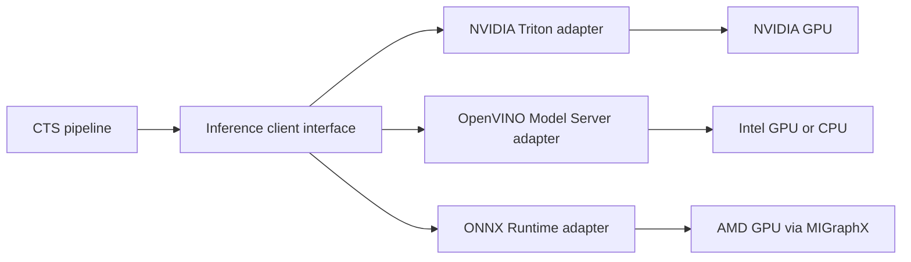

# Model quantization and accelerator portability

This page records how the CTS vision models were prepared for an 8 GB Jetson,
why several broad INT8 attempts were rejected, and how to carry the same
validation discipline to Intel or AMD GPUs.

It is written for developers who need to reproduce the model work, inspect the
tradeoffs, or replace TensorRT while preserving CTS behavior.

## What this work established

Eight model graphs now pass semantic regression checks as explicit-Q/DQ ONNX
models:

- YOLO26L person detection;
- RTMPose-m 2D pose estimation;
- SOLIDER body re-identification;
- SCRFD face detection from InsightFace `buffalo_l`;
- ArcFace face recognition from InsightFace `buffalo_l`;
- 106-point 2D facial landmarks;
- 68-point 3D facial landmarks;
- gender and age attributes.

The result is mixed precision. INT8 is used where it preserves the model's
observable contract. Accuracy-sensitive operations remain FP32 in the ONNX
graph and may use a supported higher precision in the final engine.

Depth Anything V2 was removed from the Jetson repository. The complete
five-model Buffalo_L pack is retained because the person-identification service
uses detection, recognition, landmarks, head pose, and face attributes through
one required model contract.

## Quantization concepts

### FP32, FP16, and INT8

A floating-point model commonly stores weights and activations as FP32. FP16
reduces storage and bandwidth while retaining a floating exponent. INT8 maps
values to a finite integer range using a scale, and sometimes a zero point.

For a symmetric tensor:

```text
quantized = clamp(round(real / scale), -128, 127)
real_approx = quantized * scale
```

Quantization error comes from rounding, clipping, and using one scale for many
values. Classification confidence, keypoint peaks, bounding-box regression,
and embedding direction can respond differently to that error. File size or
raw tensor RMSE is therefore not enough to approve a model.

### PTQ and QAT

Post-training quantization (PTQ) estimates activation ranges from calibration
data without changing the learned weights. It was sufficient for SOLIDER,
SCRFD, ArcFace, the landmark and attribute graphs, and a limited RTMPose
region. Each accepted graph uses only the region that passed its semantic gate.

Quantization-aware training (QAT) inserts fake quantizers during training so
the model can adapt to rounding and clipping. NVIDIA Model Optimizer notes
that fake quantization simulates low precision during training; the actual
speedup appears after export to a deployment runtime such as TensorRT. See the
[Model Optimizer PyTorch quantization guide](https://nvidia.github.io/Model-Optimizer/guides/_pytorch_quantization.html).

YOLO26L required QAT because PTQ alone did not retain enough detections at the
deployed confidence threshold.

### Explicit Q/DQ graphs

The accepted ONNX files contain `QuantizeLinear` and `DequantizeLinear` nodes.
TensorRT detects these nodes and applies
[explicit quantization](https://docs.nvidia.com/deeplearning/tensorrt/latest/inference-library/work-quantized-types.html).
This has two practical benefits:

1. precision decisions are visible and versionable in the graph;
2. TensorRT can build a strongly typed engine without a separate runtime
   calibrator.

Q/DQ placement is part of model correctness. Adding Q/DQ around every supported
operator can produce a valid engine with unacceptable output drift.

## Decision record

The optimization work followed these constraints:

| Constraint | Consequence |
| --- | --- |
| 8 GB unified memory | Load only the three required CTS graphs and the five required Buffalo_L graphs. |
| Existing CTS tensor contracts | Preserve YOLO fixed batch 8 and crop-model input shapes. |
| Household camera domain | Calibrate with actual cameras, viewpoints, lighting, and resident crops. |
| Identity continuity matters | Validate ReID and ArcFace by embedding cosine, not elementwise equality. |
| Pose feeds posture logic | Decode keypoints and measure pixel displacement. |
| Detector threshold is operational | Compare active detections, IoU, confidence, recall, and precision agreement. |
| TensorRT plans are target-specific | Export ONNX off-device, but build plans on the Jetson. |
| Public repository | Exclude identifiable images, calibration arrays, model weights, and generated plans from Git. |

The guiding rule was to widen INT8 coverage only while the model-specific
regression gate continued to pass.

## Verify Buffalo_L weight provenance

The person-identification repository contains two visible Buffalo_L
directories plus the original archive:

```text
data/models/models/buffalo_l.zip
data/models/models/buffalo_l/
data/models/buffalo_l/
```

`data/models/models/buffalo_l` matches the archive and is the canonical
full-precision source copied into `continuous-tracking/triton-models`. The
files in `data/models/buffalo_l` were rewritten by ONNX tooling, but they are
also FP32. They contain no `QuantizeLinear` or `DequantizeLinear` nodes.

Comparison found identical graph nodes and initializer tensors between the two
FP32 sets. Their binary differences are non-semantic ONNX metadata. The
rewritten set was therefore used as the calibration baseline, while generated
explicit-Q/DQ outputs are written to `triton-models-jetson`.

Do not infer precision from a directory name, modification time, or smaller
metadata section. Inspect graph operators, initializer data types, and runtime
outputs.

## Build representative calibration data

Random tensors exercise operator shapes but do not estimate useful activation
ranges. The calibration set was built from CTS keyframes that already contained
resident identity labels and person boxes.

### Selection method

The exporter:

1. queries the CTS internal keyframe API by person ID;
2. keeps detections above a minimum confidence;
3. balances samples across cameras;
4. enforces time separation so adjacent frames do not dominate;
5. prefers caregiver-reviewed bounding-box overrides;
6. falls back to stored detections or keyframe annotations;
7. writes full frames and person crops to a Git-ignored directory.

The accepted run used 128 keyframes across four cameras. SCRFD found 49 usable,
aligned faces in those person crops.

Public commands use a placeholder rather than a household identity:

```bash
set -a
source .env
set +a
export RESIDENT_ID=resident-id

python triton-models-jetson/scripts/export_keyframe_calibration_data.py \
  --orchestrator-url http://localhost:8500 \
  --person-id "$RESIDENT_ID" \
  --output-dir calibration-data/jetson \
  --max-samples 128 \
  --max-per-camera 40 \
  --min-separation-seconds 20
```

The exporter is available in
[`export_keyframe_calibration_data.py`](https://github.com/SilverMind-Project/continuous-tracking/blob/main/triton-models-jetson/scripts/export_keyframe_calibration_data.py).

::: danger Protect calibration data
The export contains identifiable people, camera names, timestamps, object-store
keys, and image crops. Do not commit it, attach it to public issues, or include
it in container images.
:::

### Reproduce each model's preprocessing

One source image becomes several different model inputs:

| Model | Tensor | Preprocessing |
| --- | --- | --- |
| YOLO26L | `[3,640,640]` | RGB letterbox with value 114, scale to `[0,1]`. |
| RTMPose-m | `[3,256,192]` | Person crop, RGB letterbox, ImageNet normalization. |
| SOLIDER | `[3,384,128]` | Resize person crop, ImageNet normalization. |
| SCRFD | `[3,640,640]` | BGR-compatible resize and zero padding, InsightFace normalization. |
| ArcFace | `[3,112,112]` | SCRFD five-point alignment, RGB conversion, ArcFace normalization. |
| 2D106 landmarks | `[3,192,192]` | Aligned face crop and InsightFace landmark normalization. |
| 3D68 landmarks | `[3,192,192]` | Aligned face crop and InsightFace landmark normalization. |
| Gender/age | `[3,96,96]` | Aligned face crop and InsightFace attribute normalization. |

Calibration preprocessing must match production preprocessing. A different
channel order, resize mode, crop policy, or normalization range changes
activation statistics and can invalidate both accuracy and performance
results.

Prepare tensors with:

```bash
python triton-models-jetson/scripts/prepare_calibration_tensors.py \
  --data-dir calibration-data/jetson \
  --buffalo-dir /path/to/buffalo_l
```

## Verify detector provenance

The available `yolo26l.pt` checkpoint did not come with the exact command used
for the deployed ONNX export. Before using it for QAT, the checkpoint was
compared with the deployed detector.

| Check | Result |
| --- | --- |
| Checkpoint SHA-256 | `9fe3c544f2b19bebad7ea41e76d7ad3d88b7c2f10d11d24430c5311f6b32db26` |
| Checkpoint metadata | Ultralytics `8.3.222` |
| Deployed ONNX exporter metadata | Ultralytics `8.4.57` |
| Shared learned initializers | 332 |
| Byte-identical learned initializers | 332 |
| Runtime comparison | Maximum absolute output difference `0.0` on 16 keyframes |

Graph constants differed because the ONNX simplifier rewrote parts of the
exported graph. Learned tensor identity and runtime output identity provide the
stronger evidence that the checkpoint matches the deployed weights.

The checkpoint was re-exported separately so the DGX model was not overwritten:

```bash
uv run --with 'ultralytics==8.4.57' \
  python triton-models/scripts/export_yolo.py \
  --weights calibration-data/jetson/checkpoints/yolo26l.pt \
  --out calibration-data/jetson/candidates/person-detector/model.onnx \
  --batch 8 \
  --imgsz 640 \
  --device 0
```

Pinning the exporter version reduces graph differences during comparison and
reproduction.

## Per-model quantization results

### Summary

| Model | Method | Selected coverage | Q/DQ nodes | Main validation |
| --- | --- | --- | ---: | --- |
| YOLO26L | Selective QAT | Backbone convolutions | 166 Q and 166 DQ | Detection recall, precision agreement, IoU, confidence |
| RTMPose-m | PTQ | Three stem convolutions | 6 Q and 6 DQ | Decoded keypoint displacement |
| SOLIDER | PTQ | Conv and MatMul | 152 Q and 152 DQ | Embedding cosine |
| SCRFD | PTQ | Conv except output heads | 92 Q and 92 DQ | Score, threshold, box, landmark drift |
| ArcFace | PTQ | Early backbone Conv | 22 Q and 22 DQ | Embedding cosine |
| 2D106 landmarks | Selective PTQ | First convolution | 2 Q and 2 DQ | Pixel-space landmark error |
| 3D68 landmarks | Selective PTQ | First convolution | 2 Q and 2 DQ | Pixel-space XY landmark error |
| Gender/age | Selective PTQ | First convolution | 2 Q and 2 DQ | Gender agreement and age error |

The generated files are deployment intermediates, not source artifacts. They
are excluded from Git and can be regenerated from source models and private
calibration data.

### YOLO26L: why PTQ was rejected

Selective PTQ produced:

| Measure | PTQ result | Required |
| --- | ---: | ---: |
| Recall at IoU 0.50 | `0.923` | at least `0.95` |
| Median IoU | `0.991` | at least `0.90` |
| Confidence MAE | `0.0509` | at most `0.05` |

The boxes still aligned well, but too many baseline detections fell below the
active threshold. That is a behavioral failure even though median IoU was high.

The accepted QAT run used:

| Setting | Value |
| --- | --- |
| Training samples | 112 |
| Batch size | 8 |
| Epochs | 12 |
| Learning rate | `3e-6` |
| Seed | 23 |
| Quantized region | Backbone layers 0 through 10 |
| Teacher | Original fused FP32 YOLO26L |
| Student losses | Backbone feature distillation, object-score distillation, box distillation |

The QAT script keeps the teacher frozen, inserts fake INT8 quantizers in the
student backbone, and chooses the best epoch by detector behavior rather than
training loss alone.

```bash
uv run \
  --with 'ultralytics==8.4.57' \
  --with 'nvidia-modelopt' \
  --with 'onnx<2' \
  python triton-models-jetson/scripts/qat_person_detector.py \
  --weights calibration-data/jetson/checkpoints/yolo26l.pt \
  --calibration-tensor calibration-data/jetson/tensors/person-detector.npy \
  --output triton-models-jetson/person-detector/1/model_int8.onnx \
  --checkpoint-output calibration-data/jetson/checkpoints/yolo26l-qat-modelopt.pt
```

The exported Q/DQ graph produced:

| Measure | QAT result |
| --- | ---: |
| Recall at IoU 0.50 | `0.959` |
| Precision agreement | `0.944` |
| Median IoU | `0.993` |
| Confidence MAE | `0.0354` |

The accepted candidate threshold is `0.69`, compared with the FP32 baseline at
`0.70`. At `0.70`, exported ONNX recall was `0.9495`, narrowly below the gate.
Threshold changes must therefore be versioned with the engine.

### RTMPose-m: why most layers remain higher precision

Pose quality degraded as quantization moved beyond the stem:

| Quantized region | Mean keypoint error | p95 keypoint error | Result |
| --- | ---: | ---: | --- |
| All convolutions | `3.29 px` | `12.72 px` | Fail |
| Stem through stage 3 | `3.08 px` | `11.5 px` | Fail |
| Stem through stage 2 | `2.94 px` | `10.5 px` | Fail |
| Stem through stage 1 | `2.87 px` | `10.5 px` | Fail |
| Stem only | `1.96 px` | `7.00 px` | Pass |

The gate is mean error at most `3 px` and p95 at most `10 px`. The narrow
stem-only result means RTMPose is INT8-compatible, but it should not be
expected to receive a large speedup. It remains the first candidate for a
smaller pose model or dedicated QAT if Jetson latency is too high.

### SOLIDER and ArcFace: validate embedding direction

ReID and face recognition compare vectors by cosine similarity. Elementwise
RMSE can look large while the vector direction, and therefore matching
behavior, remains useful.

The validation gate requires every tested embedding to retain cosine
similarity of at least `0.97` with its FP32 output.

| Model | Minimum cosine | Median cosine |
| --- | ---: | ---: |
| SOLIDER ReID | `0.9722` | `0.9826` |
| ArcFace | `0.9883` | `0.9973` |

This test checks FP32-to-INT8 output preservation. It does not replace
identity-level evaluation against known residents, visitors, occlusions, and
camera transitions.

### SCRFD: validate decoded face evidence

SCRFD has multiple output heads for scores, boxes, and five facial landmarks.
The validator checks active anchors rather than averaging mostly inactive
background anchors.

| Measure | Result | Gate |
| --- | ---: | ---: |
| Score MAE | `0.00120` | at most `0.01` |
| Threshold agreement | `0.999981` | at least `0.999` |
| Box MAE | `0.0270` | at most `0.1` |
| Landmark MAE | `0.0182` | at most `0.1` |

Prediction-head convolutions remain outside the PTQ selection because they
were more sensitive than the feature extractor.

### Landmark and attribute graphs: narrow PTQ preserves evidence

The smaller Buffalo_L evidence graphs still require model-specific checks.
Broad 3D-landmark quantization failed its pixel-error gate, so the accepted
graph quantizes only the first convolution. The same narrow policy is used for
2D landmarks and gender/age attributes.

| Model | Acceptance measure | Result |
| --- | --- | ---: |
| 2D106 landmarks | Mean pixel error | `0.10 px` |
| 2D106 landmarks | p95 pixel error | `0.32 px` |
| 3D68 landmarks | Mean XY pixel error | `0.26 px` |
| 3D68 landmarks | p95 XY pixel error | `0.70 px` |
| Gender/age | Gender agreement | `1.0000` |
| Gender/age | Age MAE | `0.19 years` |

These models are INT8-compatible because their exported graphs contain tested
Q/DQ regions. The narrow coverage also means their speedup may be modest.
Engine layer reports and target latency remain part of production approval.

## Run the complete validation

Quantize the PTQ models:

```bash
uv run --with 'nvidia-modelopt[onnx]' \
  python triton-models-jetson/scripts/quantize_int8_models.py \
  --buffalo-dir /path/to/buffalo_l \
  --calibration-dir calibration-data/jetson/tensors
```

The default list excludes YOLO so a later PTQ run cannot overwrite the accepted
QAT graph.

Validate all eight:

```bash
uv run --with 'nvidia-modelopt[onnx]' \
  python triton-models-jetson/scripts/validate_int8_onnx.py \
  --buffalo-dir /path/to/buffalo_l \
  --calibration-dir calibration-data/jetson/tensors \
  --person-detector-source \
    calibration-data/jetson/candidates/person-detector/model.onnx \
  --detector-candidate-threshold 0.69
```

An ONNX pass is necessary but not sufficient. Repeat semantic validation after
TensorRT engine construction because graph fusion and target-specific tactics
can expose new differences.

## Build and inspect TensorRT engines

The deployment script calls `trtexec` with detailed profiling and layer-report
export. NVIDIA documents `trtexec` as a tool for
[building engines, benchmarking, and exporting layer information](https://docs.nvidia.com/deeplearning/tensorrt/latest/reference/command-line-programs.html).

```bash
export TRITON_JETSON_IMAGE=jetpack-compatible-triton-image
bash triton-models-jetson/scripts/build_tensorrt_plans.sh
```

Dynamic crop models receive min, optimum, and maximum batch profiles. The
detector retains its fixed shape. The verification script fails if a layer
report contains no INT8 tensor format.

Do not infer engine precision from the filename. Inspect:

- TensorRT build logs;
- exported layer information;
- actual tensor formats;
- selected sparse tactics, if enabled;
- latency and memory on the target;
- semantic output regression.

TensorRT plans are not portable between arbitrary TensorRT, CUDA, JetPack, or
GPU versions. Rebuild after upgrading the target software stack.

## Understand structured sparse INT8

The Jetson Orin Nano Super is advertised at 67 sparse INT8 TOPS and about 33
dense INT8 TOPS. Sparse throughput requires compatible layers whose weights
follow NVIDIA's structured pattern.

For supported convolution and matrix multiplication weights, every group of
four values along the required axis must contain at least two zeros. NVIDIA's
[TensorRT sparsity documentation](https://docs.nvidia.com/deeplearning/tensorrt/10.x.x/inference-library/io-formats-sparsity.html)
describes the exact 2:4 rules and notes that TensorRT reports eligible layers
and selected sparse tactics.

The current pretrained checkpoints are dense. This command only allows sparse
tactics when the graph already qualifies:

```bash
TRT_SPARSITY=enable \
  bash triton-models-jetson/scripts/build_tensorrt_plans.sh
```

It does not create sparsity.

### A defensible sparse workflow

1. Start from the trainable source checkpoint.
2. Apply 2:4 structured pruning only to supported, performance-relevant layers.
3. Fine-tune or run sparsity-aware QAT on representative training data.
4. Re-export explicit-Q/DQ ONNX.
5. Use `polygraphy inspect sparsity` or equivalent graph inspection.
6. Build with sparse tactics enabled.
7. Confirm the TensorRT log lists eligible layers and selected sparse tactics.
8. Repeat every semantic regression test.
9. Benchmark end-to-end CTS throughput, not only isolated matrix throughput.

Avoid TensorRT's force-sparsity behavior for an accuracy-sensitive deployment.
Rewriting weights to zeros without retraining changes the model and provides no
evidence that identity or tracking behavior is preserved.

## Triton internals that affect CTS

### Model repository

Each Triton model has:

```text
model-name/
├── config.pbtxt
└── 1/
    └── model.plan
```

The Jetson Compose file uses explicit model control and lists each model with
`--load-model`. This prevents unused graphs from consuming memory.

### `max_batch_size`

Triton interprets dimensions differently depending on `max_batch_size`:

- `max_batch_size: 0` means the model configuration contains the complete
  tensor shape. YOLO's leading eight is part of that shape.
- `max_batch_size: 8` means Triton owns an additional batch dimension and may
  combine requests up to eight.

Confusing these contracts causes shape errors or double batching.

### Dynamic batching

RTMPose and SOLIDER prefer batches of 4 and 8 with a maximum scheduler delay of
2 ms. Dynamic batching raises throughput when crop requests arrive close
together. It can also add queue latency when traffic is sparse.

Tune it with actual request rates. NVIDIA's
[Triton metrics reference](https://docs.nvidia.com/deeplearning/triton-inference-server/user-guide/docs/user_guide/metrics.html)
defines request, inference, execution, queue, and compute counters. For a
Triton-batched model:

```text
average batch size = nv_inference_count / nv_inference_exec_count
```

The fixed YOLO graph needs an application metric for real frames per request,
because Triton sees padding as ordinary tensor data.

### Model instances

Each Jetson model currently has one GPU instance. Adding instances may improve
concurrency, but each instance can allocate more memory and compete for the
same memory bandwidth. On an 8 GB device, increase instance count only after
profiling queue time, memory, and throughput together.

## Port the models to Intel discrete GPUs

The portable assets are the source FP32 ONNX models, preprocessing code,
calibration set, and semantic validators. TensorRT plans and NVIDIA-specific
Q/DQ placement should be treated as target-specific.

For Intel Arc A-series or B-series GPUs, including Battlemage-based devices,
the preferred path is OpenVINO:

1. install a driver and OpenVINO release that explicitly supports the target
   GPU and operating system;
2. load or convert the source ONNX graph with OpenVINO;
3. apply NNCF PTQ or QAT using the same private calibration tensors;
4. benchmark with OpenVINO `benchmark_app`;
5. serve with OpenVINO Model Server or ONNX Runtime's OpenVINO execution
   provider;
6. rerun the model-specific validators;
7. retune batch sizes and confidence thresholds.

[OpenVINO](https://github.com/openvinotoolkit/openvino) supports Intel CPUs,
integrated GPUs, discrete GPUs, and NPUs. The
[ONNX Runtime OpenVINO execution provider](https://onnxruntime.ai/docs/execution-providers/OpenVINO-ExecutionProvider.html)
can target `GPU`, a specific `GPU.0`, or multi-device modes. Check the current
[Intel GPU configuration guide](https://docs.openvino.ai/2025/get-started/install-openvino/configurations/configurations-intel-gpu.html)
before choosing a kernel and compute-runtime package.

For INT8, use
[NNCF post-training quantization](https://docs.openvino.ai/2026/openvino-workflow/model-optimization-guide/quantizing-models-post-training.html).
Its accuracy-aware flow is a good fit for the existing detector, pose, and
embedding validators.

[OpenVINO Model Server](https://github.com/openvinotoolkit/model_server)
provides REST, gRPC, model versioning, Prometheus metrics, and Intel accelerator
support. A CTS adapter would need to map the current Triton client contract to
the selected OVMS API.

::: info Battlemage qualification
Do not select an Intel GPU from marketing TOPS alone. Confirm that the exact
consumer or Arc Pro B-series SKU appears in the OpenVINO and driver support
matrix, then measure all eight graphs. Operator coverage and INT8 performance
vary by model and software release.
:::

## Port the models to AMD discrete GPUs

For supported AMD Radeon or Instinct GPUs, start with ROCm and ONNX Runtime's
MIGraphX execution provider:

1. verify the exact GPU, operating system, kernel, and ROCm combination in the
   [ROCm compatibility matrix](https://rocm.docs.amd.com/en/latest/compatibility/compatibility-matrix.html);
2. run the source FP32 ONNX models with the
   [MIGraphX execution provider](https://onnxruntime.ai/docs/execution-providers/MIGraphX-ExecutionProvider.html);
3. identify unsupported operators and CPU fallbacks;
4. perform AMD-targeted INT8 quantization or MIGraphX compilation;
5. preserve the same preprocessing and semantic validators;
6. add a small gRPC or HTTP model service, or an accelerator-neutral inference
   adapter inside CTS;
7. profile queueing, host-to-device copies, and batch behavior.

MIGraphX accepts ONNX and supports INT8 data types, but support for a data type
does not guarantee that every operator in these eight graphs will execute as an
optimized INT8 kernel. Inspect compiled programs and benchmark the target.

The standard NVIDIA Triton TensorRT deployment does not run unchanged on AMD
hardware. The current person-identification service intentionally has one
Triton client path and no runtime fallback. An Intel or AMD deployment
therefore needs either a Triton-compatible serving endpoint or a separately
implemented and qualified service adapter. Do not add silent per-request
fallbacks to the existing service.

## Design for backend portability

An accelerator-neutral CTS design should separate four layers:



Keep these contracts stable:

- tensor names, shapes, dtypes, and normalization;
- decoded detection and keypoint schemas;
- embedding dimensions and normalization;
- timeout and retry behavior;
- metrics labels and error codes.

Keep these target-specific:

- engine files and graph compilation caches;
- Q/DQ placement;
- dynamic batching and instance count;
- precision fallback policy;
- hardware telemetry;
- latency and memory gates.

This boundary makes it possible to compare accelerators using the same input
set and the same behavioral tests.

## Compare hardware fairly

Use the same sequence for NVIDIA, Intel, and AMD:

1. validate FP32 source outputs on the target runtime;
2. quantize with the same calibration set;
3. run semantic regression;
4. benchmark each model alone with production tensor shapes;
5. benchmark the complete eight-model mix;
6. run CTS with six synchronized camera streams;
7. run a motion-heavy eight-camera test;
8. record p50, p95, and p99 latency, throughput, queue duration, memory, power,
   temperature, and dropped frames;
9. compare identity continuity and face decisions with the DGX baseline.

Report software versions with every result:

```text
operating system
driver
CUDA, ROCm, or Level Zero runtime
TensorRT, OpenVINO, MIGraphX, or ONNX Runtime
model checksum
engine or compiled-model checksum
power mode
clock and thermal configuration
batch configuration
```

Without this context, accelerator benchmark numbers are difficult to reproduce.

## Model and tooling references

### Models

- [Ultralytics YOLO26 documentation](https://github.com/ultralytics/ultralytics/blob/main/docs/en/models/yolo26.md)
- [RTMPose paper](https://arxiv.org/abs/2303.07399)
- [MMPose project](https://github.com/open-mmlab/mmpose)
- [SOLIDER paper](https://openaccess.thecvf.com/content/CVPR2023/html/Chen_Beyond_Appearance_A_Semantic_Controllable_Self-Supervised_Learning_Framework_for_Human-Centric_CVPR_2023_paper.html)
- [SOLIDER project](https://github.com/tinyvision/SOLIDER)
- [ArcFace paper](https://openaccess.thecvf.com/content_CVPR_2019/html/Deng_ArcFace_Additive_Angular_Margin_Loss_for_Deep_Face_Recognition_CVPR_2019_paper.html)
- [SCRFD paper](https://arxiv.org/abs/2105.04714)
- [InsightFace project and model license notice](https://github.com/deepinsight/insightface)

### NVIDIA deployment

- [NVIDIA Model Optimizer](https://github.com/NVIDIA/TensorRT-Model-Optimizer)
- [Model Optimizer ONNX quantization API](https://nvidia.github.io/Model-Optimizer/reference/generated/modelopt.onnx.quantization.quantize.html)
- [TensorRT explicit quantization](https://docs.nvidia.com/deeplearning/tensorrt/latest/inference-library/work-quantized-types.html)
- [TensorRT structured sparsity](https://docs.nvidia.com/deeplearning/tensorrt/10.x.x/inference-library/io-formats-sparsity.html)
- [Triton dynamic batching](https://docs.nvidia.com/deeplearning/triton-inference-server/user-guide/docs/tutorials/Conceptual_Guide/Part_2-improving_resource_utilization/README.html)
- [Triton Performance Analyzer](https://docs.nvidia.com/deeplearning/triton-inference-server/user-guide/docs/perf_analyzer/README.html)

### Alternative runtimes

- [OpenVINO 2026 documentation](https://docs.openvino.ai/2026/index.html)
- [NNCF](https://github.com/openvinotoolkit/nncf)
- [OpenVINO Model Server](https://github.com/openvinotoolkit/model_server)
- [ONNX Runtime OpenVINO execution provider](https://onnxruntime.ai/docs/execution-providers/OpenVINO-ExecutionProvider.html)
- [ROCm compatibility matrix](https://rocm.docs.amd.com/en/latest/compatibility/compatibility-matrix.html)
- [ONNX Runtime MIGraphX execution provider](https://onnxruntime.ai/docs/execution-providers/MIGraphX-ExecutionProvider.html)

## Related pages

- [Jetson CTS deployment](/hardware/jetson-cts)
- [Continuous Tracking overview](/features/continuous-tracking)
- [Frame Processing Pipeline](/features/continuous-tracking/frame-pipeline)
- [Deployment](/guide/deployment)
